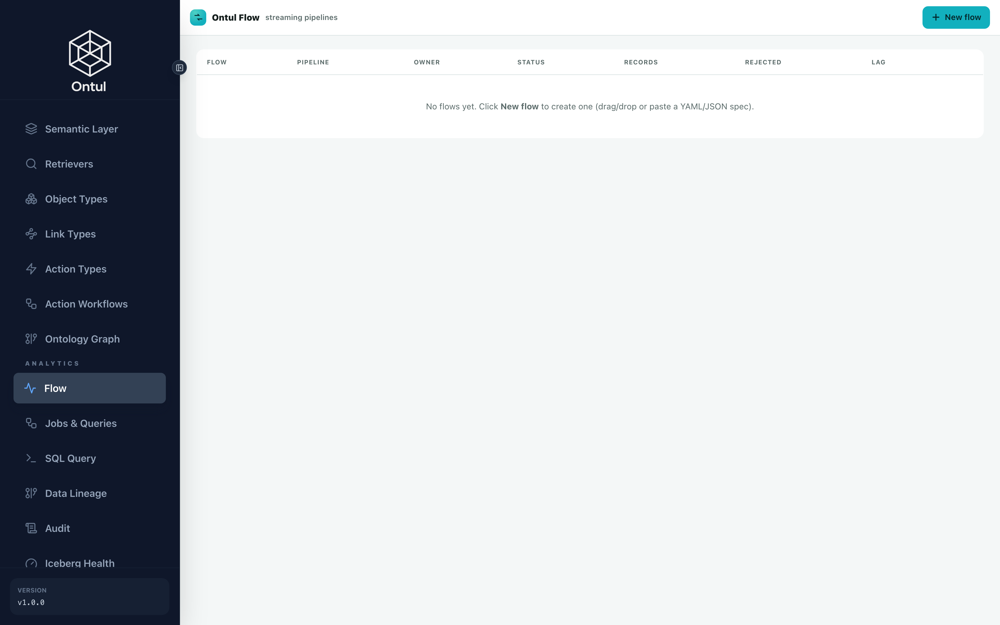

# CDC and Flow — the jobs that never finish

One thing separates these from the batch pipeline: **they do not end.** Leave
them running and the tables follow their sources.

There are three groups.

| Flow | Source → sink | Why |
|---|---|---|
| ERP CDC ×5 | PostgreSQL → Iceberg | No analytical load on the operational system, and one consistent point in time |
| Graph serving ×2 | Iceberg → NeorunBase | Because serving has to be a derivative |
| Approval events | S3 (JSON) → Iceberg | The real trigger for a regulation taking effect |

---

## 1. ERP → Iceberg (CDC)

### Why not connect directly

Read-only access sounds harmless and is usually refused anyway — few organisations
welcome analytical queries against a production ERP. And connecting directly makes
the **point in time slip**: each query sees a different instant, which shows up as
a wrong number in any answer that compares records against a regulation.

So CDC collects into Iceberg and the semantic views stay as they are. Only what is
underneath them changes.

**`demo/schema/flows/erp_cdc.json`**

```json
{
  "_comment": [
    "ERP → Iceberg, by live CDC.",
    "",
    "Early on, Ontul read Postgres directly over JDBC. That demonstrates fine and is",
    "not what a real organisation does — analytical queries sweep the OLTP buffer",
    "cache, every worker opens a connection, and above all **there is no past**. An",
    "overwritten value cannot be recovered, so there is nowhere to ask 'how many days",
    "was it in February 2025'.",
    "",
    "So Debezium reads the WAL and streams it into Iceberg. The semantic views and the",
    "IAM policies stay exactly as they are and only what is underneath changes — a",
    "swap that is possible because the views hide the source, which is also why that",
    "layer exists.",
    "",
    "One Flow per table. An Ontul Flow has a single sink table, and each Flow creates",
    "one replication slot on the Postgres side.",
    "",
    "upsertKeys is the primary key and cdc.apply is on, so an update replaces the row",
    "and a delete removes it — nothing piles up as an append. For that to work the",
    "coordinated commit has to carry the equality deletes along with the data, which",
    "is the defect fixed in 8e82f3f."
  ],
  "tables": [
    {
      "source": "public.hr_employee",
      "sink": "ice.erp.hr_employee",
      "keys": [
        "emp_no"
      ]
    },
    {
      "source": "public.hr_org",
      "sink": "ice.erp.hr_org",
      "keys": [
        "dept_cd"
      ]
    },
    {
      "source": "public.hr_leave_balance",
      "sink": "ice.erp.hr_leave_balance",
      "keys": [
        "emp_no",
        "yr",
        "lv_typ_cd"
      ]
    },
    {
      "source": "public.fi_expense",
      "sink": "ice.erp.fi_expense",
      "keys": [
        "exp_id"
      ]
    },
    {
      "source": "public.pu_purchase_order",
      "sink": "ice.erp.pu_purchase_order",
      "keys": [
        "po_id"
      ]
    }
  ],
  "source": {
    "type": "cdc",
    "connector": "postgres",
    "hostname": "postgres-erp",
    "port": "5432",
    "database": "erp",
    "username": "erp",
    "password": "${ERP_PASSWORD}",
    "snapshot": "initial",
    "_snapshot_note": "initial reads the current state once and then goes incremental. Without it only changes made after the Flow started arrive, and the table looks empty."
  },
  "sink": {
    "type": "table",
    "_write_note": "write.mode=cdc reads the op column (__op) and routes c/u/r to an upsert and d to a delete. keys differ per Flow and are filled in at submission time.",
    "write": {
      "mode": "cdc",
      "opColumn": "__op",
      "delete": "hard",
      "keys": []
    },
    "schemaEvolution": "add"
  },
  "ontul.streaming.exactly.once": "true",
  "commitIntervalMs": 3000,
  "numWorkers": 1,
  "durationMs": 9999999999
}
```


!!! danger "Leaving `decimal.handling.mode` at its default"
    Debezium's default encodes a NUMERIC as **base64 unscaled bytes**. A column
    that should read 18.0 arrives downstream as the string `"ALQ="` — and **the
    row counts match exactly**. Every count-based check passes while every value
    is wrong.

    That is why the verification on this page compares values, not counts.

**`demo/infra/cdc.sh`**

```bash
#!/usr/bin/env bash
# ERP → Iceberg, over Ontul Flow.
#
#   bash infra/cdc.sh            # start 5 Flows and check the initial snapshot
#   bash infra/cdc.sh verify     # compare row counts, source against target
#   bash infra/cdc.sh change     # apply an UPDATE/DELETE in ERP and watch it land
#   bash infra/cdc.sh stop
#
# Replaces the direct JDBC connection. The semantic views stay as they are; only
# what is underneath them changes.
set -uo pipefail
cd "$(dirname "$0")/.."
DEMO=$(pwd)
. out/stack.env 2>/dev/null || { echo "no out/stack.env — run infra/up.sh first"; exit 1; }

ONTUL=${ONTUL_URL:-http://localhost:8080}
ADMIN_PW="${ONTUL_ADMIN_PASSWORD:-regdemo-admin-2026}"
ERP_PW="${ERP_PASSWORD:-regdemo}"
SPEC="$DEMO/schema/flows/erp_cdc.json"
MODE=${1:-start}

log(){ printf '\n\033[1;36m== %s\033[0m\n' "$*"; }
step(){ printf '\033[1;32m  ok\033[0m %s\n' "$*"; }
warn(){ printf '\033[1;33m  ..\033[0m %s\n' "$*"; }
fail(){ printf '\033[1;31m  failed\033[0m %s\n' "$*"; exit 1; }

TOK=$(curl -s -m 30 -XPOST "$ONTUL/admin/auth/login" -H 'Content-Type: application/json' \
      -d "{\"username\":\"admin\",\"password\":\"$ADMIN_PW\"}" \
      | python3 -c "import sys,json;print(json.load(sys.stdin).get('accessToken',''))" 2>/dev/null)
[ -n "$TOK" ] || fail "ontul login failed"
AH="Authorization: Bearer $TOK"

sql(){ curl -s -m 120 -XPOST "$ONTUL/admin/query/execute" -H "$AH" -H 'Content-Type: application/json' \
        -d "$(python3 -c "import json,sys;print(json.dumps({'sql':sys.argv[1]}))" "$1")"; }
count(){ sql "SELECT count(*) FROM $1" | python3 -c "
import sys,json
d=json.load(sys.stdin)
print((d.get('rows') or [['ERR']])[0][0] if d.get('status')=='ok' else 'ERR')" 2>/dev/null; }
pg(){ docker exec regdemo-erp psql -U erp -d erp -tAc "$1" 2>/dev/null | tr -d '[:space:]'; }
tables(){ python3 -c "
import json;d=json.load(open('$SPEC',encoding='utf-8'))
for t in d['tables']: print(t['source'], t['sink'], ','.join(t['keys']))"; }

# Kills only its own. Killing every streaming job means this script takes down
# someone else's pipeline — which is exactly what happened: cdc killed the two
# graph_flow had started, flow killed the five cdc had started, and running the
# three scripts in sequence left only the last one alive. Nobody noticed, because
# each script reported success.
streaming_jobs(){ curl -s -m 30 "$ONTUL/v1/api/job/list" -H "$AH" \
  | python3 -c "
import sys, json
for j in json.load(sys.stdin):
    if j.get('type') != 'STREAMING':
        continue
    tag = (j.get('description') or '') + ' ' + (j.get('jobName') or '')
    if 'erp-cdc' in tag:
        print(j['jobId'])
" 2>/dev/null; }

if [ "$MODE" = "stop" ]; then
  log "stopping the Flows and cleaning up replication slots"
  for jid in $(streaming_jobs); do curl -s -XPOST "$ONTUL/v1/api/job/kill/$jid" -H "$AH" -o /dev/null; step "kill $jid"; done
  # A slot left behind makes Postgres hold on to WAL until the disk fills.
  for s in $(pg "SELECT slot_name FROM pg_replication_slots WHERE slot_name LIKE 'ontul_%';"); do
    pg "SELECT pg_drop_replication_slot('$s');" >/dev/null && step "dropped slot $s"
  done
  exit 0
fi

num_eq(){ python3 -c "
import sys
a=sys.argv[1].split('|'); b=sys.argv[2].split('|')
try:
    ok = len(a)==len(b) and all(abs(float(x)-float(y))<1e-9 for x,y in zip(a,b))
except ValueError:
    ok = False
print('1' if ok else '0')" "$1" "$2"; }

if [ "$MODE" = "verify" ]; then
  log "source vs target — row counts"
  tables | while read -r src sink keys; do
    t=${src#public.}
    a=$(pg "SELECT count(*) FROM $t;"); b=$(count "$sink")
    if [ "$a" = "$b" ]; then step "$t: $a = $b"
    else printf '\033[1;31m  differs\033[0m %s: source %s, Iceberg %s\n' "$t" "$a" "$b"; fi
  done

  # A count-only check has passed here while being wrong. While Debezium was
  # sending NUMERIC as base64 bytes, 572 = 572 held and every value read "ALQ=".
  # So values are read too — one number, one string.
  log "compared by value"
  emp=$(pg "SELECT emp_no FROM hr_leave_balance ORDER BY emp_no, lv_typ_cd LIMIT 1;")
  typ=$(pg "SELECT lv_typ_cd FROM hr_leave_balance WHERE emp_no='$emp' ORDER BY lv_typ_cd LIMIT 1;")
  src_v=$(pg "SELECT grant_days || '|' || used_days FROM hr_leave_balance WHERE emp_no='$emp' AND lv_typ_cd='$typ';")
  ice_v=$(sql "SELECT grant_days, used_days FROM ice.erp.hr_leave_balance WHERE emp_no = '$emp' AND lv_typ_cd = '$typ'" \
          | python3 -c "
import sys,json
d=json.load(sys.stdin); r=(d.get('rows') or [[None,None]])[0]
print('|'.join('' if x is None else str(x) for x in r[:2]))" 2>/dev/null)
  if [ "$(num_eq "$src_v" "$ice_v")" = "1" ]; then
    step "hr_leave_balance($emp,$typ) figures match — source $src_v, Iceberg $ice_v"
  else
    printf '\033[1;31m  mismatch\033[0m hr_leave_balance(%s,%s): source %s, Iceberg %s\n' "$emp" "$typ" "$src_v" "$ice_v"
  fi

  nm_src=$(pg "SELECT emp_nm FROM hr_employee WHERE emp_no='$emp';")
  nm_ice=$(sql "SELECT emp_nm FROM ice.erp.hr_employee WHERE emp_no = '$emp'" \
           | python3 -c "
import sys,json
d=json.load(sys.stdin); r=d.get('rows') or []
print(r[0][0] if r else '')" 2>/dev/null)
  if [ "$nm_src" = "$nm_ice" ]; then step "hr_employee($emp) name matches — $nm_src"
  else printf '\033[1;31m  mismatch\033[0m hr_employee(%s): source %s, Iceberg %s\n' "$emp" "$nm_src" "$nm_ice"; fi
  exit 0
fi

if [ "$MODE" = "change" ]; then
  # This is what shows the CDC is not an append. An update replaces the row and a
  # delete removes it — the row count must not grow.
  log "applying changes in ERP"
  before=$(count ice.erp.hr_leave_balance)
  emp=$(pg "SELECT emp_no FROM hr_leave_balance ORDER BY emp_no LIMIT 1;")
  pg "UPDATE hr_leave_balance SET used_days = used_days + 1 WHERE emp_no = '$emp';" >/dev/null
  step "UPDATE hr_leave_balance (employee $emp)"
  pg "DELETE FROM fi_expense WHERE exp_id = (SELECT exp_id FROM fi_expense ORDER BY exp_id LIMIT 1);" >/dev/null
  step "DELETE one fi_expense row"
  warn "waiting for the commit interval and the snapshot (25s)"
  sleep 25
  after=$(count ice.erp.hr_leave_balance)
  if [ "$before" = "$after" ]; then step "hr_leave_balance row count held at $before (the update replaced a row)"
  else printf '\033[1;31m  regression\033[0m hr_leave_balance %s → %s — the upsert degraded into an append\n' "$before" "$after"; fi
  bash "$0" verify
  exit 0
fi

log "1/3  clearing previous Flows and slots"
for jid in $(streaming_jobs); do curl -s -XPOST "$ONTUL/v1/api/job/kill/$jid" -H "$AH" -o /dev/null; step "killed previous job $jid"; done
for s in $(pg "SELECT slot_name FROM pg_replication_slots WHERE slot_name LIKE 'ontul_%';"); do
  pg "SELECT pg_drop_replication_slot('$s');" >/dev/null && step "dropped slot $s"
done
sql "CREATE SCHEMA IF NOT EXISTS ice.erp" >/dev/null; step "ice.erp schema"

log "2/3  submitting one Flow per table"
tables | while read -r src sink keys; do
  JOBID=$(TOK="$TOK" ONTUL="$ONTUL" SPEC="$SPEC" SRC="$src" SINK="$sink" KEYS="$keys" PW="$ERP_PW" python3 <<'PY'
import os, json, urllib.request, time
tok=os.environ["TOK"]; base=os.environ["ONTUL"]
cfg=json.loads(open(os.environ["SPEC"],encoding="utf-8").read())
cfg.pop("_comment",None); cfg.pop("tables",None)
src=cfg["source"]; src.pop("_snapshot_note",None)
src["password"]=os.environ["PW"]
src["table"]=os.environ["SRC"]
sink=cfg["sink"]; sink.pop("_write_note",None)
sink["table"]=os.environ["SINK"]
sink["write"]["keys"]=os.environ["KEYS"].split(",")
def api(path, body=None, method="GET"):
  data=json.dumps(body).encode() if body is not None else None
  r=urllib.request.Request(base+path, data=data, method=method)
  r.add_header("Authorization","Bearer "+tok); r.add_header("Content-Type","application/json")
  return json.load(urllib.request.urlopen(r,timeout=90))
try:
  # Labelled so this group can be picked out and stopped on its own later.
  cfg["description"] = "erp-cdc:" + str(cfg.get("source", {}).get("table") or "")
  d=api("/v1/api/sql", {"sql":"SUBMIT STREAMING "+json.dumps(cfg)}, "POST")
  if d.get("status")!="ok": print("ERR:"+str(d)[:220]); raise SystemExit
  want="streaming-"+(d.get("queryId") or "")[:8]
  for _ in range(25):
    for j in api("/v1/api/job/list"):
      if j.get("type")=="STREAMING" and j.get("jobName")==want: print(j["jobId"]); raise SystemExit
    time.sleep(1)
  print("ERR:job never appeared")
except SystemExit: pass
except Exception as e: print("ERR:"+str(e)[:220])
PY
)
  case "$JOBID" in ERR:*|"") printf '\033[1;31m  failed\033[0m %s -> %s (%s)\n' "$src" "$sink" "$JOBID";;
                   *) step "$src → $sink  [$JOBID]";; esac
done

log "3/3  waiting for the initial snapshot"
for i in $(seq 1 40); do
  n=$(count ice.erp.hr_employee)
  [ "$n" != "ERR" ] && [ "${n:-0}" -ge 300 ] 2>/dev/null && break
  sleep 6
done
bash "$0" verify
echo
echo "  To watch a change propagate:  bash infra/cdc.sh change"
echo "  To stop:                      bash infra/cdc.sh stop"
```


```bash
bash infra/cdc.sh
```

```text
== 2/3  Flow per table
  ok public.hr_employee → ice.erp.hr_employee  [f5fb5c96…]
  ok public.hr_org → ice.erp.hr_org            [61a06d47…]
  ok public.hr_leave_balance → …               [db339d92…]
  ok public.fi_expense → …                     [9a3e92f2…]
  ok public.pu_purchase_order → …              [ec7017ce…]

== source vs target — row counts
  ok hr_employee: 300 = 300
  ok hr_org: 12 = 12
  ok hr_leave_balance: 572 = 572
  ok fi_expense: 240 = 240
  ok pu_purchase_order: 90 = 90

== compared by value
  ok hr_leave_balance(20090001,ANN) — source 23.0|23.0, Iceberg 23.0|23.0
  ok hr_employee(20090001) name matches
```

To watch a change propagate:

```bash
bash infra/cdc.sh change
```

---

## 2. The graph → serving

The ontology's `derives_from` link is a GRAPH binding, so it traverses
NeorunBase's instance graph. These Flows are what fill that graph.

**The batch job does not write to NeorunBase.** It used to, and that was wrong
because it made the serving layer the system of record: rebuild it and the
relations were gone, no history of what changed when existed, and the only way to
fix the graph was "run the job again".

**`demo/schema/flows/graph_serving.json`**

```json
{
  "_comment": [
    "Graph serving sync — ice.reg.graph_edges → NeorunBase doc_edges.",
    "",
    "The ontology's derives_from link is a GRAPH binding, so it traverses",
    "NeorunBase's instance graph. This Flow is what fills it.",
    "",
    "This is why the batch job does not write to NeorunBase directly. Iceberg is the",
    "system of record and NeorunBase is a derived serving layer that can be rebuilt:",
    "destroy serving and the Flow reads it back from the snapshots. When and how the",
    "relations changed stays in the Iceberg history, which re-running the job could",
    "never give you.",
    "",
    "source.mode=changelog: the batch job deletes and re-inserts. Read as append and",
    "the deletes are invisible, so stale edges survive in serving — a regulation whose",
    "citation disappeared keeps trailing along as an authority and nobody sees an",
    "error.",
    "",
    "The sink being jdbc rather than neorunbase is the crux. The neorunbase sink is a",
    "REST bulk insert and only appends; against a source that rewrites itself in full,",
    "the same edges pile up. The jdbc sink in mode=cdc reads __op and applies c/u/r as",
    "an upsert on the key and d as a delete, so serving stays a replica of the source.",
    "NeorunBase serves the PostgreSQL wire protocol, so it attaches directly.",
    "",
    "snapshot=all reads the existing rows as well and then continues. The default,",
    "latest, streams only what is added after the Flow starts — so relations already",
    "built would never reach serving."
  ],
  "source": {
    "type": "iceberg",
    "table": "ice.reg.graph_edges",
    "snapshot": "all",
    "mode": "changelog"
  },
  "operations": [],
  "sink": {
    "type": "jdbc",
    "jdbcUrl": "jdbc:postgresql://${NEORUNBASE_INTERNAL_HOST}:5432/neorunbase?preferQueryMode=simple",
    "tableName": "doc_edges",
    "username": "admin",
    "password": "${NEORUNBASE_PASSWORD}",
    "mode": "cdc",
    "keys": [
      "edge_pk"
    ],
    "opColumn": "__op"
  },
  "commitIntervalMs": 2000,
  "numWorkers": 1,
  "durationMs": 9999999999
}
```
**`demo/schema/flows/graph_nodes.json`**

```json
{
  "_comment": [
    "Graph node sync — ice.reg.graph_nodes → NeorunBase doc_nodes.",
    "",
    "Same shape as the edges, for the same reason. Without the nodes the traversal",
    "still works but the results have no titles, so the agent finds the authority and",
    "has no name to call it by.",
    "",
    "snapshot=all reads the existing rows as well and then continues. The default,",
    "latest, streams only what is added after the Flow starts."
  ],
  "source": {
    "type": "iceberg",
    "table": "ice.reg.graph_nodes",
    "snapshot": "all",
    "mode": "changelog"
  },
  "operations": [],
  "sink": {
    "type": "jdbc",
    "jdbcUrl": "jdbc:postgresql://${NEORUNBASE_INTERNAL_HOST}:5432/neorunbase?preferQueryMode=simple",
    "tableName": "doc_nodes",
    "username": "admin",
    "password": "${NEORUNBASE_PASSWORD}",
    "mode": "cdc",
    "keys": [
      "doc_id"
    ],
    "opColumn": "__op"
  },
  "commitIntervalMs": 2000,
  "numWorkers": 1,
  "durationMs": 9999999999
}
```


!!! danger "A wrong `snapshot` value delivers nothing, quietly"
    The field accepts `latest` and `all`. A plausible-looking value such as
    `earliest` was **silently treated as `latest`**, so the Flow ran healthily,
    checkpointed, and delivered none of the existing rows. Indistinguishable from
    an idle source.

    (Ontul 1.0.0 rejects unrecognised values.)

!!! note "Why the sink is `jdbc` and not `neorunbase`"
    The `neorunbase` sink is a REST bulk insert — it only **appends**. Point it at
    a source that rewrites its table in full and the same edges pile up. The
    `jdbc` sink in `mode: cdc` reads `__op` and applies c/u/r as an upsert on the
    key and d as a delete, so serving stays a replica of the source. NeorunBase
    serves the PostgreSQL wire protocol, so it attaches directly.

**`demo/infra/graph_flow.sh`**

```bash
#!/usr/bin/env bash
# Graph serving Flows — ice.reg.graph_{nodes,edges} → NeorunBase.
#
#   bash infra/graph_flow.sh          # start both Flows and check they landed
#   bash infra/graph_flow.sh stop
#
# The batch job (build_graph_job) writes the relations into Iceberg. These Flows
# are what fill NeorunBase, and the graph the ontology's derives_from link (a
# GRAPH binding) traverses is the one they filled. Destroy serving and the Flows
# read it back from the snapshots.
set -uo pipefail
cd "$(dirname "$0")/.."
DEMO=$(pwd)
. out/stack.env 2>/dev/null || { echo "no out/stack.env — run infra/up.sh first"; exit 1; }

ONTUL=${ONTUL_URL:-http://localhost:8080}
ADMIN_PW="${ONTUL_ADMIN_PASSWORD:-regdemo-admin-2026}"
MODE=${1:-start}

log(){ printf '\n\033[1;36m== %s\033[0m\n' "$*"; }
step(){ printf '\033[1;32m  ok\033[0m %s\n' "$*"; }
fail(){ printf '\033[1;31m  failed\033[0m %s\n' "$*"; exit 1; }

TOK=$(curl -s -XPOST "$ONTUL/admin/auth/login" -H 'Content-Type: application/json' \
      -d "{\"username\":\"admin\",\"password\":\"$ADMIN_PW\"}" \
      | python3 -c "import sys,json;print(json.load(sys.stdin).get('accessToken',''))" 2>/dev/null)
[ -n "$TOK" ] || fail "ontul login failed"
AH="Authorization: Bearer $TOK"

# Killed by label. The approval Flow and the CDC Flows are running alongside
# these, so killing every STREAMING job would take down someone else's pipeline.
kill_graph_flows(){
  curl -s "$ONTUL/v1/api/job/list" -H "$AH" | python3 -c "
import sys, json
for j in json.load(sys.stdin):
    if j.get('type') == 'STREAMING' and 'graph' in (j.get('description') or j.get('jobName') or ''):
        print(j['jobId'])
" 2>/dev/null | while read -r jid; do
    curl -s -XPOST "$ONTUL/v1/api/job/kill/$jid" -H "$AH" -o /dev/null
    step "kill $jid"
  done
}

if [ "$MODE" = "stop" ]; then
  log "stopping the graph Flows"
  kill_graph_flows
  exit 0
fi

submit(){ # submit <spec> <label>
  TOK="$TOK" ONTUL="$ONTUL" SPEC="$1" LABEL="$2" \
  NB_HOST="${NEORUNBASE_INTERNAL_HOST:-neorun-coordinator-1}" \
  NB_PW="${NEORUNBASE_PASSWORD:-Regdemo12345}" python3 <<'PY'
import os, json, urllib.request, time
tok = os.environ["TOK"]; base = os.environ["ONTUL"]; label = os.environ["LABEL"]
raw = open(os.environ["SPEC"], encoding="utf-8").read()
# The spec is left as it is and only the credentials are injected, so that no
# password is written into a committed file.
for k, v in (("NEORUNBASE_INTERNAL_HOST", os.environ["NB_HOST"]),
             ("NEORUNBASE_PASSWORD", os.environ["NB_PW"])):
    raw = raw.replace("${%s}" % k, v)
cfg = json.loads(raw)
cfg.pop("_comment", None)
# The label rides along on the job so these Flows can be picked out later.
cfg["description"] = label

def api(path, body=None, method="GET"):
    data = json.dumps(body).encode() if body is not None else None
    r = urllib.request.Request(base + path, data=data, method=method)
    r.add_header("Authorization", "Bearer " + tok)
    r.add_header("Content-Type", "application/json")
    return json.load(urllib.request.urlopen(r, timeout=60))

try:
    d = api("/v1/api/sql", {"sql": "SUBMIT STREAMING " + json.dumps(cfg)}, "POST")
    if d.get("status") != "ok":
        print("ERR:" + str(d)[:300]); raise SystemExit
    want = "streaming-" + (d.get("queryId") or "")[:8]
    for _ in range(20):
        for j in api("/v1/api/job/list"):
            if j.get("type") == "STREAMING" and j.get("jobName") == want:
                print(j["jobId"]); raise SystemExit
        time.sleep(1)
    print("ERR:job never appeared")
except SystemExit:
    pass
except Exception as e:
    print("ERR:" + str(e)[:300])
PY
}

log "1/2  clearing previous graph Flows"
kill_graph_flows

log "2/2  starting the Flows"
for spec_label in "graph_nodes.json:graph-nodes" "graph_serving.json:graph-edges"; do
  spec=${spec_label%%:*}; label=${spec_label##*:}
  jid=$(submit "$DEMO/schema/flows/$spec" "$label")
  case "$jid" in ERR:*|"") fail "$label submit failed ($jid)";; *) step "$label started $jid";; esac
done

log "checking it landed — row counts in NeorunBase"
for i in $(seq 1 40); do
  N=$(PGPASSWORD="${NEORUNBASE_PASSWORD:-Regdemo12345}" psql -h localhost -p 5434 -U admin \
        -d neorunbase -t -A -c "SELECT count(*) FROM doc_nodes" 2>/dev/null | head -1)
  E=$(PGPASSWORD="${NEORUNBASE_PASSWORD:-Regdemo12345}" psql -h localhost -p 5434 -U admin \
        -d neorunbase -t -A -c "SELECT count(*) FROM doc_edges" 2>/dev/null | head -1)
  [ "${N:-0}" -gt 0 ] && [ "${E:-0}" -gt 0 ] && break
  sleep 3
done
step "doc_nodes=${N:-0}  doc_edges=${E:-0}"
[ "${E:-0}" -gt 0 ] || fail "no edges reached serving — the traversal retrievers and the ontology GRAPH link will return nothing"

echo
echo "  The Flows keep running. Rebuild the relations and serving follows."
echo "  To stop:  bash infra/graph_flow.sh stop"
```


```bash
bash infra/graph_flow.sh      # before the pipeline
```

!!! warning "There is an order here"
    `changelog` mode sees changes **from the moment it starts**. Run the pipeline
    first and start the Flow afterwards, and the relations already built never
    reach serving. Start the Flows, then let the pipeline fill them.

Check it:

```bash
psql -h localhost -p 5434 -U admin -d neorunbase -c "SELECT count(*) FROM doc_nodes"  # 50
psql -h localhost -p 5434 -U admin -d neorunbase -c "SELECT count(*) FROM doc_edges"  # 116
```



---

## 3. The approval event stream

What actually makes a regulation take effect is an approval row changing. This
Flow keeps `ice.reg.approval_status` upserted from those events.

**`demo/schema/flows/approval_status.json`**

```json
{
  "_comment": [
    "The approval event stream, upserted continuously into ice.reg.approval_status.",
    "",
    "source: the approval system drops one newline-JSON line into an S3 prefix per",
    "  stage. In a real organisation this is usually Kafka; the demo uses a file",
    "  source because the properties that matter — incremental consumption,",
    "  checkpointing, resuming after a restart — are all visible without standing up",
    "  another broker.",
    "",
    "sink: type=table is the Iceberg sink. upsertKeys is approval_id, so a later",
    "  stage of the same approval **replaces the existing row** rather than adding one.",
    "",
    "ontul.streaming.exactly.once: the master becomes the single committer and writes",
    "  every worker's files in one commit. Combined with upsert, the data files and",
    "  the equality-delete files go out in the same RowDelta, so the previous state",
    "  disappears at the instant the new one becomes visible — there is no window in",
    "  which both are readable."
  ],
  "source": {
    "type": "file",
    "format": "json",
    "path": "s3://iceberg-warehouse/approval-events/",
    "s3.endpoint": "${S3_ENDPOINT_INTERNAL}",
    "s3.accessKey": "${S3_ACCESS_KEY}",
    "s3.secretKey": "${S3_SECRET_KEY}",
    "s3.pathStyle": "true",
    "s3.region": "${S3_REGION}",
    "maxFilesPerPoll": "50"
  },
  "operations": [],
  "sink": {
    "type": "table",
    "table": "ice.reg.approval_status",
    "upsertKeys": [
      "approval_id"
    ]
  },
  "ontul.streaming.exactly.once": "true",
  "commitIntervalMs": 2000,
  "numWorkers": 1,
  "durationMs": 9999999999
}
```


!!! note "exactly-once together with upsert"
    The master becomes the single committer and writes every worker's files in one
    commit. Combined with upsert, the data files and the equality-delete files go
    out in the **same RowDelta**, so the previous state disappears at the instant
    the new one becomes visible — there is no window where both are readable.

**`demo/infra/flow.sh`**

```bash
#!/usr/bin/env bash
# The approval event stream — an Ontul Flow on top of the demo stack.
#
#   bash infra/flow.sh          # create the table, start the Flow, emit a first batch
#   bash infra/flow.sh advance  # later-stage events — watch the upsert happen
#   bash infra/flow.sh stop
#
# One thing separates this from the batch pipeline: it does not end. Leave the
# job running and the table changes as new event files arrive.
set -uo pipefail
cd "$(dirname "$0")/.."
DEMO=$(pwd)
. out/stack.env 2>/dev/null || { echo "no out/stack.env — run infra/up.sh first"; exit 1; }

ONTUL=${ONTUL_URL:-http://localhost:8080}
ADMIN_PW="${ONTUL_ADMIN_PASSWORD:-regdemo-admin-2026}"
PREFIX=approval-events
BUCKET=$(echo "${S3_WAREHOUSE:-s3://iceberg-warehouse/}" | sed 's#^s3://##; s#/.*##')
MODE=${1:-start}

log(){ printf '\n\033[1;36m== %s\033[0m\n' "$*"; }
step(){ printf '\033[1;32m  ok\033[0m %s\n' "$*"; }
fail(){ printf '\033[1;31m  failed\033[0m %s\n' "$*"; exit 1; }

export AWS_ACCESS_KEY_ID=$S3_ACCESS_KEY AWS_SECRET_ACCESS_KEY=$S3_SECRET_KEY
export AWS_DEFAULT_REGION=${S3_REGION:-us-east-1}
aws configure set default.s3.addressing_style path 2>/dev/null
S3="aws --endpoint-url $S3_ENDPOINT_HOST s3"

TOK=$(curl -s -XPOST "$ONTUL/admin/auth/login" -H 'Content-Type: application/json' \
      -d "{\"username\":\"admin\",\"password\":\"$ADMIN_PW\"}" \
      | python3 -c "import sys,json;print(json.load(sys.stdin).get('accessToken',''))" 2>/dev/null)
[ -n "$TOK" ] || fail "ontul login failed"
AH="Authorization: Bearer $TOK"

# Reads the body rather than the status line — /admin/query/execute answers 200
# even when the statement failed.
sql(){ curl -s -XPOST "$ONTUL/admin/query/execute" -H "$AH" -H 'Content-Type: application/json' \
        -d "$(python3 -c "import json,sys;print(json.dumps({'sql':sys.argv[1]}))" "$1")"; }
sql_ok(){ local out; out=$(sql "$1")
  case "$out" in *'"status":"error"'*) fail "$2: $(echo "$out" | head -c 200)";; esac; step "$2"; }

# Kills only its own. Killing every streaming job means this script takes down
# someone else's pipeline — which is exactly what happened: cdc killed the two
# graph_flow had started, flow killed the five cdc had started, and running the
# three scripts in sequence left only the last one alive. Nobody noticed, because
# each script reported success.
jobs_streaming(){ curl -s "$ONTUL/v1/api/job/list" -H "$AH" \
  | python3 -c "
import sys, json
for j in json.load(sys.stdin):
    if j.get('type') != 'STREAMING':
        continue
    tag = (j.get('description') or '') + ' ' + (j.get('jobName') or '')
    if 'approval-stream' in tag:
        print(j['jobId'])
" 2>/dev/null; }

if [ "$MODE" = "stop" ]; then
  log "stopping the Flow"
  for jid in $(jobs_streaming); do curl -s -XPOST "$ONTUL/v1/api/job/kill/$jid" -H "$AH" -o /dev/null; step "kill $jid"; done
  exit 0
fi

# ── Emitting events ─────────────────────────────────────────────────────────
# Modelled on real approval records. The regulation each one targets has to exist
# in the ledger, or the agent cannot place it beside the current version.
emit(){ # emit <seq> <<'JSON' ... JSON
  local seq=$1 tmp; tmp=$(mktemp); cat > "$tmp"
  $S3 cp "$tmp" "s3://$BUCKET/$PREFIX/evt-$(printf '%05d' "$seq").json" >/dev/null 2>&1 \
    && step "uploaded event batch $seq" || fail "upload failed"
  rm -f "$tmp"
}

if [ "$MODE" = "advance" ]; then
  log "later-stage events — the same approvals move on"
  # Same approval_id. An append would add rows; an upsert replaces them.
  emit 2 <<'JSON'
{"approval_id":"APV-2026-0142","doc_no":"HR-REG-003","version":4,"step":"APPROVED","step_seq":3,"drafter":"20170003","owner_dept":"HR","summary":"육아지원규정 제4차 개정 — 돌봄휴가 20일→25일 확대","expected_from":"2026-09-01","updated_at":"2026-08-21 14:20:00"}
{"approval_id":"APV-2026-0151","doc_no":"SEC-GDL-001","version":3,"step":"REJECTED","step_seq":3,"drafter":"20190004","owner_dept":"SEC","summary":"보안점검 주기 단축 개정안","expected_from":"2026-10-01","updated_at":"2026-08-21 14:25:00"}
JSON
  log "checking"
  sleep 8
  sql "SELECT approval_id, doc_no, step, step_seq FROM ice.reg.approval_status ORDER BY 1" \
    | python3 -c "
import sys,json; d=json.load(sys.stdin); rows=d.get('rows') or []
print('  approval status now:')
for r in rows: print('   ', r)
print('  rows:', len(rows), '(3 means upsert; 5 means it degraded into an append)')"
  exit 0
fi

log "1/4  the target table"
# Strips everything after -- wherever it appears, not only at the start of a
# line. A trailing comment after a column definition makes the parser swallow the
# next column along with it and answer "Failed to parse CREATE TABLE" — without
# saying which line.
# The trailing semicolon goes too. Ontul's CREATE TABLE parser, unlike its
# SELECT parser, does not accept one and answers "Failed to parse CREATE TABLE
# statement".
DDL=$(sed 's/--.*$//' "$DEMO/schema/iceberg/40_approval_stream.sql" | tr '\n' ' ' | sed 's/  */ /g; s/^ *//; s/ *$//; s/;$//')
sql_ok "$DDL" "ice.reg.approval_status ready"

log "2/4  clearing previous Flows and emptying the event prefix"
for jid in $(jobs_streaming); do curl -s -XPOST "$ONTUL/v1/api/job/kill/$jid" -H "$AH" -o /dev/null; step "killed previous job $jid"; done
$S3 rm "s3://$BUCKET/$PREFIX/" --recursive >/dev/null 2>&1 || true
sql "DELETE FROM ice.reg.approval_status" >/dev/null 2>&1
step "emptied s3://$BUCKET/$PREFIX/"

log "3/4  submitting the Flow"
JOBID=$(TOK="$TOK" ONTUL="$ONTUL" SPEC="$DEMO/schema/flows/approval_status.json" \
        EP="$S3_ENDPOINT_INTERNAL" AK="$S3_ACCESS_KEY" SK="$S3_SECRET_KEY" RG="${S3_REGION:-us-east-1}" \
        python3 <<'PY'
import os,json,urllib.request,time,re
tok=os.environ["TOK"]; base=os.environ["ONTUL"]
raw=open(os.environ["SPEC"],encoding="utf-8").read()
# The spec is left as it is and only the credentials are injected, so that no key
# is written into a committed file.
for k,v in (("S3_ENDPOINT_INTERNAL",os.environ["EP"]),("S3_ACCESS_KEY",os.environ["AK"]),
            ("S3_SECRET_KEY",os.environ["SK"]),("S3_REGION",os.environ["RG"])):
    raw=raw.replace("${%s}"%k, v)
cfg=json.loads(raw); cfg.pop("_comment",None)
def api(path, body=None, method="GET"):
  data=json.dumps(body).encode() if body is not None else None
  r=urllib.request.Request(base+path, data=data, method=method)
  r.add_header("Authorization","Bearer "+tok); r.add_header("Content-Type","application/json")
  return json.load(urllib.request.urlopen(r,timeout=60))
try:
  cfg["description"] = "approval-stream"
  d=api("/v1/api/sql", {"sql":"SUBMIT STREAMING "+json.dumps(cfg)}, "POST")
  if d.get("status")!="ok": print("ERR:"+str(d)[:300]); raise SystemExit
  want="streaming-"+(d.get("queryId") or "")[:8]
  for _ in range(20):
    for j in api("/v1/api/job/list"):
      if j.get("type")=="STREAMING" and j.get("jobName")==want: print(j["jobId"]); raise SystemExit
    time.sleep(1)
  print("ERR:job never appeared")
except SystemExit: pass
except Exception as e: print("ERR:"+str(e)[:300])
PY
)
case "$JOBID" in ERR:*|"") fail "Flow submit failed ($JOBID)";; *) step "Flow started $JOBID";; esac

log "4/4  first events — three approvals, each at a different stage"
emit 1 <<'JSON'
{"approval_id":"APV-2026-0142","doc_no":"HR-REG-003","version":4,"step":"REVIEW","step_seq":2,"drafter":"20170003","owner_dept":"HR","summary":"육아지원규정 제4차 개정 — 돌봄휴가 20일→25일 확대","expected_from":"2026-09-01","updated_at":"2026-08-21 11:05:00"}
{"approval_id":"APV-2026-0151","doc_no":"SEC-GDL-001","version":3,"step":"REVIEW","step_seq":2,"drafter":"20190004","owner_dept":"SEC","summary":"보안점검 주기 단축 개정안","expected_from":"2026-10-01","updated_at":"2026-08-21 11:12:00"}
{"approval_id":"APV-2026-0163","doc_no":"FIN-GDL-001","version":2,"step":"DRAFT","step_seq":1,"drafter":"20210001","owner_dept":"FIN","summary":"국내출장비 일비 인상","expected_from":"2026-11-01","updated_at":"2026-08-21 11:30:00"}
JSON

for i in $(seq 1 30); do
  n=$(sql "SELECT count(*) FROM ice.reg.approval_status" \
      | python3 -c "import sys,json;r=(json.load(sys.stdin).get('rows') or [[0]]);print(r[0][0] if r else 0)" 2>/dev/null)
  [ "${n:-0}" = "3" ] && break; sleep 3
done
sql "SELECT approval_id, doc_no, version, step FROM ice.reg.approval_status ORDER BY 1" \
  | python3 -c "
import sys,json; d=json.load(sys.stdin); rows=d.get('rows') or []
print('  revisions in flight:')
for r in rows: print('   ', r)"

log "done — the Flow keeps running"
echo "  To push the next stage through:  bash infra/flow.sh advance"
echo "  To stop:                         bash infra/flow.sh stop"
```


```bash
bash infra/flow.sh            # start, plus a first batch of events
bash infra/flow.sh advance    # later stages — watch the upsert happen
bash infra/flow.sh stop
```

This is the table the agent's `pending_revision` tool reads. The regulations
tables hold only what is **already** in force, so an approved revision taking
effect next month is invisible to them — which is exactly where an answer is
correct today and wrong for the decision being made.

---

Next: [IAM and retrievers](iam.md) — why the same question gets different answers.
