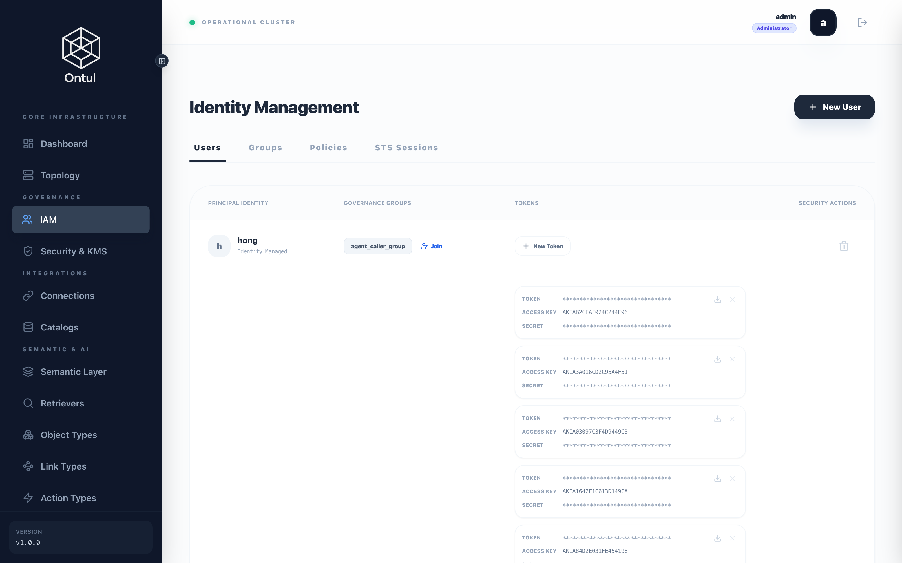
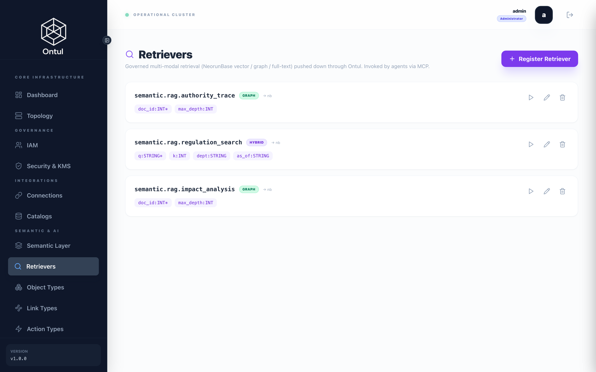
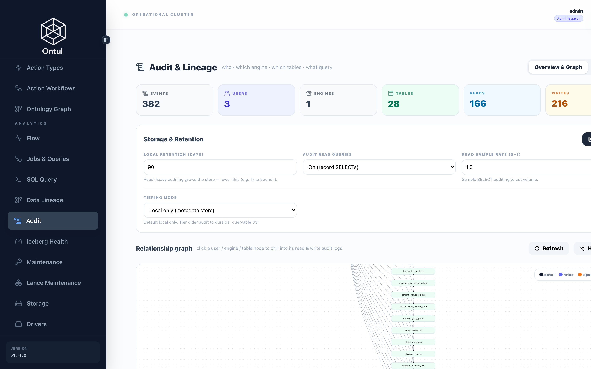
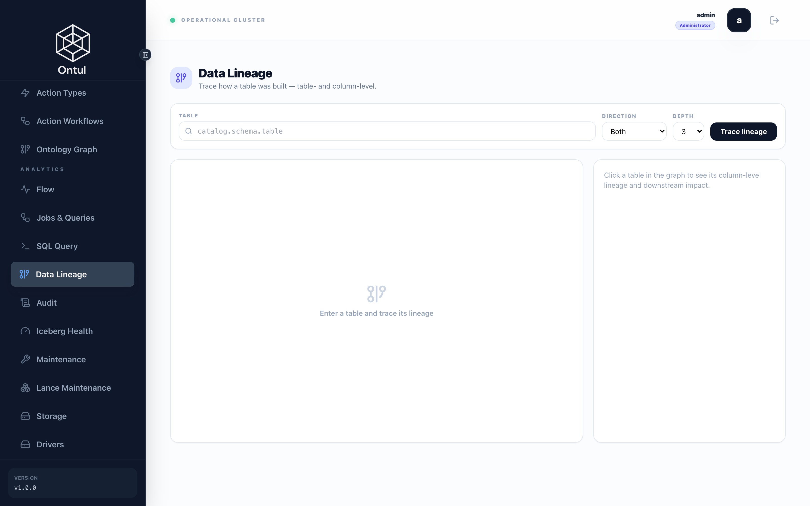

# IAM and retrievers — same question, different answer

The agent **runs as the person asking**. It is not a service account with broad
access that filters afterwards: a row that caller cannot read is a row the agent
cannot read, and that stays true however the question is phrased.

"박부장 연봉 알려줘" ("tell me the manager's salary") returns nothing because of a
**row filter**, not because the prompt says so. Prompts are negotiable; this is
not.

---

## Three personas

| | Employee no. | Dept | Clearance | Can see |
|---|---|---|---|---|
| 홍가은 | 20170003 | DEV | none | Their own records; public and internal regulations |
| 박부장 | 20150010 | DEV | manager | Their department's records too |
| 조태윤 | 20090001 | HR | hr | Company-wide HR records; restricted regulations |

Asked the same question — *"tell me the disciplinary scale"* — 홍가은 is told it
could not be found and 조태윤 gets the document. There are not two retrievers: the
**row filter makes the candidate set different**.



---

## The policies

### The agent caller — the baseline persona

**`demo/schema/iam/01_agent_caller.json`**

```json
{
  "_comment": "Baseline for an ordinary employee talking to the agent. The agent inherits this identity; it never runs with more authority than the person asking.",
  "Version": "2024-01-01",
  "Statement": [
    {
      "Sid": "ReadCitableRegulations",
      "Effect": "Allow",
      "Action": [
        "data:Select",
        "data:SelectTable"
      ],
      "Resource": [
        "semantic.reg.*",
        "data:table:semantic.reg.*"
      ],
      "Condition": "sensitivity <> '대외비'",
      "_condition_note": "'대외비', not 'RESTRICTED'. The ledger stores the classification the documents themselves use, and a filter written against a value that never occurs is always true — so the policy read as if it excluded restricted regulations while excluding nothing at all. Nothing errors on a comparison to a value that does not exist.",
      "_ontology_note": "온톨로지 객체 조회는 읽기 원본에 대해 data:SelectTable 을 요구합니다. 객체가 시맨틱 뷰를 읽으므로 이 한 문장이 SQL 경로와 온톨로지 경로를 모두 덮습니다 — 분류 조건도 한 번만 쓰면 됩니다."
    },
    {
      "Sid": "InvokeRetrievers",
      "_comment": "The retriever route authorises data:SelectTable against the bare fqn, while a SELECT authorises data:Select against data:table:<fqn>. Two spellings for reading, so the grant covers both — a policy written in only one of them fails as a 403 with no indication of which rule was missing.",
      "Effect": "Allow",
      "Action": [
        "data:Select",
        "data:SelectTable"
      ],
      "Resource": [
        "semantic.rag.*",
        "data:table:semantic.rag.*"
      ],
      "Condition": "sensitivity <> '대외비'",
      "_condition_note": "리트리버는 semantic.rag.* 이고 규정 뷰는 semantic.reg.* 라, 뷰에만 조건을 걸면 검색 경로가 그 조건을 지나치지 않습니다. 실제로 그래서 일반 직원에게 대외비 규정이 검색되었습니다. 조건은 읽기 경로마다 필요합니다."
    },
    {
      "Sid": "RequestRevision",
      "_comment": "개정 요청은 에이전트가 할 수 있는 유일한 쓰기입니다. 액션 호출은 그 자체로 인가 대상이고(ontology:InvokeAction), 실행되는 것은 관리자가 작성한 SQL 템플릿뿐입니다 — 호출자가 문장을 고를 수 없습니다.",
      "Effect": "Allow",
      "Action": [
        "ontology:InvokeAction",
        "data:Insert"
      ],
      "Resource": [
        "reg.ontology.request_revision",
        "ice.reg.revision_requests",
        "data:table:ice.reg.revision_requests"
      ]
    },
    {
      "Sid": "OwnHrRecordOnly",
      "_comment": "The reason this is a row filter and not a prompt rule: '박부장 연봉 알려줘' has to return nothing, and it has to keep returning nothing when the question is rephrased.",
      "Effect": "Allow",
      "Action": [
        "data:Select",
        "data:SelectTable"
      ],
      "Resource": [
        "semantic.hr.employees",
        "semantic.hr.leave_balance",
        "semantic.hr.expenses",
        "data:table:semantic.hr.employees",
        "data:table:semantic.hr.leave_balance",
        "data:table:semantic.hr.expenses"
      ],
      "Condition": "\"사번\" = '${user.attr.emp_no}'",
      "_identifier_note": "Korean identifiers are double-quoted. Ontul's SQL lexer rejects a bare 사번 outright — the error is a lexical one at the column position and says nothing about identifiers, so it reads like a broken policy rather than a quoting rule."
    },
    {
      "Sid": "NationalIdIsRemovedNotMasked",
      "_comment": "Deny rather than Mask. A mask still lets WHERE rrn = '...' confirm a guess, because masking rewrites the output schema and not the predicate.",
      "Effect": "Deny",
      "Action": "data:Select",
      "Resource": "semantic.hr.*",
      "Columns": [
        "주민등록번호",
        "rrn"
      ]
    },
    {
      "Sid": "ContactBlunted",
      "Effect": "Mask",
      "Action": "data:Select",
      "Resource": "semantic.hr.employees",
      "MaskedColumns": {
        "연락처": "SUBSTRING(\"연락처\" FROM 1 FOR 4) || '****' || SUBSTRING(\"연락처\" FROM 9)"
      },
      "_expression_note": "SUBSTRING(x FROM a FOR b), not regexp_replace: the planner is Calcite and has no REGEXP_REPLACE. 010-7850-3702 becomes 010-****-3702 — enough to confirm a number someone already has, not enough to learn one."
    },
    {
      "Sid": "RegulationProseRedacted",
      "_comment": "A chunk is one VARCHAR, so masking it wholesale would return an empty result rather than a protected one. The mask swaps to the redacted twin the pipeline already produced.",
      "Effect": "Mask",
      "Action": "data:Select",
      "Resource": "semantic.reg.*",
      "MaskedColumns": {
        "text": "CASE WHEN '${user.attr.clearance}' IN ('hr','security') THEN text ELSE text_redacted END"
      }
    },
    {
      "Sid": "OntologyGraphVertex",
      "_comment": "RegulationNode 만 서빙 표를 직접 읽습니다. GRAPH 순회가 이웃 정점을 NeorunBase 안에서 조인하기 때문에 대상이 그 카탈로그에 있어야 하고, 시맨틱 뷰로 바꿀 수 없습니다. 본문은 담기지 않고 제목과 위계만 있습니다.",
      "Effect": "Allow",
      "Action": [
        "data:Select",
        "data:SelectTable"
      ],
      "Resource": [
        "nb.public.doc_nodes",
        "data:table:nb.public.doc_nodes"
      ]
    }
  ]
}
```


### Department manager

**`demo/schema/iam/02_dept_manager.json`**

```json
{
  "_comment": "부서장. Sees the team, but not what the team earns — a manager needs headcount and leave, not compensation.",
  "Version": "2024-01-01",
  "Statement": [
    {
      "Sid": "TeamRows",
      "Effect": "Allow",
      "Action": [
        "data:Select",
        "data:SelectTable"
      ],
      "Resource": [
        "semantic.hr.employees",
        "semantic.hr.leave_balance",
        "semantic.hr.expenses",
        "semantic.hr.purchase_orders",
        "data:table:semantic.hr.employees",
        "data:table:semantic.hr.leave_balance",
        "data:table:semantic.hr.expenses",
        "data:table:semantic.hr.purchase_orders"
      ],
      "Condition": "\"부서코드\" = '${user.attr.dept}'",
      "_ontology_note": "온톨로지 객체 조회는 같은 대상에 대해 data:SelectTable 을 요구합니다 — SELECT 는 data:Select 를, 객체 경로는 data:SelectTable 을 봅니다. 읽기의 철자가 둘이라 한쪽만 적으면 이유를 말하지 않는 403 이 됩니다."
    },
    {
      "Sid": "InvokeRetrievers",
      "_comment": "The retriever route authorises data:SelectTable against the bare fqn, while a SELECT authorises data:Select against data:table:<fqn>. Two spellings for reading, so the grant covers both — a policy written in only one of them fails as a 403 with no indication of which rule was missing.",
      "Effect": "Allow",
      "Action": [
        "data:Select",
        "data:SelectTable"
      ],
      "Resource": [
        "semantic.rag.*",
        "data:table:semantic.rag.*"
      ],
      "Condition": "sensitivity <> '대외비'",
      "_condition_note": "리트리버는 semantic.rag.* 이고 규정 뷰는 semantic.reg.* 라, 뷰에만 조건을 걸면 검색 경로가 그 조건을 지나치지 않습니다. 실제로 그래서 일반 직원에게 대외비 규정이 검색되었습니다. 조건은 읽기 경로마다 필요합니다."
    },
    {
      "Sid": "InternalRegulations",
      "Effect": "Allow",
      "Action": [
        "data:Select",
        "data:SelectTable"
      ],
      "Resource": [
        "semantic.reg.*",
        "data:table:semantic.reg.*"
      ],
      "Condition": "sensitivity <> '대외비'",
      "_condition_note": "'대외비', not 'RESTRICTED'. The ledger stores the classification the documents themselves use, and a filter written against a value that never occurs is always true — so the policy read as if it excluded restricted regulations while excluding nothing at all. Nothing errors on a comparison to a value that does not exist.",
      "_ontology_note": "온톨로지 객체 조회는 같은 대상에 대해 data:SelectTable 을 요구합니다 — SELECT 는 data:Select 를, 객체 경로는 data:SelectTable 을 봅니다. 읽기의 철자가 둘이라 한쪽만 적으면 이유를 말하지 않는 403 이 됩니다."
    },
    {
      "Sid": "NationalIdRemoved",
      "Effect": "Deny",
      "Action": "data:Select",
      "Resource": "semantic.hr.*",
      "Columns": [
        "주민등록번호",
        "rrn"
      ]
    },
    {
      "Sid": "OntologyGraphVertex",
      "_comment": "GRAPH 순회는 이웃 정점을 NeorunBase 안에서 조인하므로 대상이 그 카탈로그에 있어야 합니다. 시맨틱 뷰로 대체할 수 없는 유일한 자리입니다.",
      "Effect": "Allow",
      "Action": [
        "data:Select",
        "data:SelectTable"
      ],
      "Resource": [
        "nb.public.doc_nodes",
        "data:table:nb.public.doc_nodes"
      ]
    }
  ]
}
```


### HR

**`demo/schema/iam/03_hr_staff.json`**

```json
{
  "_comment": "인사팀. Sees every row and the restricted regulations, and still does not get raw national IDs — breadth of access is not the same as needing an identifier in the clear.",
  "Version": "2024-01-01",
  "Statement": [
    {
      "Sid": "AllHrRows",
      "Effect": "Allow",
      "Action": [
        "data:Select",
        "data:SelectTable"
      ],
      "Resource": [
        "semantic.hr.*",
        "data:table:semantic.hr.*"
      ],
      "_ontology_note": "온톨로지 객체 조회는 같은 대상에 대해 data:SelectTable 을 요구합니다 — SELECT 는 data:Select 를, 객체 경로는 data:SelectTable 을 봅니다. 읽기의 철자가 둘이라 한쪽만 적으면 이유를 말하지 않는 403 이 됩니다."
    },
    {
      "Sid": "InvokeRetrievers",
      "_comment": "The retriever route authorises data:SelectTable against the bare fqn, while a SELECT authorises data:Select against data:table:<fqn>. Two spellings for reading, so the grant covers both — a policy written in only one of them fails as a 403 with no indication of which rule was missing.",
      "Effect": "Allow",
      "Action": [
        "data:Select",
        "data:SelectTable"
      ],
      "Resource": [
        "semantic.rag.*",
        "data:table:semantic.rag.*"
      ],
      "_condition_note": "인사팀에는 조건이 없습니다 — 대외비 규정도 검색 결과에 나와야 합니다. 그게 이 페르소나의 차이입니다."
    },
    {
      "Sid": "AllRegulationsIncludingRestricted",
      "Effect": "Allow",
      "Action": [
        "data:Select",
        "data:SelectTable"
      ],
      "Resource": [
        "semantic.reg.*",
        "data:table:semantic.reg.*"
      ],
      "_ontology_note": "온톨로지 객체 조회는 같은 대상에 대해 data:SelectTable 을 요구합니다 — SELECT 는 data:Select 를, 객체 경로는 data:SelectTable 을 봅니다. 읽기의 철자가 둘이라 한쪽만 적으면 이유를 말하지 않는 403 이 됩니다."
    },
    {
      "Sid": "NationalIdStillRemoved",
      "Effect": "Deny",
      "Action": "data:Select",
      "Resource": "semantic.hr.*",
      "Columns": [
        "주민등록번호",
        "rrn"
      ]
    },
    {
      "Sid": "CertifyOntologyForHrDomain",
      "_comment": "The minimal curation: marking a document as citable is an ownership decision, so it gets its own action rather than requiring admin.",
      "Effect": "Allow",
      "Action": "ontology:Certify",
      "Resource": "ontology.reg.*"
    },
    {
      "Sid": "OntologyGraphVertex",
      "_comment": "GRAPH 순회는 이웃 정점을 NeorunBase 안에서 조인하므로 대상이 그 카탈로그에 있어야 합니다. 시맨틱 뷰로 대체할 수 없는 유일한 자리입니다.",
      "Effect": "Allow",
      "Action": [
        "data:Select",
        "data:SelectTable"
      ],
      "Resource": [
        "nb.public.doc_nodes",
        "data:table:nb.public.doc_nodes"
      ]
    }
  ]
}
```


### The indexing job

**`demo/schema/iam/04_indexer.json`**

```json
{
  "_comment": "The pipeline identity. Reads every chunk in the clear because it has to embed the text that a caller will later see redacted, and writes only the derived tables. It never serves a user query — the agent uses the caller's identity, not this one.",
  "Version": "2024-01-01",
  "Statement": [
    {
      "Sid": "ReadLedger",
      "Effect": "Allow",
      "Action": "data:Select",
      "Resource": "data:table:ice.reg.*"
    },
    {
      "Sid": "WriteLedgerAndVectors",
      "Effect": "Allow",
      "Action": ["data:Insert", "data:Update", "data:Merge", "data:CreateTable"],
      "Resource": ["data:table:ice.reg.*", "data:table:nb.public.doc_vectors_*"]
    },
    {
      "Sid": "ReadSourceSystems",
      "Effect": "Allow",
      "Action": "data:Select",
      "Resource": ["data:table:erp.*.*", "data:table:gw.*.*"]
    },
    {
      "Sid": "NoInteractiveUse",
      "_comment": "Explicitly cannot read through the semantic layer, so a leaked pipeline credential does not become a way to query HR data with full row visibility.",
      "Effect": "Deny",
      "Action": "data:Select",
      "Resource": "semantic.*.*"
    }
  ]
}
```


**`demo/schema/iam/README.md`**

```markdown
# IAM policies

Two things have to be true at once, and they are enforced differently.

**An agent must not become a way around access control.** It runs SQL on the
caller's behalf, so whatever the caller could not read directly must stay
unreadable through the agent. That cannot be a prompt instruction — prompts are
negotiable and this is not. It is a row filter.

**Masking is a display control, not an inference control.** Ontul applies masks
to the output schema (`QueryService` checks `node.getOutputSchema()`), so a
predicate on a masked column still evaluates: `WHERE rrn = '880101-1234567'`
returns rows without ever showing the value, confirming the guess. Aggregates
over small groups leak the same way.

So sensitive columns split into two kinds:

| Nature | Mechanism | Columns |
|---|---|---|
| Existence must be hidden | `Deny` + `Columns` — removed from the schema | 주민등록번호 |
| Value shown but blunted | `Mask` — expression replaces the value | 연락처, 급여, 주소 |

`Deny` wins over `Mask` in the evaluator (`deniedColumns` are removed from
`maskedColumns`), which is the ordering these policies rely on.
```


---

## Why sensitive columns split two ways

Masking applies to the **output schema** — `QueryService` inspects
`node.getOutputSchema()`. So a predicate on a masked column still evaluates, and
still confirms a guess:

```sql
SELECT 성명 FROM semantic.hr.employees WHERE 주민등록번호 LIKE '901010%'
```

Even with the name masked, a row coming back tells you that person's date of
birth. So sensitive columns divide by nature:

| Nature | Mechanism |
|---|---|
| Existence itself must be hidden | `Deny` + `Columns` — national ID |
| Value shown but blunted | `Mask` — phone numbers, regulation prose |

Not even HR gets national IDs in the clear. **Breadth of access and needing an
identifier in plaintext are different things.**

---

## Retrievers

A retriever is a backend-native search query **given a name**. The agent does not
write SQL; it calls the name.



### Regulation search — hybrid

**`demo/schema/retrievers/01_regulation_search.json`**

```json
{
  "_comment": "Hybrid retrieval over currently-effective, citable regulation text. The caller passes a question; it never passes a vector — embedding happens server-side through the same connection that built the index, so an agent cannot introduce a second vector space by using a different model.\n\n분류 조건이 템플릿 안에 있습니다. IAM 행 필터는 SQL 경로(semantic.reg.*)에는 걸리지만 리트리버 호출 경로에는 적용되지 않아서, 뷰에만 걸어 두면 일반 직원에게 대외비 규정이 그대로 검색됩니다 — 실제로 그랬습니다. ${user.attr.clearance} 는 호출자의 IAM 속성이고 리터럴로 치환되므로 호출자가 조작할 수 없습니다.",
  "catalog": "semantic",
  "schema": "rag",
  "name": "regulation_search",
  "kind": "HYBRID",
  "_target_note": "targetCatalog, not 'backend'. The retriever names the catalog it executes against; the vector space it searches is fixed by the embedding connection inside sqlTemplate, not by this.",
  "targetCatalog": "nb",
  "params": [
    {
      "name": "q",
      "type": "STRING",
      "required": true
    },
    {
      "name": "k",
      "type": "INT",
      "required": false,
      "defaultValue": "8"
    },
    {
      "name": "dept",
      "type": "STRING",
      "required": false
    },
    {
      "name": "as_of",
      "type": "STRING",
      "required": false,
      "defaultValue": "",
      "description": "YYYY-MM-DD; empty means today",
      "default": ""
    }
  ],
  "sqlTemplate": "SELECT v.chunk_id AS chunk_id, v.doc_no AS doc_no, v.version AS version, v.article_no AS article_no, v.body AS body, v.effective_from AS effective_from, v.effective_to AS effective_to, v.owner_dept AS owner_dept, h.score AS score FROM HYBRID_SEARCH(table => 'public.doc_vectors_gen1', ts_query => ${q}, ts_index => 'ix_gen1_fts', vec_query => embed_query('emb_main', ${q}), vec_index => 'ix_gen1_ann', alpha => 0.4, beta => 0.6, k => 60) h JOIN doc_vectors_gen1 v ON v.chunk_pk = h.id WHERE v.is_official = TRUE AND (v.sensitivity <> '대외비' OR ${user.attr.clearance} IN ('hr','security')) AND v.effective_from <= COALESCE(CAST(NULLIF(${as_of}, '') AS DATE), CURRENT_DATE) AND (v.effective_to IS NULL OR v.effective_to > COALESCE(CAST(NULLIF(${as_of}, '') AS DATE), CURRENT_DATE)) ORDER BY 9 DESC LIMIT ${k}",
  "outputColumns": [
    {
      "name": "chunk_id",
      "description": "청크 식별자 {doc_no}#{version}#{ordinal}"
    },
    {
      "name": "doc_no",
      "description": "문서번호"
    },
    {
      "name": "version",
      "description": "버전"
    },
    {
      "name": "article_no",
      "description": "조문"
    },
    {
      "name": "body",
      "description": "조문 본문"
    },
    {
      "name": "effective_from",
      "description": "시행일 (전자결재 승인일)"
    },
    {
      "name": "effective_to",
      "description": "종료일 — NULL 이면 현행"
    },
    {
      "name": "owner_dept",
      "description": "소관 부서"
    },
    {
      "name": "score",
      "description": "하이브리드 융합 점수"
    }
  ],
  "_temporal_note": "The date predicate sits outside HYBRID_SEARCH but inside the same statement, so it filters the joined rows rather than the top-k. A superseded version can still consume a slot — which is why the retriever asks for more than it returns and why the view, not the ranking, is what removes expired text.",
  "_as_of_note": "Empty means today. The renderer turns every param into a literal, so a default of CURRENT_DATE would arrive quoted and be compared as the text 'CURRENT_DATE'; NULLIF folds the empty default to NULL and COALESCE supplies the date. effective_from is a real DATE in the vector table, so the comparison is a date comparison — an empty result here means no version was in force on that day, not a unit mismatch.",
  "_rerank_note": "No reranker. Hybrid fusion already happens inside the engine, and a cross-encoder is a second model container on a budget that is already ten JVMs deep. Ontul supports it through a RERANK connection when the corpus is big enough that fusion alone stops separating the top few — 121 regulation versions is not that corpus.",
  "_paramtype_note": "Param types are the retriever's own (STRING / INT / NUMBER / BOOL / VECTOR / IDENT), not SQL types. They decide how a value is rendered into the template — STRING is quoted and escaped, INT is validated as a long and rendered bare — which is what keeps a caller from reaching past the template.",
  "_template_note": "Placeholders are ${name}; the renderer turns each into a checked literal. embed_query() is resolved here too, before the SQL leaves Ontul — NeorunBase receives a vector, not a function call, because HYBRID_SEARCH is rewritten by NeorunBase itself and never passes through Ontul's planner. That is also what keeps the caller from embedding the question: a caller that embeds can embed with anything, and then the query and the index are no longer the same space.",
  "_hybrid_note": "HYBRID_SEARCH returns (id, score), so the row is joined back on _rowid. alpha/beta weight lexical against vector; the Korean analyzer is what makes '육아휴직을' match the noun in ts_query, and the vector is what makes a question that shares no words with the article still find it.",
  "_topk_note": "The search asks for 60 and the caller gets ${k}. The temporal predicate runs on the joined rows, after HYBRID_SEARCH has already chosen its top-k, so superseded versions consume slots and then vanish — ask for 5 and you get 1. Over-fetching is the honest fix here: the filter cannot move inside the search, because the search is NeorunBase's and it has no notion of which version is current.",
  "_order_note": "ORDER BY 9 — positional, because neither `h.score` nor the alias `score` resolves in ORDER BY here. 9 is the score column; it moves if the SELECT list is edited, which is the price of the only form that works."
}
```


!!! danger "The temporal predicate has to be inside the search"
    Take the top k and filter by effective date afterwards and fewer than k rows
    survive — sometimes none. The superseded version took the top slots, because
    it is the best answer to the question it used to answer.

!!! note "And so does the classification predicate"
    A row filter written for `semantic.reg.*` applies when a query names that
    view. Invoking a retriever does not name it — the retriever renders its own
    SQL against the backing engine. Written only on the view, the filter is
    absent from the path the agent actually uses, and an ordinary employee gets
    restricted text back from search seconds after being refused it in SQL.

    The retriever binds the caller's IAM attributes as `${user.attr.X}` and
    carries the predicate itself.

### Tracing authority

**`demo/schema/retrievers/02_authority_trace.json`**

```json
{
  "_comment": "Every regulation a given one derives its authority from. Depth varies per document — a guideline may sit two levels under a rule or four — so this is a traversal, not a join with a fixed number of levels. Runs inside NeorunBase via GRAPH_NEIGHBORS rather than pulling edges out and walking them client-side.",
  "catalog": "semantic",
  "schema": "rag",
  "name": "authority_trace",
  "kind": "GRAPH",
  "_target_note": "targetCatalog, not 'backend'. The retriever names the catalog it executes against; the vector space it searches is fixed by the embedding connection inside sqlTemplate, not by this.",
  "targetCatalog": "nb",
  "params": [
    {
      "name": "doc_id",
      "type": "INT",
      "required": true
    },
    {
      "name": "max_depth",
      "type": "INT",
      "required": false,
      "defaultValue": "5"
    }
  ],
  "sqlTemplate": "SELECT n.doc_no AS doc_no, n.title AS title, n.tier AS tier, n.owner_dept AS owner_dept, g.depth AS depth FROM GRAPH_NEIGHBORS(edge_table => 'public.doc_edges', seed => ${doc_id}, max_depth => ${max_depth}, edge_filter => 'CHILD_OF', max_results => 200) g JOIN doc_nodes n ON n.doc_id = g.id ORDER BY 5",
  "outputColumns": [
    {
      "name": "doc_no",
      "description": "문서번호"
    },
    {
      "name": "title",
      "description": "문서 제목"
    },
    {
      "name": "tier",
      "description": "1=최상위 2=규정 3=지침"
    },
    {
      "name": "owner_dept",
      "description": "소관 부서"
    },
    {
      "name": "depth",
      "description": "시작 문서로부터의 거리"
    }
  ],
  "_paramtype_note": "Param types are the retriever's own (STRING / INT / NUMBER / BOOL / VECTOR / IDENT), not SQL types. They decide how a value is rendered into the template — STRING is quoted and escaped, INT is validated as a long and rendered bare — which is what keeps a caller from reaching past the template.",
  "_graph_note": "Seeds on a numeric id, because that is what the traversal takes — the tool resolves doc_no to it first. Following CHILD_OF outward answers 'what does this derive its authority from', and depth is the answer's shape: a chain, not a list."
}
```


### Impact analysis

**`demo/schema/retrievers/03_impact_analysis.json`**

```json
{
  "_comment": "The reverse traversal: which guidelines depend on this regulation. This is the question 인사팀 actually has before a revision — and the one that made a document graph worth building, since neither the ledger nor the ERP can answer it alone.",
  "catalog": "semantic",
  "schema": "rag",
  "name": "impact_analysis",
  "kind": "GRAPH",
  "_target_note": "targetCatalog, not 'backend'. The retriever names the catalog it executes against; the vector space it searches is fixed by the embedding connection inside sqlTemplate, not by this.",
  "targetCatalog": "nb",
  "params": [
    {
      "name": "doc_id",
      "type": "INT",
      "required": true
    },
    {
      "name": "max_depth",
      "type": "INT",
      "required": false,
      "defaultValue": "5"
    }
  ],
  "sqlTemplate": "SELECT n.doc_no AS doc_no, n.title AS title, n.tier AS tier, n.owner_dept AS owner_dept, g.depth AS depth FROM GRAPH_NEIGHBORS(edge_table => 'public.doc_edges', seed => ${doc_id}, max_depth => ${max_depth}, edge_filter => 'DEPENDED_ON_BY', max_results => 200) g JOIN doc_nodes n ON n.doc_id = g.id ORDER BY 5",
  "outputColumns": [
    {
      "name": "doc_no",
      "description": "문서번호"
    },
    {
      "name": "title",
      "description": "문서 제목"
    },
    {
      "name": "tier",
      "description": "1=최상위 2=규정 3=지침"
    },
    {
      "name": "owner_dept",
      "description": "소관 부서"
    },
    {
      "name": "depth",
      "description": "시작 문서로부터의 거리"
    }
  ],
  "_comment_2": "Both CHILD_OF and REFERENCES are followed inbound: a guideline that merely cites 제12조 is affected by a change to 제12조 just as much as one that derives from it, and only one of those relationships is hierarchical.",
  "_paramtype_note": "Param types are the retriever's own (STRING / INT / NUMBER / BOOL / VECTOR / IDENT), not SQL types. They decide how a value is rendered into the template — STRING is quoted and escaped, INT is validated as a long and rendered bare — which is what keeps a caller from reaching past the template.",
  "_graph_note": "Walks DEPENDED_ON_BY — the CHILD_OF edges stored in reverse. The traversal only expands src → dst, so 'what depends on this' cannot be the same rows read backwards; it has to be rows. Same facts, one direction each."
}
```


**`demo/schema/retrievers/README.md`**

```markdown
# Retrievers

Three registered semantic objects. All of them take text and return rows; none
of them takes a vector.

That is deliberate. Ontul's retriever surface accepts a query vector as a
parameter, which would put the choice of embedding model in the caller's hands —
and with several agents, several chances for one of them to use a different one.
Calling `embed_query('emb_main', :q)` inside the template moves that choice to
the connection the index was built through, so an agent passing a question
cannot introduce a second vector space.

| Retriever | Answers |
|---|---|
| `regulation_search` | what the rule is, or what it was on a given date |
| `authority_trace` | which regulations this one derives from (outbound, multi-hop) |
| `impact_analysis` | which guidelines a revision would affect (inbound) |

## IAM resource form

Semantic-object routes check the **bare** fully-qualified name. A policy written
as `data:table:semantic.rag.*` does not authorise a retriever invocation —
`semantic.rag.*` does. The difference reads as "IAM is broken" rather than "the
pattern never matched", which is why it is written down here.
```


---

## Audit and lineage

Every query is audited — who, what, against which tables.



Lineage goes down to the column. Being able to retrace which file an answer came
from is what makes a regulation answer defensible when it is audited.



---

Next: [the ontology](ontology.md) — entities by name, and a governed write.
