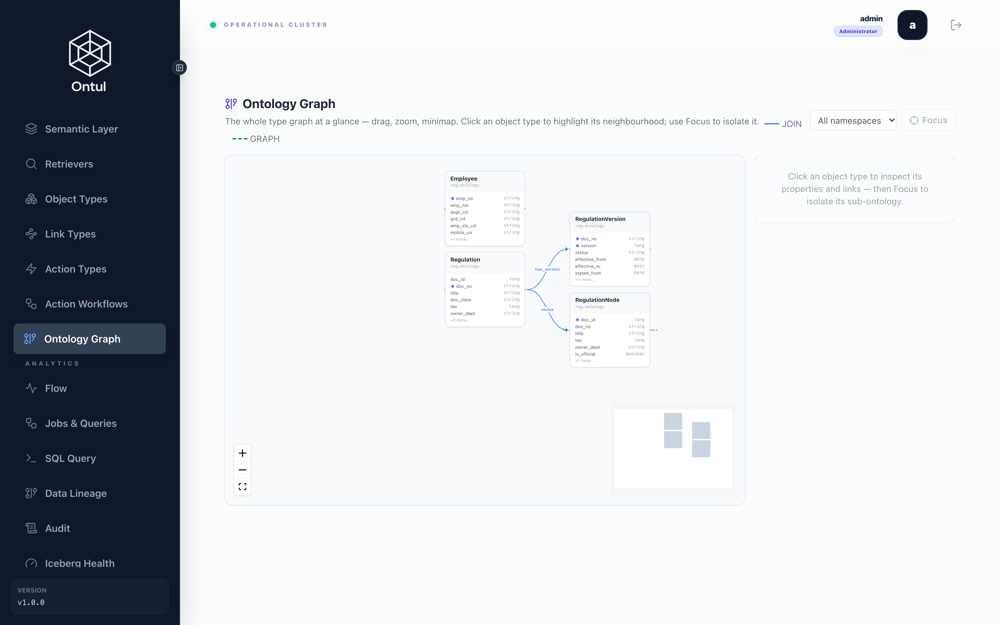
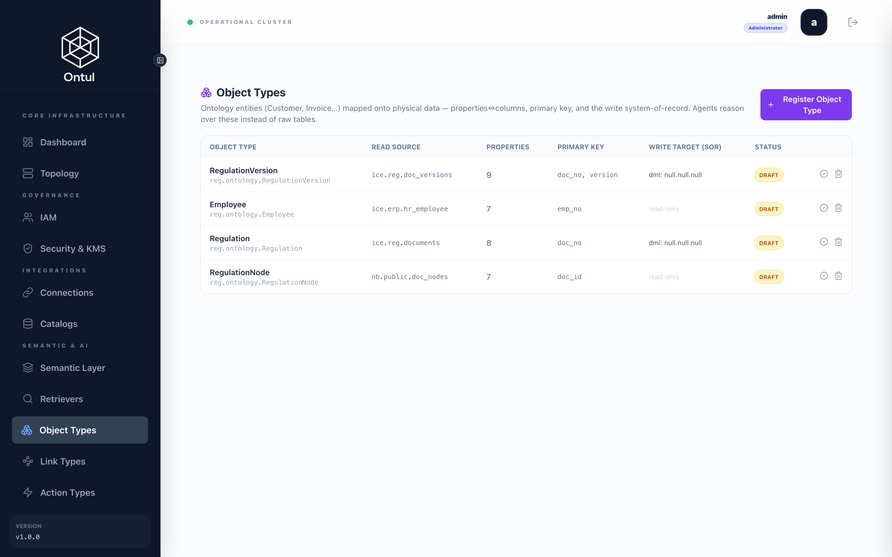
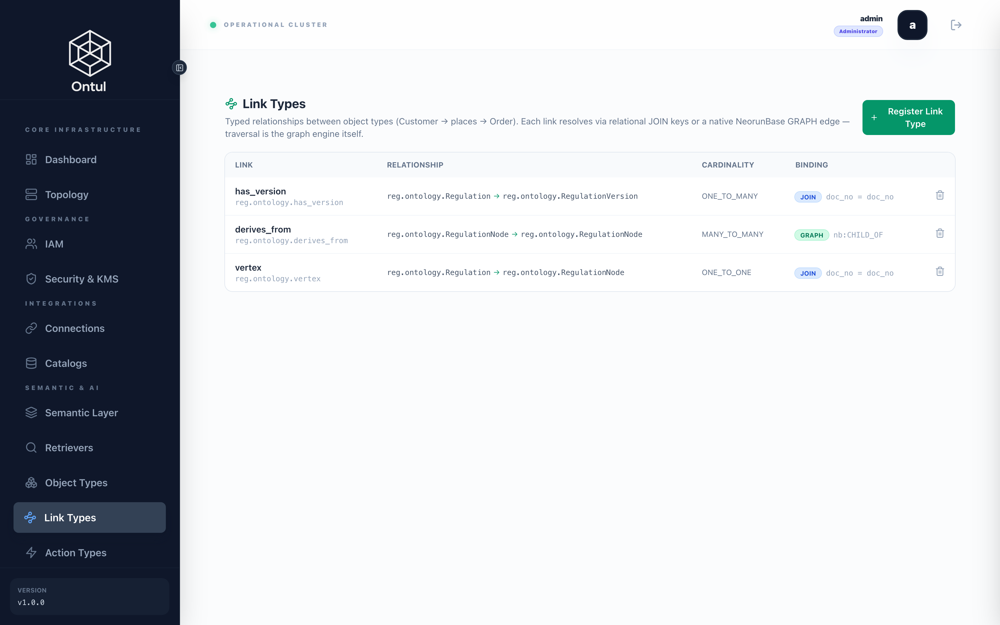
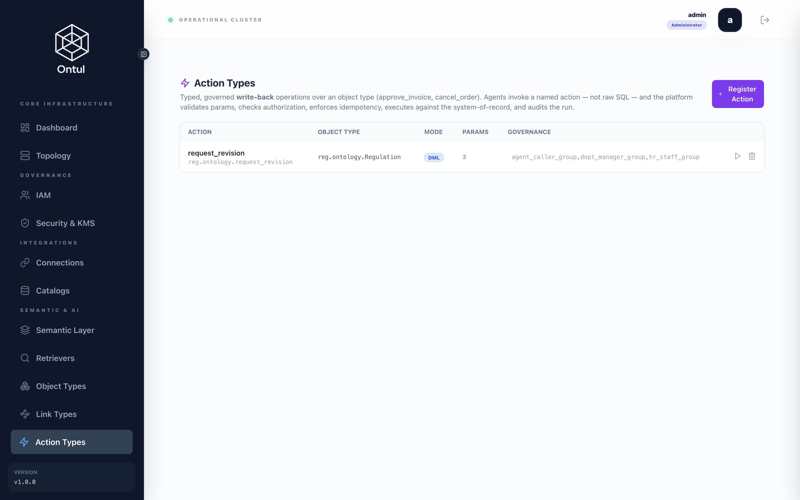

# The ontology — objects, links, actions

A semantic view curates *metrics*; a retriever curates *retrieval*. The ontology
curates **entities and what can be done to them**. Three places show the
difference in this demo.

1. **The agent writes no SQL.** "Tell me about HR-REG-003" is
   `{"filters":{"doc_no":"HR-REG-003"}}` against an object type. Which catalog,
   which table, which join — none of it has to be known. Referencing an undeclared
   property is rejected with a 400 **before** any SQL is built.
2. **The same relationship is followed two ways.** `has_version` is a JOIN: a
   regulation and its versions share a key and the engine resolves it in SQL.
   `derives_from` is a GRAPH: authority relations are edges in NeorunBase's
   instance graph, and the graph engine walks them.
3. **There is a write.** `request_revision` records a revision request in the
   ledger — the system of record, not the derived layer — with validation,
   authorization, idempotency and audit all applied.



**`demo/schema/ontology/README.md`**

```markdown
# 온톨로지 — 객체 · 링크 · 액션

시맨틱 뷰는 *지표* 를, 리트리버는 *검색* 을 큐레이션합니다. 온톨로지는
*개체와 그 개체에 할 수 있는 일* 을 큐레이션합니다. 이 데모에서 그 차이가
드러나는 지점은 셋입니다.

**1. 에이전트가 SQL 을 짜지 않아도 됩니다.** "HR-REG-003 알려줘" 는
`object-types/reg.ontology.Regulation/query` 에 `{"filters":{"doc_no":"HR-REG-003"}}`
입니다. 컬럼 이름도, 조인도, 어느 카탈로그인지도 몰라도 됩니다. 이름은
`doc_no` 이지 `documents.doc_no` 가 아니고, 그 매핑은 서버가 압니다.

**2. 같은 관계를 두 가지 방식으로 따라갑니다.** `has_version` 은 JOIN 입니다 —
규정과 그 버전은 키가 같고, 엔진이 SQL 로 풉니다. `derives_from` 은 GRAPH
입니다 — 지침이 어느 규정을 근거로 삼는지는 NeorunBase 의 인스턴스 그래프에
엣지로 있고, 순회는 그래프 엔진이 합니다. 애플리케이션 쪽 루프가 아닙니다.

**3. 쓰기가 있습니다.** `request_revision` 은 개정 요청을 원장(Iceberg)에
기록합니다. 파생 계층이 아니라 원본에 씁니다 — NeorunBase 는 다시 만들 수 있는
서빙 계층이고, 다시 만들면 사라질 곳에 기록을 남기는 것은 기록이 아닙니다.
IAM 이 그대로 적용되므로, 규정을 읽을 수 없는 사람은 그 규정의 개정을 요청할
수도 없습니다.

| 파일 | 내용 |
|---|---|
| `01_object_regulation.json` | `Regulation` — `ice.reg.documents` |
| `02_object_version.json` | `RegulationVersion` — `ice.reg.doc_versions` |
| `03_object_employee.json` | `Employee` — `ice.erp.hr_employee` (CDC 로 들어온 ERP) |
| `10_link_has_version.json` | `Regulation ─has_version→ RegulationVersion` (JOIN) |
| `11_link_derives_from.json` | `Regulation ─derives_from→ Regulation` (GRAPH) |
| `20_action_request_revision.json` | 개정 요청 — Iceberg 에 DML 로 기록 |
```


---

## Object types



### Regulation

**`demo/schema/ontology/01_object_regulation.json`**

```json
{
  "_comment": "규정 한 건. 읽는 곳이 원장이 아니라 시맨틱 뷰인 것이 중요합니다 — 정책이 한 곳에만 있게 하려는 것입니다. 원장을 직접 읽게 하면 분류 조건과 마스킹을 온톨로지 쪽에 한 벌 더 써야 하고, 한 벌 더 쓰는 순간 두 벌이 갈라집니다. 실제로 갈라졌고, 제한 규정이 객체 경로로 새어 나갔습니다.\n\ndoc_no 가 업무 키이고 doc_id 는 그래프 정점 id 입니다: derives_from(GRAPH 바인딩) 순회는 숫자 정점에서 출발하므로, doc_no 로 객체를 찾은 다음 그 doc_id 로 순회합니다.",
  "catalog": "reg",
  "schema": "ontology",
  "name": "Regulation",
  "readSource": "semantic.reg.doc_index",
  "primaryKey": [
    "doc_no"
  ],
  "properties": [
    {
      "name": "doc_id",
      "type": "long",
      "column": "doc_id",
      "synonyms": [
        "정점 id",
        "graph vertex id"
      ]
    },
    {
      "name": "doc_no",
      "type": "string",
      "column": "doc_no",
      "synonyms": [
        "규정번호",
        "문서번호"
      ]
    },
    {
      "name": "title",
      "type": "string",
      "column": "title",
      "synonyms": [
        "제목",
        "규정명"
      ]
    },
    {
      "name": "tier",
      "type": "long",
      "column": "tier",
      "synonyms": [
        "위계",
        "단계"
      ]
    },
    {
      "name": "owner_dept",
      "type": "string",
      "column": "owner_dept",
      "synonyms": [
        "소관부서",
        "주관부서"
      ]
    },
    {
      "name": "is_official",
      "type": "boolean",
      "column": "is_official",
      "synonyms": [
        "공식",
        "정식"
      ]
    },
    {
      "name": "sensitivity",
      "type": "string",
      "column": "sensitivity",
      "synonyms": [
        "민감도",
        "등급"
      ]
    }
  ],
  "tags": [
    "regulation",
    "governed"
  ],
  "status": "CERTIFIED"
}
```


`doc_no` is the business key and `doc_id` is the graph vertex id. Note that the
object reads a **governed semantic view**, not the raw ledger. Reading the ledger
directly would mean writing the classification condition a second time, and the
two copies diverged the moment they existed: restricted regulations leaked through
the object path while search correctly refused them.

### RegulationVersion

**`demo/schema/ontology/02_object_version.json`**

```json
{
  "_comment": "규정의 한 판. effective_from 은 부칙이 아니라 결재 승인일입니다 — 이 데모 전체가 그 구분 위에 서 있습니다. 읽는 곳은 시맨틱 뷰이고, 그래서 분류 조건이 여기에도 그대로 적용됩니다.",
  "catalog": "reg",
  "schema": "ontology",
  "name": "RegulationVersion",
  "readSource": "semantic.reg.version_history",
  "primaryKey": [
    "doc_no",
    "version"
  ],
  "properties": [
    {
      "name": "doc_no",
      "type": "string",
      "column": "doc_no",
      "synonyms": [
        "규정번호"
      ]
    },
    {
      "name": "title",
      "type": "string",
      "column": "title",
      "synonyms": [
        "제목"
      ]
    },
    {
      "name": "version",
      "type": "long",
      "column": "version",
      "synonyms": [
        "판",
        "버전"
      ]
    },
    {
      "name": "status",
      "type": "string",
      "column": "status",
      "synonyms": [
        "상태",
        "시행/폐지"
      ]
    },
    {
      "name": "effective_from",
      "type": "date",
      "column": "effective_from",
      "synonyms": [
        "시행일",
        "발효일",
        "승인일"
      ]
    },
    {
      "name": "effective_to",
      "type": "date",
      "column": "effective_to",
      "synonyms": [
        "종료일",
        "폐지일"
      ]
    },
    {
      "name": "stated_from",
      "type": "date",
      "column": "stated_from",
      "synonyms": [
        "부칙 시행일"
      ]
    },
    {
      "name": "date_mismatch",
      "type": "boolean",
      "column": "date_mismatch",
      "synonyms": [
        "시행일 불일치"
      ]
    },
    {
      "name": "approval_id",
      "type": "string",
      "column": "approval_id",
      "synonyms": [
        "결재번호"
      ]
    },
    {
      "name": "sensitivity",
      "type": "string",
      "column": "sensitivity",
      "synonyms": [
        "민감도"
      ]
    }
  ],
  "tags": [
    "regulation",
    "temporal"
  ],
  "status": "CERTIFIED"
}
```


### Employee — the ERP copy that arrived by CDC

**`demo/schema/ontology/03_object_employee.json`**

```json
{
  "_comment": "직원. CDC 로 Iceberg 에 들어온 ERP 사본을 읽되, 원장이 아니라 시맨틱 뷰를 읽습니다 — 그 뷰에 사번 행 필터와 주민등록번호 Deny 가 걸려 있습니다. 원장을 직접 열어 주면 온톨로지 경로가 그 정책을 우회하는 뒷문이 됩니다.",
  "catalog": "reg",
  "schema": "ontology",
  "name": "Employee",
  "readSource": "semantic.hr.employees",
  "primaryKey": [
    "사번"
  ],
  "properties": [
    {
      "name": "사번",
      "type": "string",
      "column": "사번",
      "synonyms": [
        "emp_no",
        "사원번호"
      ]
    },
    {
      "name": "성명",
      "type": "string",
      "column": "성명",
      "synonyms": [
        "emp_nm",
        "이름"
      ]
    },
    {
      "name": "부서",
      "type": "string",
      "column": "부서",
      "synonyms": [
        "dept",
        "부서코드"
      ]
    },
    {
      "name": "직급",
      "type": "string",
      "column": "직급",
      "synonyms": [
        "grade"
      ]
    },
    {
      "name": "연락처",
      "type": "string",
      "column": "연락처",
      "synonyms": [
        "mobile"
      ],
      "pii": true
    }
  ],
  "tags": [
    "hr",
    "pii"
  ],
  "status": "CERTIFIED"
}
```


### RegulationNode — the same regulation, on the graph

**`demo/schema/ontology/04_object_regulation_node.json`**

```json
{
  "_comment": "그래프 위의 규정 — 서빙 쪽 정점입니다. Regulation 과 같은 개체를 가리키지만 읽는 곳이 다릅니다: Regulation 은 원장(Iceberg)이고 이쪽은 NeorunBase 의 doc_nodes 입니다. 굳이 나눈 이유는 GRAPH 순회가 이웃 정점을 NeorunBase 안에서 대상 테이블에 조인해 돌려주기 때문입니다 — 대상이 Iceberg 테이블이면 'Table not found: ice.reg.documents' 가 됩니다. 정점 id 는 원장이 부여한 doc_id 그대로라, 두 객체는 같은 번호로 서로를 가리킵니다.",
  "catalog": "reg",
  "schema": "ontology",
  "name": "RegulationNode",
  "readSource": "nb.public.doc_nodes",
  "primaryKey": ["doc_id"],
  "properties": [
    {"name": "doc_id", "type": "long", "column": "doc_id", "synonyms": ["정점 id"]},
    {"name": "doc_no", "type": "string", "column": "doc_no", "synonyms": ["규정번호"]},
    {"name": "title", "type": "string", "column": "title", "synonyms": ["제목"]},
    {"name": "tier", "type": "long", "column": "tier", "synonyms": ["위계"]},
    {"name": "owner_dept", "type": "string", "column": "owner_dept", "synonyms": ["소관부서"]},
    {"name": "is_official", "type": "boolean", "column": "is_official", "synonyms": ["공식"]},
    {"name": "sensitivity", "type": "string", "column": "sensitivity", "synonyms": ["민감도"]}
  ],
  "tags": ["regulation", "graph"],
  "status": "CERTIFIED"
}
```


!!! note "Why a regulation is two object types"
    GRAPH traversal joins the neighbouring vertices to the target table **inside
    NeorunBase**. An Iceberg table cannot be found there — the result is
    `Table not found: ice.reg.documents`. So the graph-side regulation reads the
    serving table, and the two objects point at each other through the same
    `doc_id`.

---

## Link types



### has_version — JOIN

**`demo/schema/ontology/10_link_has_version.json`**

```json
{
  "_comment": "규정과 그 판. 키가 같으니 JOIN 으로 풉니다 — 엔진이 SQL 로 만들고, 그래프 엔진은 관여하지 않습니다.",
  "catalog": "reg",
  "schema": "ontology",
  "name": "has_version",
  "fromObjectType": "reg.ontology.Regulation",
  "toObjectType": "reg.ontology.RegulationVersion",
  "cardinality": "ONE_TO_MANY",
  "binding": {"mode": "JOIN", "fromKey": "doc_no", "toKey": "doc_no"}
}
```


```bash
curl -s -X POST "$ONTUL/api/v1/link-types/reg.ontology.has_version/traverse" \
  -H "Authorization: Bearer $TOK" -H 'Content-Type: application/json' \
  -d '{"sourceKey":"HR-REG-003","select":["version","status","effective_from"],"limit":10}'
```

```json
{
  "fqn": "reg.ontology.has_version",
  "mode": "JOIN",
  "columns": ["doc_no", "version", "status", "effective_from"],
  "rows": [["HR-REG-003", 3, "EFFECTIVE", 20162], ["HR-REG-003", 2, "SUPERSEDED", 19875]],
  "sql": "SELECT t.\"doc_no\" AS \"doc_no\", … FROM semantic.reg.version_history t WHERE t.\"doc_no\" = 'HR-REG-003' LIMIT 10"
}
```

The response carries the SQL that ran. That matters: the ontology is not a layer
that hides SQL, it is one that **writes** it, and what it wrote has to be
reviewable.

### derives_from — GRAPH

**`demo/schema/ontology/11_link_derives_from.json`**

```json
{
  "_comment": "지침이 어느 규정을 근거로 삼는가. 이건 조인으로 풀 수 없습니다 — 근거 관계는 본문에서 뽑아 NeorunBase 인스턴스 그래프에 엣지로 넣은 것이고, 여러 단계를 따라가야 답이 됩니다. 순회는 그래프 엔진이 하고 애플리케이션은 결과만 받습니다. 양쪽 끝이 RegulationNode 인 이유는 순회가 이웃 정점을 NeorunBase 안에서 대상 테이블에 조인하기 때문입니다 — Iceberg 테이블을 대상으로 두면 거기서 찾지 못합니다.",
  "catalog": "reg",
  "schema": "ontology",
  "name": "derives_from",
  "fromObjectType": "reg.ontology.RegulationNode",
  "toObjectType": "reg.ontology.RegulationNode",
  "cardinality": "MANY_TO_MANY",
  "binding": {
    "mode": "GRAPH",
    "graphCatalog": "nb",
    "edgeTable": "doc_edges",
    "edgeLabel": "CHILD_OF",
    "direction": "OUT"
  }
}
```


```bash
# find the object by doc_no, then traverse from its doc_id
curl -s -X POST "$ONTUL/api/v1/link-types/reg.ontology.derives_from/traverse" \
  -H "Authorization: Bearer $TOK" -H 'Content-Type: application/json' \
  -d '{"sourceKey":"22","maxDepth":2,"select":["doc_no","title","tier"],"limit":20}'
```

```json
{
  "mode": "GRAPH",
  "columns": ["doc_no", "title", "tier"],
  "rows": [["HR-GDL-003", "징계 양정기준", 0], ["HR-REG-001", "인사규정", 0]],
  "sql": "SELECT t.doc_no AS doc_no, … FROM GRAPH_NEIGHBORS(edge_table => 'doc_edges', seed => 22, max_depth => 2, edge_filter => 'CHILD_OF') n JOIN public.doc_nodes t ON t.doc_id = n.id LIMIT 20"
}
```

The traversal runs on the `GRAPH_NEIGHBORS` TVF **inside NeorunBase**. It is not
an application loop fetching neighbours and querying again.

### vertex — the JOIN that connects the two

**`demo/schema/ontology/12_link_vertex.json`**

```json
{
  "_comment": "원장의 규정과 그래프 위의 같은 규정을 잇습니다. doc_no 로 맞물리는 JOIN 이고, 에이전트가 'HR-GDL-003 의 근거를 따라가라' 를 수행하는 경로가 이것입니다: Regulation 을 찾고 → vertex 로 정점을 얻고 → derives_from 으로 순회합니다.",
  "catalog": "reg",
  "schema": "ontology",
  "name": "vertex",
  "fromObjectType": "reg.ontology.Regulation",
  "toObjectType": "reg.ontology.RegulationNode",
  "cardinality": "ONE_TO_ONE",
  "binding": {
    "mode": "JOIN",
    "fromKey": "doc_no",
    "toKey": "doc_no"
  }
}
```


---

## Actions — a governed write



**`demo/schema/ontology/20_action_request_revision.json`**

```json
{
  "_comment": "규정 개정 요청. 에이전트가 SQL 을 짜서 INSERT 하는 것과 다른 점은 넷입니다 — 파라미터가 검증되고, 호출자가 인가되고, 멱등 키로 재시도가 안전하고, 실행이 감사에 남습니다. 요청자를 파라미터로 두지 않은 것도 같은 이유입니다: 남의 이름으로 요청할 수 있으면 감사 자료가 아닙니다. 누가 언제 불렀는지는 감사 로그가 기록합니다.",
  "catalog": "reg",
  "schema": "ontology",
  "name": "request_revision",
  "objectType": "reg.ontology.Regulation",
  "mode": "DML",
  "parameters": [
    {
      "name": "doc_no",
      "type": "STRING",
      "required": true,
      "description": "개정을 요청할 규정 번호"
    },
    {
      "name": "version",
      "type": "LONG",
      "required": true,
      "description": "현재 시행 중인 판"
    },
    {
      "name": "reason",
      "type": "STRING",
      "required": true,
      "description": "요청 사유"
    }
  ],
  "sqlTemplate": "INSERT INTO ice.reg.revision_requests (request_id, doc_no, version, reason, status) SELECT ${doc_no} || '-v' || CAST(${version} AS VARCHAR), ${doc_no}, CAST(${version} AS INTEGER), ${reason}, 'REQUESTED'",
  "allowedRoles": [
    "agent_caller_group",
    "dept_manager_group",
    "hr_staff_group"
  ],
  "requiresApproval": false,
  "tags": [
    "regulation",
    "write-back"
  ],
  "status": "CERTIFIED"
}
```


The target table.

**`demo/schema/iceberg/60_revision_requests.sql`**

```sql
-- 개정 요청 원장.
--
-- 온톨로지 액션 request_revision 이 쓰는 곳입니다. 파생 서빙 계층이 아니라
-- Iceberg 에 쓰는 것이 요점입니다 — NeorunBase 는 파이프라인이 언제든 다시
-- 만들 수 있는 사본이고, 다시 만들면 사라질 곳에 남긴 기록은 기록이 아닙니다.
--
-- "누가 언제" 가 이 표에 없는 이유가 중요합니다. 액션의 SQL 템플릿은 선언된
-- 파라미터만 치환하므로 세션 사용자를 넣을 자리가 없고, 그렇다고 requested_by
-- 를 파라미터로 받으면 남의 이름으로 요청할 수 있게 됩니다 — 위조 가능한 칸이
-- 진짜 기록 옆에 앉아 있는 것이 아무 칸도 없는 것보다 나쁩니다. 호출자와 시각은
-- 플랫폼의 감사 로그가 기록하고, 그건 호출자가 고칠 수 없습니다.
--
--   SELECT * FROM ontul.audit WHERE action = 'action:invoke'
--
-- request_id 는 (규정, 판) 하나당 하나입니다. 같은 판에 대한 두 번째 요청은 새
-- 요청이 아니라 같은 요청이고, 멱등 키가 그것을 그대로 돌려줍니다.
CREATE TABLE IF NOT EXISTS ice.reg.revision_requests (
    request_id    VARCHAR,
    doc_no        VARCHAR,
    version       INT,
    reason        VARCHAR,
    status        VARCHAR
) USING iceberg;
```


### Invoking it

```bash
curl -s -X POST "$ONTUL/api/v1/action-types/reg.ontology.request_revision/invoke" \
  -H "Authorization: Bearer $TOK" -H 'Content-Type: application/json' \
  -d '{"args":{"doc_no":"HR-REG-003","version":3,"reason":"…"},
       "idempotencyKey":"demo-req-1"}'
```

```json
{"action":"reg.ontology.request_revision","ok":true,"mode":"DML","commandTag":"INSERT 1","elapsedMs":1391}
```

Called again with the same key, it **does not write again** — it returns the
earlier result.

```sql
SELECT request_id, doc_no, version, status FROM ice.reg.revision_requests;
-- HR-REG-003-v3 | HR-REG-003 | 3 | REQUESTED     ← one row, after two calls
```

Both calls are in the audit log.

```json
{"userId":"admin","action":"action:invoke",         "resource":"reg.ontology.request_revision","details":"via=REST"}
{"userId":"admin","action":"action:invoke:replayed","resource":"reg.ontology.request_revision","details":"via=REST idempotencyKey=demo-req-1"}
```

!!! note "Why the requester is not a parameter"
    An action's SQL template substitutes only declared parameters, so there is no
    slot for the session user. Taking `requested_by` as a parameter instead would
    let anyone file **under someone else's name** — a forgeable field sitting next
    to real ones is worse than no field at all. Who called and when is recorded by
    the audit log, which the caller cannot edit.

---

## From the agent

Three tools attach to the agent's tool set — two reads and a write. The full
source is on the [agent page](agent.md).

| Tool | Ontology path |
|---|---|
| `describe_regulation` | ObjectSet query + `has_version` traversal |
| `related_regulations` | `derives_from` GRAPH traversal |
| `request_regulation_revision` | the `request_revision` action |

---

## What this adds up to

Graph RAG is already in place: vectors, full-text and the graph in one engine, so
hybrid fusion happens in the engine rather than in application code. Four things
sit on top of that.

1. **Temporal correctness is structural, not a ranking weight.** A superseded
   regulation is not scored lower; it is absent from the view.
2. **Access control lives in the engine.** The same question returns different
   rows to different people.
3. **It federates.** "How much childcare leave do I have left?" is a number that
   needs both the regulation (a document) and the balance (ERP, arriving by CDC).
4. **It is not read-only.** Actions open a governed write.
---

Next: [the agent](agent.md).
