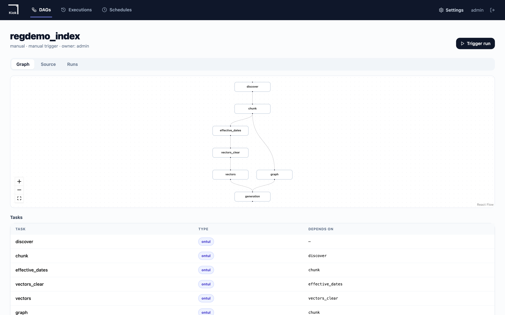
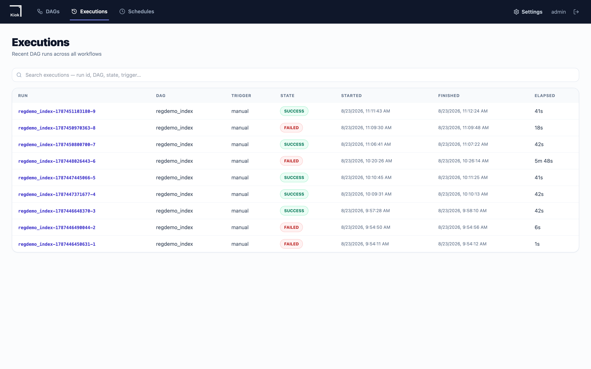

# 파이프라인 — kiok DAG 로 도는 분산 인덱싱

한두 건이면 셸 스크립트로 충분합니다. 수만·수십억 건이면 다릅니다. 이 데모의
인덱싱은 **kiok DAG** 가 순서를 들고, 무거운 일은 전부 **Ontul 워커**가 합니다.

```text
    discover ──► chunk ──► effective_dates ──► vectors_clear ──► vectors ──┐
                    └────► graph ───────────────────────────────────────────┴──► generation
```

| 태스크 | 종류 | 하는 일 |
|---|---|---|
| `discover` | Ontul PYTHON | S3 를 훑어 인입 대기열을 채웁니다 |
| `chunk` | Ontul BATCH SQL | `UNNEST(extract_chunks(uri))` — 드라이버는 데이터를 들지 않습니다 |
| `effective_dates` | Ontul BATCH SQL | 전자결재와 **연합 조인**해 승인일을 확정합니다 |
| `vectors_clear` | Ontul PYTHON | 세대 테이블을 비웁니다 |
| `vectors` | Ontul BATCH SQL | `embed_passage()` 를 Arrow 배치마다 평가합니다 |
| `graph` | Ontul PYTHON | 본문 인용에서 근거 관계를 뽑아 레이크에 씁니다 |
| `generation` | Ontul BATCH SQL | 이 세대의 신원을 기록합니다 |

!!! quote "왜 kiok 인가"
    셸 스크립트의 줄 순서는 조회할 수 없습니다. 어느 단계가 어디서 멈췄는지,
    무엇만 다시 돌리면 되는지, 어제 실행과 오늘 실행이 어떻게 달랐는지가 아무
    데도 남지 않습니다. DAG 로 옮기면 그게 전부 데이터가 됩니다.



---

## DAG 정의

**`demo/schema/dags/regdemo_index.yaml`**

```yaml
# 규정 인덱싱 파이프라인.
#
# 이 파일이 있기 전에는 단계 사이의 의존 순서가 infra/index.sh 라는 셸 스크립트
# 안에만 있었습니다. 한 번 돌리기에는 충분하지만 파이프라인이라고 하기는
# 어렵습니다 — 어느 단계가 어디서 멈췄는지, 무엇만 다시 돌리면 되는지, 어제
# 실행과 오늘 실행이 어떻게 달랐는지가 아무 데도 남지 않습니다.
#
#   discover ─→ chunk ─→ effective_dates ─→ vectors ─→ generation
#                   └──→ graph ───────────────────────────┘
#
# 무거운 일은 전부 ontul 워커가 합니다. kiok 은 순서를 지키고 결과를 기록할
# 뿐이라 데이터를 들고 있지 않습니다.
#
# 두 가지가 이 파일에 명시적으로 없습니다:
#
#   토큰 — ${conn.regdemoOntul.*} 참조만 있습니다. kiok 이 태스크 실행 직전에
#   워커에서 KMS 암호화 커넥션 저장소에서 풀어주므로, 저장된 DagSpec 에도 admin
#   UI 의 Source 탭에도 값이 남지 않습니다. 그래서 이 파일은 그대로 커밋됩니다.
#   넣는 값도 로그인 JWT 가 아니라 만료되지 않는 사용자 토큰(OTOK…)입니다 —
#   JWT 는 15분이면 끝나서 스케줄로 도는 DAG 의 다음 실행을 깨뜨립니다.
#
#   의존은 requires 입니다. depends_on 으로 적었을 때 kiok 은 모르는 키를 조용히
#   버렸고, 파일은 순서가 있어 보이는데 여섯 태스크가 전부 동시에 돌았습니다.
dag:
  id: regdemo_index
  default_timeout: 30m
tasks:
- id: discover
  type: ontul
  config:
    ontul.url: ${conn.regdemoOntul.url}
    ontul.token: ${conn.regdemoOntul.token}
    ontul.jobType: PYTHON
    ontul.scriptPath: ${conn.regdemoJobs.discover_job}
    ontul.args:
      bucket: iceberg-warehouse
      prefix: corpus/
      run_id: '#{ nowFormatted(''yyyyMMdd-HHmmss'') }'
      s3_endpoint: ${conn.regdemoS3.endpoint}
      s3_access_key: ${conn.regdemoS3.accessKey}
      s3_secret_key: ${conn.regdemoS3.secretKey}
    ontul.jobConfig:
      ontul.job.driver.mode: worker
      ontul.deps.s3.connectionId: regdemoS3
    ontul.pollIntervalMs: '2000'
  timeout: 10m
- id: chunk
  type: ontul
  requires:
  - discover
  timeout: 20m
  config:
    ontul.url: ${conn.regdemoOntul.url}
    ontul.token: ${conn.regdemoOntul.token}
    ontul.jobType: BATCH
    ontul.pollIntervalMs: '3000'
  script: "INSERT INTO ice.reg.doc_chunks\n  (chunk_pk, chunk_id, doc_no, version, ordinal_no, article_no,\
    \ article_title,\n   page_from, page_to, text, token_count)\nSELECT\n  chunk_pk(q.s3_uri || '#' ||\
    \ jfield(c, 'ordinal_no')),\n  q.s3_uri || '#' || jfield(c, 'ordinal_no'),\n  v.doc_no,\n  v.version,\n\
    \  CAST(jfield(c, 'ordinal_no') AS INTEGER),\n  jfield(c, 'article_no'),\n  jfield(c, 'article_title'),\n\
    \  CAST(jfield(c, 'page_from') AS INTEGER),\n  CAST(jfield(c, 'page_to') AS INTEGER),\n  jfield(c,\
    \ 'text'),\n  CAST(jfield(c, 'token_count') AS INTEGER)\nFROM ice.reg.ingest_queue q\nJOIN ice.reg.doc_versions\
    \ v ON v.s3_uri = q.s3_uri,\n     UNNEST(extract_chunks(q.s3_uri)) AS t(c)\nWHERE q.status = 'PENDING'\n"
- id: effective_dates
  type: ontul
  requires:
  - chunk
  config:
    ontul.url: ${conn.regdemoOntul.url}
    ontul.token: ${conn.regdemoOntul.token}
    ontul.jobType: BATCH
    ontul.pollIntervalMs: '2000'
  script: 'UPDATE ice.reg.ingest_queue SET status = ''EXTRACTED'' WHERE status = ''PENDING''

    '
- id: vectors_clear
  type: ontul
  requires:
  - effective_dates
  timeout: 10m
  config:
    ontul.url: ${conn.regdemoOntul.url}
    ontul.token: ${conn.regdemoOntul.token}
    ontul.jobType: PYTHON
    ontul.scriptPath: ${conn.regdemoJobs.clear_vectors_job}
    ontul.args:
      host: ${conn.regdemoNeorun.host}
      port: ${conn.regdemoNeorun.port}
      database: ${conn.regdemoNeorun.database}
      user: ${conn.regdemoNeorun.username}
      password: ${conn.regdemoNeorun.password}
    ontul.jobConfig:
      ontul.job.driver.mode: worker
      ontul.deps.s3.connectionId: regdemoS3
    ontul.pollIntervalMs: '2000'
- id: vectors
  type: ontul
  requires:
  - vectors_clear
  timeout: 30m
  config:
    ontul.url: ${conn.regdemoOntul.url}
    ontul.token: ${conn.regdemoOntul.token}
    ontul.jobType: BATCH
    ontul.pollIntervalMs: '5000'
  script: "INSERT INTO nb.public.doc_vectors_gen1\n    (chunk_pk, chunk_id, doc_no, version, article_no,\
    \ effective_from, effective_to,\n     is_official, sensitivity, owner_dept, body, embedding)\nSELECT\n\
    \    c.chunk_pk,\n    c.chunk_id,\n    c.doc_no,\n    c.version,\n    c.article_no,\n    v.effective_from,\n\
    \    v.effective_to,\n    d.is_official,\n    d.sensitivity,\n    d.owner_dept,\n    c.text,\n   \
    \ embed_passage('emb_main', c.text)\nFROM ice.reg.doc_chunks c\nJOIN ice.reg.doc_versions v\n  ON\
    \ c.doc_no || '#' || CAST(c.version AS VARCHAR)\n   = v.doc_no || '#' || CAST(v.version AS VARCHAR)\n\
    JOIN ice.reg.documents d ON d.doc_no = c.doc_no\n"
- id: graph
  type: ontul
  requires:
  - chunk
  config:
    ontul.url: ${conn.regdemoOntul.url}
    ontul.token: ${conn.regdemoOntul.token}
    ontul.jobType: PYTHON
    ontul.scriptPath: ${conn.regdemoJobs.build_graph_job}
    ontul.jobConfig:
      ontul.job.driver.mode: worker
      ontul.deps.s3.connectionId: regdemoS3
    ontul.pollIntervalMs: '3000'
  timeout: 15m
- id: generation
  type: ontul
  requires:
  - vectors
  - graph
  config:
    ontul.url: ${conn.regdemoOntul.url}
    ontul.token: ${conn.regdemoOntul.token}
    ontul.jobType: BATCH
    ontul.pollIntervalMs: '2000'
  script: 'SELECT count(*) AS docs FROM ice.reg.documents

    '
```


!!! danger "`requires` 이지 `depends_on` 이 아닙니다"
    kiok 은 모르는 키를 **조용히 버립니다**. `depends_on` 으로 적었을 때 파일은
    순서가 있어 보이는데 여섯 태스크가 전부 동시에 돌았고, 실행은 빨랐고,
    아무것도 실패하지 않았습니다. 그래프 화면에 선이 없는 것이 유일한 단서였습니다.

!!! note "토큰이 파일에 없습니다"
    `${conn.regdemoOntul.token}` 참조만 있습니다. kiok 이 태스크 실행 직전에
    워커에서 KMS 암호화 커넥션 저장소에서 풀어주므로, 저장된 DagSpec 에도 admin
    UI 에도 값이 남지 않습니다. 그래서 이 파일은 그대로 커밋됩니다. 넣는 값도
    로그인 JWT 가 아니라 만료되지 않는 사용자 토큰(`OTOK…`)입니다 — JWT 는
    15분이면 끝나서 스케줄로 도는 DAG 의 다음 실행을 깨뜨립니다.

---

## 1. 원장 적재 (로컬 파이썬)

이 단계만 로컬에서 돕니다. PDF/DOCX/XLSX 를 읽고 규정 목록과 대조하는 일은
파일시스템과 포맷 라이브러리가 필요하고, 결과는 원장 몇만 행입니다.

```bash
python3 -m venv .venv && .venv/bin/pip install -e pipeline
( cd pipeline/src && PYTHONPATH=. ../../.venv/bin/python -m regdemo_pipeline.jobs.ingest \
    --out ../../out --no-upload )
```

**`demo/pipeline/src/regdemo_pipeline/jobs/ingest.py`**

```python
"""
Ingest: files on disk become rows in the ledger.

What this job does and, more importantly, what it deliberately does not do.

It does not embed anything. Embedding is a separate job (jobs/10_index_vectors.sql)
that runs inside Ontul, distributed across workers, because that is where the
data already is. Doing it here would mean pulling every chunk to one machine and
pushing 6,000 vectors back — and it would put the model behind a Python import
instead of behind the connection that the retriever also names, which is the one
thing that guarantees an index and a query are comparable.

It does not decide when a regulation took effect. That comes from the approval
system and is applied by jobs/20_effective_dates.sql. A document's 부칙 states an
intended date; the approval is what makes it binding, and the two disagree often
enough that trusting the document is a real source of wrong answers.

What it does own is the part that genuinely needs a filesystem: reading formats,
finding article boundaries, and deciding what each file actually is. Everything
downstream is SQL.

    python -m regdemo_pipeline.jobs.ingest --out ./out --ontul http://localhost:8080
"""
from __future__ import annotations

import argparse
import json
import sys
import time
import uuid
from dataclasses import dataclass, field
from datetime import datetime, timezone
from pathlib import Path

from ..extract import extract
from ..extract.base import Route
from ..chunk.split import chunk as chunk_sections
from ..relations.register import load_register, match, unregistered_rows

BATCH_ROWS = 200          # rows per INSERT — large enough to matter, small enough to read in an error
BUCKET = "iceberg-warehouse"
PREFIX = "corpus/"


# ── SQL literals ────────────────────────────────────────────────────────────
# Hand-built because these statements go through Ontul's REST endpoint, not a
# driver with bind parameters. Everything that reaches here is machine-generated
# corpus text, but it still contains quotes and newlines, and getting this
# wrong produces a syntax error hundreds of rows into a batch.
class Raw(str):
    """A value that is already SQL and must not be quoted."""


def lit(v) -> str:
    if isinstance(v, Raw):
        return str(v)
    if v is None:
        return "NULL"
    if isinstance(v, bool):
        return "TRUE" if v else "FALSE"
    if isinstance(v, (int, float)):
        return str(v)
    s = str(v).replace("\\", "\\\\").replace("'", "''")
    return "'" + s + "'"


def row(*vals) -> str:
    return "(" + ",".join(lit(v) for v in vals) + ")"


@dataclass
class Stats:
    seen: int = 0
    extracted: int = 0
    chunks: int = 0
    uploaded: int = 0
    skipped: dict[str, int] = field(default_factory=dict)
    unmatched: list[str] = field(default_factory=list)

    def skip(self, reason: str) -> None:
        self.skipped[reason] = self.skipped.get(reason, 0) + 1


class Ontul:
    """The master, reached over its admin API.

    Statements go through the master rather than straight to a worker so that
    IAM, lineage and the query log see them. An ingest that bypasses those is an
    ingest nobody can audit afterwards.
    """

    def __init__(self, url: str, user: str, password: str):
        import requests
        self.s = requests.Session()
        self.url = url.rstrip("/")
        r = self.s.post(f"{self.url}/admin/auth/login",
                        json={"username": user, "password": password}, timeout=30)
        r.raise_for_status()
        body = r.json()
        # The response names it accessToken; "token" is empty and produces a
        # Bearer header that fails as Unauthorized rather than as a bad login.
        self.token = body.get("accessToken") or body.get("token")
        if not self.token:
            raise SystemExit(f"login returned no token: {body}")
        self.s.headers["Authorization"] = f"Bearer {self.token}"

    def sql(self, statement: str) -> dict:
        """Run one statement, and treat a reported failure as a failure.

        /admin/query/execute answers 200 for a statement that did not run and puts
        the reason in the body. Checking only the status code makes an ingest
        report every row as loaded while the table stays empty — which is worse
        than crashing, because the next stage then fails somewhere unrelated and
        the count that was wrong is three steps back.
        """
        r = self.s.post(f"{self.url}/admin/query/execute",
                        json={"sql": statement}, timeout=300)
        head = statement[:180].replace("\n", " ")
        if r.status_code >= 300:
            raise SystemExit(f"SQL failed ({r.status_code}): {r.text[:400]}\n  -> {head}")
        body = r.json() if r.content else {}
        if body.get("status") == "error" or body.get("error"):
            raise SystemExit(f"SQL failed: {body.get('error') or body}\n  -> {head}")
        return body

    def count(self, table: str) -> int:
        body = self.sql(f"SELECT count(*) FROM {table}")
        rows = body.get("rows") or []
        return int(rows[0][0]) if rows and rows[0] else 0

    def insert(self, table: str, cols: list[str], rows: list[str], exact: bool = True) -> int:
        """Insert, then check the table actually holds what was inserted.

        Reporting the number of rows sent is not the same as reporting the number
        of rows there. A DELETE that silently did nothing leaves the previous load
        in place, the insert succeeds on top of it, and the job prints a number
        that looks right while the table holds a multiple of it. That stays
        invisible until something downstream counts — which, if it is a retriever,
        means duplicated evidence in an answer rather than an error.
        """
        for i in range(0, len(rows), BATCH_ROWS):
            batch = rows[i:i + BATCH_ROWS]
            self.sql(f"INSERT INTO {table} ({','.join(cols)}) VALUES {','.join(batch)}")
        if not exact:
            # An append-only history: it is supposed to grow across runs, so the
            # count is not a statement about this run.
            return len(rows)
        actual = self.count(table)
        if actual != len(rows):
            raise SystemExit(
                f"{table}: inserted {len(rows)} rows but the table holds {actual}. "
                f"A preceding DELETE did not take effect, or another writer is active.")
        return len(rows)


def s3_client(env: dict):
    import boto3
    from botocore.config import Config
    return boto3.client(
        "s3",
        endpoint_url=env["S3_ENDPOINT_HOST"],
        aws_access_key_id=env["S3_ACCESS_KEY"],
        aws_secret_access_key=env["S3_SECRET_KEY"],
        region_name=env.get("S3_REGION", "us-east-1"),
        config=Config(s3={"addressing_style": "path"}, retries={"max_attempts": 3}),
    )


def read_stack_env(path: Path) -> dict:
    """out/stack.env, written by infra/up.sh. Credentials are minted per
    bring-up, so nothing downstream should hard-code them."""
    env = {}
    if not path.is_file():
        raise SystemExit(f"{path} not found — run infra/up.sh first")
    for line in path.read_text(encoding="utf-8").splitlines():
        line = line.strip()
        if not line.startswith("export "):
            continue
        k, _, v = line[len("export "):].partition("=")
        env[k.strip()] = v.strip()
    return env


def main(argv=None) -> int:
    ap = argparse.ArgumentParser(description=__doc__)
    ap.add_argument("--out", default="./out", type=Path)
    ap.add_argument("--ontul", default=None, help="defaults to ONTUL_URL from stack.env")
    ap.add_argument("--password", default="regdemo-admin-2026")
    ap.add_argument("--user", default="admin")
    ap.add_argument("--limit", type=int, default=0, help="stop after N files (smoke runs)")
    ap.add_argument("--no-upload", action="store_true",
                    help="skip putting the originals in ShannonStore; s3_uri still recorded")
    ap.add_argument("--with-chunks", action="store_true",
                    help="also load doc_chunks from this machine (legacy single-node path). "
                         "The kiok DAG chunks in the cluster instead; loading here as well "
                         "puts every article in the index twice.")
    a = ap.parse_args(argv)

    out: Path = a.out
    env = read_stack_env(out / "stack.env")
    ontul_url = a.ontul or env.get("ONTUL_URL", "http://localhost:8080")

    docs_dir = out / "documents"
    if not docs_dir.is_dir():
        raise SystemExit(f"{docs_dir} not found — run 'make seed' first")

    register = load_register(out / "regulations_master.xlsx")
    files = sorted(p for p in docs_dir.rglob("*") if p.is_file())
    if a.limit:
        files = files[:a.limit]

    run_id = uuid.uuid4().hex[:12]
    # The ingest stamps its own rows. CURRENT_TIMESTAMP is not evaluable in this
    # position — the planner rejects it and the writer, given the word as a
    # string, fails parsing at index 0 — and the moment worth recording is when
    # the stage ran here, not when the commit landed.
    ran_at = Raw("TIMESTAMP '" + datetime.now(timezone.utc).strftime("%Y-%m-%d %H:%M:%S") + "'")
    st = Stats()
    s3 = None if a.no_upload else s3_client(env)

    doc_rows: dict[str, tuple] = {}       # doc_no -> documents row, deduped
    ver_rows: dict[tuple, tuple] = {}     # (doc_no, version) -> doc_versions row
    # Chunks are held per (doc_no, version) rather than appended per file. The
    # same version usually arrives twice — the .docx that was drafted and the
    # .pdf that was published — and appending both puts the same article in the
    # index twice. It survives every count check (799 chunks is 799 chunks) and
    # shows up only at the far end, as an answer citing the same clause twice.
    chunks_by_version: dict[tuple, tuple] = {}   # (doc,ver) -> (file_format, [chunk tuples])
    log_rows: list[str] = []
    seen_sha: dict[str, str] = {}         # sha256 -> first s3_key that carried it
    matched_keys: set[str] = set()

    print(f"=== ingest {run_id} — {len(files)} files ===")
    for n, path in enumerate(files, 1):
        st.seen += 1
        rel = path.relative_to(docs_dir).as_posix()
        s3_key = f"{PREFIX}{rel}"
        s3_uri = f"s3://{BUCKET}/{s3_key}"
        t0 = time.time()

        try:
            ex = extract(path, s3_key)
        except Exception as e:                                  # noqa: BLE001
            st.skip("extract_error")
            log_rows.append(row(run_id, s3_uri, "extract", "error", None,
                                int((time.time() - t0) * 1000), str(e)[:400], ran_at))
            continue

        # A scanned page is not a failure of the pipeline; it is a fact about
        # the file. Recording it as 'skipped/image_only_pdf' is what makes the
        # difference between "we have 411 documents" and "we can answer from 389
        # of them" visible to whoever has to trust this.
        if ex.route is Route.UNREADABLE:
            st.skip(ex.skip_reason or "unreadable")
            log_rows.append(row(run_id, s3_uri, "extract", "skipped", ex.skip_reason,
                                int((time.time() - t0) * 1000), None, ran_at))
            continue

        # The same regulation is routinely present twice: the .docx someone
        # drafted and the .pdf that was published. Both are real; only one is
        # authoritative, and it is the published one.
        first = seen_sha.get(ex.sha256)
        is_authoritative = True
        if first is not None:
            is_authoritative = False
            st.skip("duplicate_sha")
            log_rows.append(row(run_id, s3_uri, "extract", "skipped", "duplicate_sha",
                                int((time.time() - t0) * 1000), f"same bytes as {first}",
                                ran_at))
        else:
            seen_sha[ex.sha256] = s3_key

        m = match(s3_key, ex.header_doc_no, ex.header_version, register)
        if not m.doc_no or m.version is None:
            st.unmatched.append(s3_key)
            log_rows.append(row(run_id, s3_uri, "discover", "skipped", m.reason or "no_doc_no",
                                int((time.time() - t0) * 1000), None, ran_at))
            continue
        matched_keys.add(m.doc_no)

        reg = next((r for r in register if r.doc_no == m.doc_no), None)
        if reg is None:
            st.unmatched.append(s3_key)
            continue

        st.extracted += 1
        if s3 is not None:
            s3.put_object(Bucket=BUCKET, Key=s3_key, Body=path.read_bytes())
            st.uploaded += 1

        doc_rows.setdefault(m.doc_no, (
            m.doc_no, reg.title, reg.kind,
            int(m.doc_no.split("-")[-1][0]) if m.doc_no.split("-")[-1][:1].isdigit() else 2,
            reg.dept,
            reg.sensitivity != "RESTRICTED",   # is_official — RESTRICTED never becomes an answer
            reg.sensitivity, "onedrive",
        ))

        # effective_from is left NULL on purpose. stated_from is what the
        # document claims; only the approval system can say what is binding, and
        # 20_effective_dates.sql applies it.
        # One version routinely arrives as two files: the .docx someone drafted and
        # the .pdf that was published. Both are real. Overwriting by arrival order
        # would let the draft win whenever it sorts later, so the published form
        # takes the row and the draft is recorded as non-authoritative.
        key = (m.doc_no, m.version)
        row_v = (
            m.doc_no, m.version, "DRAFT", None, None,
            ex.header_stated_date, None, None,
            s3_uri, ex.file_format, ex.sha256, is_authoritative, ex.page_count,
        )
        prev = ver_rows.get(key)
        if prev is None:
            ver_rows[key] = row_v
        else:
            prev_fmt, new_fmt = prev[9], ex.file_format
            if new_fmt == "pdf" and prev_fmt != "pdf":
                ver_rows[key] = row_v            # published form supersedes the draft
            # else: keep what is already there — an equally-authoritative duplicate
            # or a draft arriving after the published form.

        chunks = chunk_sections(ex.sections)
        prev_chunks = chunks_by_version.get(key)
        if prev_chunks is None or (ex.file_format == "pdf" and prev_chunks[0] != "pdf"):
            chunks_by_version[key] = (ex.file_format, chunks)
        log_rows.append(row(run_id, s3_uri, "chunk", "ok", None,
                            int((time.time() - t0) * 1000), None, ran_at))

        if n % 50 == 0:
            print(f"  {n}/{len(files)}  versions={len(chunks_by_version)}")

    # Numbering happens after the winners are known, so the key is dense and
    # stable for a given ledger rather than an artefact of walk order.
    chunk_rows: list[str] = []
    next_chunk_pk = 1
    for (doc_no, version), (_fmt, chunks) in sorted(chunks_by_version.items()):
        for c in chunks:
            chunk_rows.append(row(
                next_chunk_pk,
                f"{doc_no}#{version}#{c.ordinal}", doc_no, version, c.ordinal,
                c.article_no, c.article_title, c.page_from, c.page_to,
                c.text, c.text_redacted, json.dumps(c.pii_types, ensure_ascii=False),
                len(c.text), None,
            ))
            next_chunk_pk += 1
    st.chunks = len(chunk_rows)

    # ── Load. Ledger first: a chunk whose document is absent is unciteable.
    o = Ontul(ontul_url, a.user, a.password)
    print("\n=== loading ===")

    o.sql("DELETE FROM ice.reg.doc_chunks")
    o.sql("DELETE FROM ice.reg.doc_versions")
    o.sql("DELETE FROM ice.reg.documents")
    # doc_chunks is cleared either way. This stage owns the ledger, and the
    # chunks belonging to a ledger that is about to be replaced are stale
    # whether or not this run is the one that refills them.
    #
    # Clearing them means the ingest queue is now lying: it says EXTRACTED for
    # objects whose chunks no longer exist, and the DAG's chunk task only reads
    # rows still marked PENDING. Left alone, the next pipeline run reports
    # success and produces nothing — the queue is drained, the ledger is fresh,
    # and doc_chunks stays empty, which downstream reads as "this corpus has no
    # text in it". Whoever invalidates the chunks has to invalidate the claim
    # that they were made.
    o.sql("UPDATE ice.reg.ingest_queue SET status = 'PENDING' WHERE status = 'EXTRACTED'")

    # 그래프 정점 id 는 여기서 부여합니다. doc_no 로 정렬해서 매기므로 같은
    # 규정 집합에 대해 항상 같은 값이 나오고, 그래프를 다시 만들어도 어제의
    # 엣지가 여전히 같은 문서를 가리킵니다.
    doc_ids = {d: i + 1 for i, d in enumerate(sorted(doc_rows))}
    n = o.insert("ice.reg.documents",
                 ["doc_id", "doc_no", "title", "doc_class", "tier", "owner_dept",
                  "is_official", "sensitivity", "source_system"],
                 [row(doc_ids[k], *v) for k, v in doc_rows.items()])
    print(f"  documents      {n}")

    n = o.insert("ice.reg.doc_versions",
                 ["doc_no", "version", "status", "effective_from", "effective_to",
                  "stated_from", "date_mismatch", "approval_id",
                  "s3_uri", "file_format", "sha256", "is_authoritative", "page_count"],
                 [row(*v) for v in ver_rows.values()])
    print(f"  doc_versions   {n}")

    # Chunking belongs to the cluster now. The DAG's `chunk` task calls
    # extract_chunks() per row of the ingest queue, so the work spreads with the
    # scan instead of running here on one machine — which is the only shape that
    # survives a corpus that does not fit on one.
    #
    # Loading them here as well is not a smaller version of the same thing: the
    # DAG would then insert the same articles again, the count would double, and
    # nothing would report it. Every check that counts rows still passes, and the
    # only visible symptom is an answer citing the same clause twice.
    if a.with_chunks:
        n = o.insert("ice.reg.doc_chunks",
                     ["chunk_pk", "chunk_id", "doc_no", "version", "ordinal_no", "article_no", "article_title",
                      "page_from", "page_to", "text", "text_redacted", "pii_types",
                      "token_count", "created_at"],
                     chunk_rows)
        print(f"  doc_chunks     {n}   (--with-chunks; the DAG normally does this)")
    else:
        print(f"  doc_chunks     0     (DAG 의 chunk 태스크가 채웁니다; 이 실행에서 뜯은 {st.chunks} 개는 버립니다)")

    n = o.insert("ice.reg.ingest_log",
                 ["run_id", "s3_uri", "stage", "status", "reason", "elapsed_ms", "error", "ran_at"],
                 log_rows, exact=False)
    print(f"  ingest_log     {n}")

    missing = unregistered_rows(register, matched_keys)
    print(f"""
=== ingest {run_id} ===
  files seen         {st.seen}
  documents ingested {st.extracted}   (uploaded to S3: {st.uploaded})
  chunks             {st.chunks}
  skipped            {sum(st.skipped.values())}  {st.skipped or ''}
  unmatched files    {len(st.unmatched)}
  register rows with no file  {len(missing)}  {missing[:5]}

  Nothing above is an error on its own. A corpus with no skipped files and no
  unmatched rows would mean the generator built something tidier than a real
  shared drive, which would make every downstream number look better than it
  should.

  Next: bash infra/pipeline.sh   (kiok DAG: chunk, dates, vectors, graph)
""")
    return 0


if __name__ == "__main__":
    sys.exit(main())
```


!!! danger "청크는 여기서 싣지 않습니다"
    예전에는 이 잡이 청크까지 실었습니다. DAG 의 `chunk` 태스크도 같은 청크를
    싣기 때문에 818개가 1636개가 되었고 — **행 수를 세는 모든 검사가 통과했습니다.**
    유일한 증상은 답이 같은 조항을 두 번 인용하는 것이었습니다.

    그리고 청크를 지웠으면 인입 대기열도 되돌려야 합니다. 대기열이 `EXTRACTED`
    라고 말하는 채로 두면 다음 실행이 빈 대기열을 비우고 성공을 보고합니다 —
    원장은 새것이고 색인은 비어 있고 아무도 실패했다고 하지 않습니다.

### 추출기

**`demo/pipeline/src/regdemo_pipeline/extract/__init__.py`**

```python
"""Dispatch on format. PDF only where PDF is the original."""
from __future__ import annotations

from pathlib import Path

from .base import Extracted, Route, Section

_BY_SUFFIX = {".pdf": "pdf", ".docx": "docx", ".xlsx": "xlsx"}


def extract(path: Path, s3_key: str) -> Extracted:
    kind = _BY_SUFFIX.get(path.suffix.lower())
    if kind == "pdf":
        from . import pdf
        return pdf.extract(path, s3_key)
    if kind == "docx":
        from . import docx as docx_mod
        return docx_mod.extract(path, s3_key)
    if kind == "xlsx":
        from . import xlsx
        return xlsx.extract(path, s3_key)
    return Extracted(s3_key=s3_key, file_format=path.suffix.lstrip("."),
                     route=Route.UNREADABLE, sha256="",
                     skip_reason="unsupported_format")
```
**`demo/pipeline/src/regdemo_pipeline/extract/base.py`**

```python
"""Format-aware extraction.

DOCX and XLSX are structured formats: heading levels, table cells and styles are
already metadata. Converting them to PDF first throws that away and forces the
structure to be guessed back from a visual layout, so each format is read
natively and PDF is used only where PDF is the original.

Prose and tables take different routes. A spreadsheet is not prose — chunking a
register into text produces context-free cells, so tables land in Iceberg as
rows and only prose is embedded.
"""
from __future__ import annotations

import hashlib
import re
from dataclasses import dataclass, field
from enum import Enum
from pathlib import Path


class Route(Enum):
    PROSE = "prose"      # chunk and embed
    TABLE = "table"      # load as rows; never embedded
    UNREADABLE = "unreadable"


@dataclass
class Section:
    """A 조 where the document has them, otherwise a paragraph block."""
    article_no: str | None      # "제12조"
    title: str | None           # "(휴가의 종류)"
    text: str
    page_from: int
    page_to: int


@dataclass
class Extracted:
    s3_key: str
    file_format: str
    route: Route
    sha256: str
    sections: list[Section] = field(default_factory=list)
    tables: list[list[list[str]]] = field(default_factory=list)
    # Recovered from the running header, which survives a filename that does not
    # say which version it is.
    header_doc_no: str | None = None
    header_version: int | None = None
    header_stated_date: str | None = None
    page_count: int = 0
    skip_reason: str | None = None


ARTICLE_RE = re.compile(r"^제\s*(\d+)\s*조\s*(\([^)]*\))?")
HEADER_RE = re.compile(
    r"([A-Z]{2,4}-(?:RUL|REG|GDL)-\d{3})\s+v(\d+)\s+시행\s+(\d{4}-\d{2}-\d{2})")


def sha256_of(data: bytes) -> str:
    return hashlib.sha256(data).hexdigest()


def split_articles(text: str, page_from: int = 1, page_to: int = 1) -> list[Section]:
    """Split on 조 boundaries.

    Article-level chunks are the right unit here: a 조 is what a regulation
    citation points at, so a retrieved chunk maps onto something a person can
    verify. Text before the first 조 (cover page, metadata table) is dropped —
    it is layout, not content.
    """
    lines = [ln.strip() for ln in text.splitlines()]
    sections: list[Section] = []
    cur_no: str | None = None
    cur_title: str | None = None
    buf: list[str] = []

    def flush() -> None:
        if cur_no and buf:
            body = " ".join(x for x in buf if x).strip()
            if body:
                sections.append(Section(cur_no, cur_title, body, page_from, page_to))

    for ln in lines:
        m = ARTICLE_RE.match(ln)
        if m:
            flush()
            cur_no = f"제{m.group(1)}조"
            cur_title = m.group(2)
            rest = ln[m.end():].strip()
            buf = [rest] if rest else []
        elif cur_no is not None:
            buf.append(ln)
    flush()
    return sections


def parse_header(text: str) -> tuple[str | None, int | None, str | None]:
    """Recover doc_no / version / stated date from the running header.

    Filenames are unreliable — "[최종]…(2022.06.01).pdf" names a superseded
    version — so identity comes from the page header and, authoritatively, from
    matching against the register.
    """
    m = HEADER_RE.search(text)
    return (m.group(1), int(m.group(2)), m.group(3)) if m else (None, None, None)
```
**`demo/pipeline/src/regdemo_pipeline/extract/pdf.py`**

```python
"""PDF extraction. Used where PDF is the original — scans and published copies."""
from __future__ import annotations

from pathlib import Path

import pdfplumber

from .base import Extracted, Route, parse_header, sha256_of, split_articles

# Below this, a PDF is a scan: glyphs were never embedded, so no extractor will
# ever read it. Reported rather than dropped — a document that silently never
# entered the index is the failure this corpus exists to expose.
MIN_CHARS_PER_PAGE = 40


def extract(path: Path, s3_key: str) -> Extracted:
    data = path.read_bytes()
    out = Extracted(s3_key=s3_key, file_format="pdf", route=Route.PROSE,
                    sha256=sha256_of(data))
    texts: list[str] = []
    with pdfplumber.open(path) as doc:
        out.page_count = len(doc.pages)
        for page in doc.pages:
            texts.append(page.extract_text() or "")

    full = "\n".join(texts)
    if out.page_count and len(full.strip()) < MIN_CHARS_PER_PAGE * out.page_count:
        out.route = Route.UNREADABLE
        out.skip_reason = "image_only_pdf"
        return out

    out.header_doc_no, out.header_version, out.header_stated_date = parse_header(full)
    out.sections = split_articles(full, 1, out.page_count)
    if not out.sections:
        # No 조 structure — a general document. Keep it as one block per page so
        # it is still searchable, but it carries no article citation.
        out.sections = [
            __import__("regdemo_pipeline.extract.base", fromlist=["Section"]).Section(
                None, None, t.strip(), i + 1, i + 1)
            for i, t in enumerate(texts) if t.strip()]
    return out
```
**`demo/pipeline/src/regdemo_pipeline/extract/docx.py`**

```python
"""DOCX extraction — read natively, never via a PDF conversion.

Heading levels and table cells are already metadata here. A conversion to PDF
flattens both into a visual layout that then has to be reconstructed by
guesswork, which is strictly worse than reading what is already there.
"""
from __future__ import annotations

from pathlib import Path

from docx import Document

from .base import Extracted, Route, Section, parse_header, sha256_of, split_articles


def extract(path: Path, s3_key: str) -> Extracted:
    data = path.read_bytes()
    out = Extracted(s3_key=s3_key, file_format="docx", route=Route.PROSE,
                    sha256=sha256_of(data))
    doc = Document(path)

    lines: list[str] = []
    for p in doc.paragraphs:
        t = p.text.strip()
        if not t:
            continue
        # A heading styled as such already tells us it starts a section; keep the
        # text as-is so the shared 조 splitter sees the same shape it sees in PDF.
        lines.append(t)

    # Tables travel with the prose that surrounds them rather than being embedded
    # separately: a cell on its own has no context to retrieve on.
    for t in doc.tables:
        rows = [[c.text.strip() for c in r.cells] for r in t.rows]
        if rows:
            out.tables.append(rows)

    full = "\n".join(lines)
    out.page_count = 1
    out.header_doc_no, out.header_version, out.header_stated_date = parse_header(full)
    out.sections = split_articles(full)
    if not out.sections and full.strip():
        out.sections = [Section(None, None, full.strip(), 1, 1)]
    return out
```
**`demo/pipeline/src/regdemo_pipeline/extract/xlsx.py`**

```python
"""XLSX extraction — rows, not chunks.

A spreadsheet is not prose. Chunking a register into text produces cells with no
context to retrieve on, and embedding them pollutes the index with fragments
that match everything weakly. Sheets become Iceberg rows instead; the register
in particular is the master for document identity, not a search target.
"""
from __future__ import annotations

from pathlib import Path

from openpyxl import load_workbook

from .base import Extracted, Route, sha256_of


def extract(path: Path, s3_key: str) -> Extracted:
    out = Extracted(s3_key=s3_key, file_format="xlsx", route=Route.TABLE,
                    sha256=sha256_of(path.read_bytes()))
    wb = load_workbook(path, read_only=True, data_only=True)
    for ws in wb.worksheets:
        rows = [["" if c is None else str(c) for c in row]
                for row in ws.iter_rows(values_only=True)]
        rows = [r for r in rows if any(x.strip() for x in r)]
        if rows:
            out.tables.append(rows)
    wb.close()
    return out
```


### 청킹 — 조 단위

**`demo/pipeline/src/regdemo_pipeline/chunk/split.py`**

```python
"""Chunking.

One 조 is one chunk wherever a document has them: it is the unit a citation
points at, so a retrieved chunk maps onto something a person can open and check.
General documents have no 조, so they fall back to paragraph blocks bounded by
token budget.

Long articles are split, but on sentence boundaries and with the article number
carried onto every part — a fragment that cannot say which 조 it came from is
useless as an answer's evidence no matter how well it matches.
"""
from __future__ import annotations

import re
from dataclasses import dataclass

from ..extract.base import Section
from ..pii.detect import redact

# The embedding model's window is 512 tokens. Korean runs roughly 1.5 chars per
# token for this model, so this is a conservative character budget that leaves
# room for the "passage: " prefix.
MAX_CHARS = 600
SENT_END = re.compile(r"(?<=[.。」』])\s+|(?<=다\.)\s+")


@dataclass
class Chunk:
    ordinal: int
    article_no: str | None
    article_title: str | None
    text: str
    text_redacted: str
    pii_types: list[str]
    page_from: int
    page_to: int

    @property
    def has_pii(self) -> bool:
        return bool(self.pii_types)


def _split_long(text: str) -> list[str]:
    if len(text) <= MAX_CHARS:
        return [text]
    parts, cur = [], ""
    for sent in SENT_END.split(text):
        if not sent:
            continue
        if len(cur) + len(sent) + 1 > MAX_CHARS and cur:
            parts.append(cur.strip())
            cur = sent
        else:
            cur = f"{cur} {sent}".strip()
    if cur.strip():
        parts.append(cur.strip())
    return parts


def chunk(sections: list[Section]) -> list[Chunk]:
    out: list[Chunk] = []
    for sec in sections:
        pieces = _split_long(sec.text)
        for i, piece in enumerate(pieces):
            # The article number and title ride on the text itself, not only in
            # metadata: the embedding sees them, so "제12조 육아휴직" matches a
            # query naming the article as well as one naming the topic.
            head = ""
            if sec.article_no:
                head = f"{sec.article_no}{sec.title or ''} "
                if len(pieces) > 1:
                    head = f"{sec.article_no}{sec.title or ''} ({i + 1}/{len(pieces)}) "
            body = head + piece
            r = redact(body)
            out.append(Chunk(len(out), sec.article_no, sec.title, body,
                             r.text, r.types, sec.page_from, sec.page_to))
    return out
```


### PII 탐지

**`demo/pipeline/src/regdemo_pipeline/pii/detect.py`**

```python
"""PII detection and redaction for free text.

Column masking cannot help here. A regulation's prose is one VARCHAR, so masking
it wholesale would return an empty search result rather than a protected one —
the value is in the sentence, not in a field. So the pipeline produces a
redacted twin of every chunk and lets masking swap between the two columns:
text → CASE WHEN clearance THEN text ELSE text_redacted END.

Rule-based on purpose. These patterns are well-formed identifiers with check
digits and fixed shapes, and a rule that misses is visible in the ground-truth
score; a model that misses is not.
"""
from __future__ import annotations

import re
from dataclasses import dataclass

# 주민등록번호. Deny rather than mask on the ERP side, but in prose it has to be
# redacted in place — there is no column to remove.
RRN = re.compile(r"\b(\d{6})-([1-4]\d{6})\b")
PHONE = re.compile(r"\b(01[016-9])-?(\d{3,4})-?(\d{4})\b")
EMP_NO = re.compile(r"\b(20[0-2]\d)(\d{4})\b")
EMAIL = re.compile(r"\b[\w.+-]+@[\w-]+\.[\w.]+\b")
# Deliberately does not start with a mobile prefix: without that guard this
# pattern swallows 010-7850-3702 before the phone rule sees it, and the number
# comes back fully masked instead of keeping its last four digits.
ACCOUNT = re.compile(r"\b(?!01[016-9]-)\d{3,6}-\d{2,6}-\d{4,8}\b")


@dataclass
class Redaction:
    text: str
    types: list[str]


def redact(text: str) -> Redaction:
    """Return the text with identifiers replaced, and which kinds were found.

    Shape is preserved (last four digits of a phone, the leading date part of an
    RRN) because a reader has to be able to tell that something was removed and
    roughly what — a blanket ██ makes a redacted document unreviewable.
    """
    found: list[str] = []

    def mark(kind: str):
        def sub(m: re.Match) -> str:
            if kind not in found:
                found.append(kind)
            if kind == "RRN":
                return f"{m.group(1)}-*******"
            if kind == "PHONE":
                return f"{m.group(1)}-****-{m.group(3)}"
            if kind == "EMP_NO":
                return f"{m.group(1)}****"
            if kind == "EMAIL":
                return "***@***"
            return "***-**-****"
        return sub

    out = RRN.sub(mark("RRN"), text)
    out = PHONE.sub(mark("PHONE"), out)
    out = ACCOUNT.sub(mark("ACCOUNT"), out)
    out = EMAIL.sub(mark("EMAIL"), out)
    out = EMP_NO.sub(mark("EMP_NO"), out)
    return Redaction(out, found)
```


---

## 2. UDF 등록

`chunk` 태스크가 `extract_chunks(uri)` 를 부릅니다. **GLOBAL 스코프**로 등록해야
합니다 — 세션 스코프는 등록한 연결에서만 보이는데, 스케줄러의 태스크는 자기
연결을 따로 열기 때문에 `No match found for function signature` 로 끝납니다.

**`demo/pipeline/src/regdemo_pipeline/jobs/register_udfs.py`**

```python
"""파이프라인이 쓰는 UDF 를 클러스터에 등록합니다.

세션 스코프로 등록하면 등록한 연결에서만 보입니다. 탐색할 때는 그게 맞지만
파이프라인에는 맞지 않습니다 — 스케줄러의 태스크는 자기 연결을 따로 열기
때문에 함수가 없다고 나옵니다. GLOBAL 은 서버에 영속되어 세션과 재시작을
모두 넘깁니다.

    python -m regdemo_pipeline.jobs.register_udfs --out ./out

cloudpickle 이 함수를 값으로 직렬화하므로 워커에 이 모듈이 설치돼 있을 필요는
없습니다. 대신 클라이언트와 워커의 파이썬 버전이 같아야 합니다 — code object
구조가 버전마다 달라서, 어긋나면 "code expected at most 16 arguments" 라는,
파이썬도 버전도 언급하지 않는 오류가 납니다.
"""
from __future__ import annotations

import argparse
import os
import sys
from pathlib import Path


def main(argv=None) -> int:
    ap = argparse.ArgumentParser(prog="register_udfs")
    ap.add_argument("--out", default="./out")
    ap.add_argument("--ontul", default=None)
    ap.add_argument("--password", default=os.environ.get("ONTUL_ADMIN_PASSWORD", "regdemo-admin-2026"))
    ap.add_argument("--scope", default="GLOBAL", choices=["GLOBAL", "USER", "TEMPORARY"])
    a = ap.parse_args(argv)

    from .ingest import read_stack_env, Ontul
    env = read_stack_env(Path(a.out) / "stack.env")
    url = a.ontul or env.get("ONTUL_URL", "http://localhost:8080")
    ontul = Ontul(url, "admin", a.password)

    import cloudpickle
    from ontul.session import OntulSession
    from ..udf import extract_chunks as mod

    # 참조가 아니라 값으로. 참조 직렬화는 워커에 같은 모듈이 설치돼 있기를
    # 요구하고, 그러면 추출기를 고칠 때마다 이미지를 다시 만들어야 합니다.
    cloudpickle.register_pickle_by_value(mod)

    s3cfg = {
        "endpoint": env["S3_ENDPOINT_INTERNAL"],
        "access_key": env["S3_ACCESS_KEY"],
        "secret_key": env["S3_SECRET_KEY"],
        "region": env.get("S3_REGION", "us-east-1"),
    }

    def extract_chunks(s3_uri):
        # 워커에는 stack.env 가 없으므로 자격증명이 클로저를 타고 갑니다.
        os.environ.setdefault("REGDEMO_S3_ENDPOINT", s3cfg["endpoint"])
        os.environ.setdefault("REGDEMO_S3_ACCESS_KEY", s3cfg["access_key"])
        os.environ.setdefault("REGDEMO_S3_SECRET_KEY", s3cfg["secret_key"])
        os.environ.setdefault("REGDEMO_S3_REGION", s3cfg["region"])
        return mod.extract_chunks(s3_uri)

    def jfield(doc, key):
        # 청크가 JSON 으로 다니는 이유: 엔진이 구조체 배열의 원소 타입을 스키마로
        # 실어 나르지 않고, JSON_VALUE 도 구현돼 있지 않습니다. 필드가 하나 늘어도
        # DDL 이 필요 없다는 이점은 덤입니다.
        import json as _json
        if not doc:
            return None
        try:
            v = _json.loads(doc).get(key)
        except Exception:                                     # noqa: BLE001
            return None
        return None if v is None else str(v)

    # ── doc_no 대조 ───────────────────────────────────────────────────────────
    # 파일명은 신뢰할 수 없습니다 — "[최종]배포 승인지침(2019.10.10).docx" 에는
    # 문서번호가 없고, "개발 보안코딩 지침 사본.pdf" 는 무엇의 사본인지도 말하지
    # 않습니다. 그래서 규정목록이 권위이고, 대조 결과만 원장에 남습니다.
    #
    # 목록을 클로저에 실어 보냅니다. 50행이라 가능하고, 이 함수가 등록될 때의
    # 목록으로 고정된다는 뜻이기도 합니다 — 규정이 새로 등록되면 UDF 도 다시
    # 등록해야 합니다. 그 편이 워커가 매 행마다 원장을 조회하는 것보다 낫습니다.
    body = ontul.sql("SELECT doc_no, title FROM ice.reg.documents")
    register = [(r[0], r[1]) for r in (body.get("rows") or []) if r[0] and r[1]]
    if not register:
        raise SystemExit("규정목록이 비어 있습니다 — 원장에 문서가 없습니다")
    # 긴 제목을 먼저 봅니다. "출장비 지급지침" 이 "국내출장비 지급지침" 보다
    # 먼저 맞으면 엉뚱한 문서로 갑니다.
    register.sort(key=lambda t: -len(t[1]))

    def doc_no_for(object_key):
        """파일 경로에서 문서번호. 번호가 이름에 있으면 그것을, 없으면 제목 대조."""
        import re as _re
        if not object_key:
            return None
        m = _re.search(r"([A-Z]{2,4}-[A-Z]{3}-\d{3})", object_key)
        if m:
            return m.group(1)
        # 파일명에서 확장자와 흔한 장식을 걷어낸 줄기로 대조합니다. 원장 제목이
        # "개발 보안코딩 지침규정" 인데 파일은 "개발 보안codING 지침 사본.pdf" 처럼
        # 짧은 쪽이라, 제목이 파일명에 들어 있는지만 보면 영영 안 맞습니다.
        stem = object_key.rsplit("/", 1)[-1]
        stem = _re.sub(r"\.[A-Za-z0-9]+$", "", stem)
        stem = _re.sub(r"[\[(].*?[\])]", " ", stem)
        stem = _re.sub(r"(사본|최종|수정|복사본|v\d+|\d{4}[.\-]\d{2}[.\-]\d{2})", " ", stem)
        stem = _re.sub(r"[_\s]+", " ", stem).strip()
        for no, title in register:
            if not title:
                continue
            if title in stem or stem in title:
                return no
        return None

    def chunk_pk(chunk_id):
        """chunk_id 에서 안정적인 64비트 정수.

        NeorunBase 의 FTS 인덱스는 숫자 기본키를 요구하고, HYBRID_SEARCH 가
        돌려주는 id 도 이것입니다. 순번을 매기려면 윈도우 함수가 필요한데 엔진에
        없으므로, 값에서 유도합니다 — 같은 청크는 몇 번을 다시 색인해도 같은
        키를 받습니다. 그래서 재색인이 기존 행과 충돌하지 않고 교체됩니다.
        """
        import hashlib
        if not chunk_id:
            return None
        h = hashlib.blake2b(str(chunk_id).encode("utf-8"), digest_size=8).digest()
        # 부호 있는 64비트에 맞춥니다. 음수 PK 는 인덱스에는 문제없지만 읽는
        # 사람에게 혼란스러워서 상위 비트를 떨굽니다.
        return int.from_bytes(h, "big") & 0x7FFF_FFFF_FFFF_FFFF

    host = url.split("//", 1)[-1].split(":")[0]
    session = OntulSession(host=host, token=ontul.token)
    session.register_udf("extract_chunks", extract_chunks, return_type="list",
                         param_types=["string"], element_type="string", scope=a.scope)
    session.register_udf("jfield", jfield, return_type="string",
                         param_types=["string", "string"], scope=a.scope)
    session.register_udf("doc_no_for", doc_no_for, return_type="string",
                         param_types=["string"], scope=a.scope)
    session.register_udf("chunk_pk", chunk_pk, return_type="long",
                         param_types=["string"], scope=a.scope)
    print(f"registered extract_chunks, jfield, doc_no_for, chunk_pk "
          f"(scope={a.scope}, register={len(register)} documents)")

    # 다른 연결에서 실제로 보이는지 확인합니다. 등록이 되었다는 응답과 쓸 수
    # 있다는 것은 다른 이야기이고, 여기서 확인하지 않으면 DAG 안에서 드러납니다.
    probe = ontul.sql("SELECT jfield('{\"k\":\"v\"}', 'k') AS v")
    got = (probe.get("rows") or [[None]])[0][0]
    if got != "v":
        raise SystemExit(f"UDF registered but not usable from a new connection: got {got!r}")
    print("verified from a separate connection")
    return 0


if __name__ == "__main__":
    sys.exit(main())
```


UDF 본체입니다. cloudpickle 이 함수를 **값으로** 직렬화하므로 워커에 이 모듈이
설치돼 있을 필요는 없습니다.

**`demo/pipeline/src/regdemo_pipeline/udf/extract_chunks.py`**

```python
"""추출과 청킹을 워커에서 돌리는 UDF.

이 모듈이 존재하는 이유는 위치입니다. 같은 코드가
``regdemo_pipeline.extract`` / ``.chunk`` 에 이미 있지만, 그쪽은 드라이버에서
돌면서 파일을 열고 결과를 밀어 넣습니다. 파일 수가 늘면 그 한 대가 병목이고,
더 늘면 목록조차 메모리에 안 들어갑니다.

여기 있는 함수는 Ontul 워커의 파이썬 프로세스에서 실행됩니다. 입력은 S3 URI
한 개, 출력은 그 문서의 청크 배열입니다. 그래서 파이프라인이 이렇게 됩니다::

    INSERT INTO ice.reg.doc_chunks
    SELECT q.s3_uri, c.ordinal_no, c.article_no, c.text
    FROM ice.reg.ingest_queue q,
         UNNEST(extract_chunks(q.s3_uri)) AS c

드라이버는 아무것도 들고 있지 않습니다. 워커가 자기 split 의 행만 보고, 그
행이 가리키는 객체만 읽습니다.

반환이 배열인 것이 핵심입니다 — 문서 하나가 청크 여럿이 되는 1→N 을 SQL 로
표현하려면 UNNEST 가 필요하고, 그게 없으면 결국 드라이버로 돌아옵니다.
"""
from __future__ import annotations

import json
import os

# 워커 프로세스는 UDF 호출마다 새로 뜨지 않습니다. 클라이언트와 추출기를
# 모듈 수준에 두어 문서마다 다시 만들지 않게 합니다 — 442건에서는 안 보이고
# 수십만 건에서는 전부인 차이입니다.
_S3 = None


def _s3():
    global _S3
    if _S3 is None:
        import boto3
        from botocore.config import Config
        _S3 = boto3.client(
            "s3",
            endpoint_url=os.environ.get("REGDEMO_S3_ENDPOINT", "http://api-server-1:8080"),
            aws_access_key_id=os.environ.get("REGDEMO_S3_ACCESS_KEY", ""),
            aws_secret_access_key=os.environ.get("REGDEMO_S3_SECRET_KEY", ""),
            region_name=os.environ.get("REGDEMO_S3_REGION", "us-east-1"),
            config=Config(s3={"addressing_style": "path"}, retries={"max_attempts": 3}),
        )
    return _S3


def extract_chunks(s3_uri: str) -> list:
    """한 문서를 청크 JSON 문자열의 배열로.

    각 원소는 JSON 객체입니다. ARRAY<ROW> 가 아니라 ARRAY<VARCHAR> 인 이유는
    엔진이 구조체 배열의 원소 타입을 아직 스키마로 실어 나르지 않기 때문이고,
    JSON 한 겹은 그 제약을 우회하면서 컬럼 추가에도 스키마 변경이 필요 없게
    합니다.

    실패는 값으로 돌려줍니다 — 예외를 던지면 그 배치 전체가 죽고, 어느
    문서였는지는 남지 않습니다. 대신 error 를 담은 원소 하나를 내보내
    파이프라인이 그것을 FAILED 로 기록할 수 있게 합니다.
    """
    if not s3_uri:
        return []
    try:
        without = s3_uri[len("s3://"):] if s3_uri.startswith("s3://") else s3_uri
        bucket, _, key = without.partition("/")
        body = _s3().get_object(Bucket=bucket, Key=key)["Body"].read()
    except Exception as e:                                   # noqa: BLE001
        return [json.dumps({"error": f"read failed: {type(e).__name__}: {e}",
                            "ordinal_no": 0}, ensure_ascii=False)]

    try:
        sections = _sections(key, body)
    except Exception as e:                                   # noqa: BLE001
        return [json.dumps({"error": f"extract failed: {type(e).__name__}: {e}",
                            "ordinal_no": 0}, ensure_ascii=False)]

    out = []
    for i, sec in enumerate(sections):
        out.append(json.dumps({
            "ordinal_no": i,
            "article_no": sec.get("article_no"),
            "article_title": sec.get("article_title"),
            "page_from": sec.get("page_from"),
            "page_to": sec.get("page_to"),
            "text": sec.get("text", ""),
            "token_count": len(sec.get("text", "")) // 2,
        }, ensure_ascii=False))
    return out


def _sections(key: str, body: bytes) -> list:
    """포맷별 추출. 확장자가 아니라 내용으로 정하지 않는 이유는, 이 코퍼스의
    파일명이 신뢰할 수 없어도 확장자만은 원본 시스템이 붙인 것이기 때문입니다."""
    import io
    lower = key.lower()
    if lower.endswith(".pdf"):
        return _pdf(io.BytesIO(body))
    if lower.endswith(".docx"):
        return _docx(io.BytesIO(body))
    if lower.endswith(".xlsx"):
        return _xlsx(io.BytesIO(body))
    return [{"text": body.decode("utf-8", errors="replace")}]


def _pdf(buf) -> list:
    import pdfplumber
    pages = []
    with pdfplumber.open(buf) as pdf:
        for n, page in enumerate(pdf.pages, start=1):
            pages.append((n, page.extract_text() or ""))
    return _split_articles(pages)


def _docx(buf) -> list:
    import docx
    d = docx.Document(buf)
    text = "\n".join(p.text for p in d.paragraphs)
    return _split_articles([(1, text)])


def _xlsx(buf) -> list:
    import openpyxl
    wb = openpyxl.load_workbook(buf, read_only=True, data_only=True)
    rows = []
    for ws in wb.worksheets:
        for row in ws.iter_rows(values_only=True):
            cells = [str(c) for c in row if c is not None]
            if cells:
                rows.append(" | ".join(cells))
    return [{"text": "\n".join(rows)}]


def _split_articles(pages: list) -> list:
    """조문 경계로 자릅니다. 고정 길이로 자르지 않는 이유는, 답변이 "제3조"를
    인용해야 하는데 고정 길이 청크는 조문 중간에서 끊겨 인용할 단위가 없기
    때문입니다."""
    import re
    article = re.compile(r"^\s*(제\s*\d+\s*조(?:의\s*\d+)?)\s*[\(（]?([^\)）\n]*)[\)）]?")
    out, cur = [], None
    for page_no, text in pages:
        for line in (text or "").splitlines():
            m = article.match(line)
            if m:
                if cur:
                    out.append(cur)
                cur = {"article_no": m.group(1).replace(" ", ""),
                       "article_title": (m.group(2) or "").strip() or None,
                       "page_from": page_no, "page_to": page_no, "text": line}
            elif cur is not None:
                cur["text"] += "\n" + line
                cur["page_to"] = page_no
            else:
                cur = {"article_no": None, "article_title": None,
                       "page_from": page_no, "page_to": page_no, "text": line}
    if cur:
        out.append(cur)
    # 빈 청크는 인덱스에 들어가면 검색 결과를 차지하면서 아무것도 답하지 않습니다.
    return [s for s in out if s.get("text", "").strip()]
```


---

## 3. 잡 소스 게시

PYTHON 잡의 스크립트는 S3 에 올리고 DAG 는 커넥션을 통해 참조합니다.

**`demo/pipeline/jobs/publish.sh`**

```bash
#!/usr/bin/env bash
# 잡 소스를 S3 에 게시하고, 그 URI 를 kiok 커넥션에 기록합니다.
#
#   bash pipeline/jobs/publish.sh
#
# 내용 해시를 키에 넣습니다. ontul 의 dep 페처는 "같은 키면 같은 내용" 을 전제로
# 워커에 캐시하므로, 고정 경로에 덮어쓰면 고친 스크립트가 영영 실행되지 않습니다 —
# 아무 오류도 없이 옛 코드가 계속 돕니다. 해시를 키에 넣으면 바뀐 파일은 새 키가
# 되고, 안 바뀐 파일은 캐시가 그대로 유효합니다.
#
# 그리고 DAG 는 이 경로를 직접 적지 않습니다. 커넥션 regdemoJobs 가 현재 URI 를
# 들고 DAG 는 ${conn.regdemoJobs.<name>} 로 참조합니다 — 파일이 바뀔 때마다 DAG 를
# 고치지 않아도 되고, 어느 판이 돌았는지는 커넥션을 보면 됩니다.
set -uo pipefail
cd "$(dirname "$0")/../.."
DEMO=$(pwd)
. out/stack.env 2>/dev/null || { echo "out/stack.env 없음"; exit 1; }

KIOK=${KIOK_URL:-http://localhost:18081}
KIOK_PW=${KIOK_PASSWORD:-Regdemo-kiok-2026}

export AWS_ACCESS_KEY_ID=$S3_ACCESS_KEY AWS_SECRET_ACCESS_KEY=$S3_SECRET_KEY
export AWS_DEFAULT_REGION=${S3_REGION:-us-east-1}
aws configure set default.s3.addressing_style path 2>/dev/null
BUCKET=$(echo "${S3_WAREHOUSE:-s3://iceberg-warehouse/}" | sed 's#^s3://##; s#/.*##')
PREFIX="pipeline/jobs"

declare -a NAMES URIS
for f in pipeline/jobs/*.py; do
  base=$(basename "$f" .py)
  sha=$(shasum -a 256 "$f" | cut -c1-12)
  key="$PREFIX/$sha-$base.py"
  aws --endpoint-url "$S3_ENDPOINT_HOST" s3 cp "$f" "s3://$BUCKET/$key" >/dev/null \
    || { echo "게시 실패: $f"; exit 1; }
  NAMES+=("$base"); URIS+=("s3://$BUCKET/$key")
  echo "  $base -> $sha"
done

# kiok 커넥션에 현재 URI 를 기록합니다.
KTOK=$(curl -s -m 30 -X POST "$KIOK/api/v1/auth/login" -H 'Content-Type: application/json' \
       -d "{\"user\":\"admin\",\"password\":\"$KIOK_PW\"}" \
     | python3 -c "import sys,json;print(json.load(sys.stdin).get('accessToken',''))" 2>/dev/null)
if [ -z "$KTOK" ]; then
  echo "  (kiok 로그인 실패 — 커넥션은 pipeline.sh 가 갱신합니다)"
  exit 0
fi
BODY=$(python3 - "${NAMES[@]}" -- "${URIS[@]}" <<'PY'
import json, sys
argv = sys.argv[1:]
sep = argv.index("--")
names, uris = argv[:sep], argv[sep + 1:]
print(json.dumps({
    "connectionId": "regdemoJobs",
    "type": "generic",
    "description": "published pipeline job sources, content-addressed",
    "properties": dict(zip(names, uris)),
}))
PY
)
code=$(curl -s -o /dev/null -w '%{http_code}' -X POST "$KIOK/api/v1/connections" \
        -H "Authorization: Bearer $KTOK" -H 'Content-Type: application/json' -d "$BODY")
case "$code" in 2*) echo "  kiok 커넥션 regdemoJobs 갱신";;
  *) echo "  커넥션 갱신 실패 HTTP $code";; esac
```


!!! danger "내용 해시를 키에 넣는 이유"
    Ontul 의 dep 페처는 "같은 키면 같은 내용" 을 전제로 워커에 캐시합니다.
    고정 경로에 덮어쓰면 고친 스크립트가 **영영 실행되지 않습니다** — 아무 오류도
    없이 옛 코드가 계속 돕니다.

---

## 4. 분산 잡들

### discover — S3 를 훑어 대기열 채우기

**`demo/pipeline/jobs/discover_job.py`**

```python
"""S3 를 훑어 인입 대기열을 채우는 ontul PYTHON 잡.

kiok DAG 가 ``ontul.jobType: PYTHON`` 으로 이 스크립트의 s3:// URI 를 가리키고,
ontul 워커가 내려받아 실행합니다. 인자는 ``key=value`` 로 argv 에 들어옵니다.

    prefix=corpus/  bucket=iceberg-warehouse  run_id=...

파이프라인에서 이 단계만 목록을 다룹니다. 읽고·뜯고·자르는 일은 전부 SQL 로
넘어가고, 그 SQL 이 워커에서 분산됩니다. 목록조차 한 대에 안 들어가는 규모라면
나뉘는 것은 prefix 이지 파일이 아니어서, 그래서 prefix 를 인자로 받습니다.
"""
import os
import sys
from datetime import datetime, timezone

FORMATS = {".pdf": "pdf", ".docx": "docx", ".xlsx": "xlsx", ".hwpx": "hwpx"}


def args():
    return dict(a.split("=", 1) for a in sys.argv[1:] if "=" in a)


def main():
    p = args()
    bucket = p.get("bucket", "iceberg-warehouse")
    prefix = p.get("prefix", "")
    run_id = p.get("run_id", "discover")
    batch = int(p.get("batch", "500"))

    import boto3
    from botocore.config import Config
    from ontul.session import OntulSession

    s3 = boto3.client(
        "s3",
        endpoint_url=p.get("s3_endpoint", os.environ.get("REGDEMO_S3_ENDPOINT", "http://api-server-1:8080")),
        aws_access_key_id=p.get("s3_access_key", os.environ.get("REGDEMO_S3_ACCESS_KEY", "")),
        aws_secret_access_key=p.get("s3_secret_key", os.environ.get("REGDEMO_S3_SECRET_KEY", "")),
        region_name=p.get("s3_region", "us-east-1"),
        config=Config(s3={"addressing_style": "path"}))

    # 잡은 워커 안에서 돌고 있으므로 마스터는 이름으로 닿습니다.
    session = OntulSession(host=p.get("ontul_host", "ontul-master-1"),
                           port=int(p.get("ontul_port", "47470")))

    # 이미 큐에 있는 객체는 건드리지 않습니다. 큐의 식별자가 s3_uri 라 다시 넣으면
    # upsert 가 되어 status 가 PENDING 으로 되돌아가고, 다음 실행이 같은 문서를 또
    # 청킹합니다 — 청크가 두 배가 되고 기본키가 충돌합니다. 파이프라인을 다시
    # 돌리는 것이 안전하려면 이 단계가 "새로 도착한 것" 만 보아야 합니다.
    seen = set()
    try:
        rows = session.source("SELECT s3_uri FROM ice.reg.ingest_queue").to_pylist()
        seen = {r["s3_uri"] for r in rows if r.get("s3_uri")}
    except Exception as e:                                   # noqa: BLE001
        # 큐가 아직 없으면 전부 새 것입니다. 그 외의 실패는 조용히 넘기면 중복을
        # 만들므로 말은 해둡니다.
        print(f"queue not readable yet ({type(e).__name__}) — treating everything as new")

    now = datetime.now(timezone.utc).strftime("%Y-%m-%d %H:%M:%S")
    pending, total, skipped, already = [], 0, 0, 0

    for page in s3.get_paginator("list_objects_v2").paginate(Bucket=bucket, Prefix=prefix):
        for obj in page.get("Contents", []):
            key = obj["Key"]
            ext = key[key.rfind("."):].lower() if "." in key else ""
            fmt = FORMATS.get(ext)
            if fmt is None:
                skipped += 1
                continue
            uri = f"s3://{bucket}/{key}"
            if uri in seen:
                already += 1
                continue
            total += 1
            pending.append((uri, bucket, key, obj["Size"], obj["ETag"].strip('"'), fmt))
            if len(pending) >= batch:
                insert(session, pending, now, run_id)
                pending = []
    if pending:
        insert(session, pending, now, run_id)

    print(f"discovered {total} new file(s) under s3://{bucket}/{prefix} "
          f"({already} already queued, {skipped} skipped: unsupported format), "
          f"run_id={run_id}")


def insert(session, rows, now, run_id):
    def lit(v):
        return "NULL" if v is None else "'" + str(v).replace("'", "''") + "'"
    values = ", ".join(
        "(" + ", ".join([lit(r[0]), lit(r[1]), lit(r[2]), str(r[3]), lit(r[4]), lit(r[5]),
                         f"TIMESTAMP '{now}'", "'PENDING'", "0", "NULL", "NULL", lit(run_id)]) + ")"
        for r in rows)
    res = session.execute(
        "INSERT INTO ice.reg.ingest_queue "
        "(s3_uri, bucket, object_key, size_bytes, etag, file_format, discovered_at, "
        " status, attempt, error, processed_at, run_id) VALUES " + values)
    # execute() 는 실패를 예외가 아니라 상태로 돌려줍니다. 확인하지 않으면 큐가
    # 비어 있는 채로 다음 단계가 "처리할 것 없음" 으로 성공합니다.
    if res.get("status") != "ok":
        raise SystemExit(f"queue insert failed: {res.get('message')}")


if __name__ == "__main__":
    main()
```


### 분산 청킹 (SQL 경로의 파이썬 판)

**`demo/pipeline/src/regdemo_pipeline/jobs/chunk_distributed.py`**

```python
"""추출·청킹을 워커에서 돌리는 단계.

이전 구현은 드라이버가 442개 파일을 열어 청크를 만들고 INSERT 했습니다.
여기서는 드라이버가 SQL 두 문장을 보내고 끝입니다 — 파일을 여는 것도, 자르는
것도, 쓰는 것도 워커가 합니다.

    python -m regdemo_pipeline.jobs.chunk_distributed --run-id <id>

동작 방식:

1. ``extract_chunks`` 를 Python UDF 로 등록합니다. 함수는 cloudpickle 로
   직렬화되어 질의 계획과 함께 워커로 갑니다. 모듈을 값으로 직렬화하도록
   지정하는 이유는, 기본값인 참조 직렬화는 워커에 같은 모듈이 설치돼 있기를
   요구하기 때문입니다 — 그러면 코드를 고칠 때마다 이미지를 다시 만들어야
   합니다.

2. ``UNNEST`` 로 문서 하나를 청크 여럿으로 펼쳐 doc_chunks 에 넣습니다.
   1→N 을 SQL 안에서 하는 것이 요점입니다. 드라이버로 돌아왔다가 다시
   나가면 규모가 커질수록 그 왕복이 전부가 됩니다.

3. 큐의 상태를 갱신합니다. 실패한 문서는 FAILED 로 남고 사유가 붙습니다 —
   조용히 건너뛴 파일이 없어야 다음 단계의 숫자를 믿을 수 있습니다.
"""
from __future__ import annotations

import argparse
import os
import sys
import uuid
from pathlib import Path


def main(argv=None) -> int:
    ap = argparse.ArgumentParser(prog="chunk_distributed")
    ap.add_argument("--out", default="./out")
    ap.add_argument("--ontul", default=None)
    ap.add_argument("--password", default=os.environ.get("ONTUL_ADMIN_PASSWORD", "regdemo-admin-2026"))
    ap.add_argument("--run-id", default=None)
    ap.add_argument("--limit", type=int, default=0,
                    help="process at most N queued files (0 = all); a way to try the "
                         "pipeline on a slice before committing the whole corpus")
    a = ap.parse_args(argv)

    from .ingest import read_stack_env, Ontul
    env = read_stack_env(Path(a.out) / "stack.env")
    run_id = a.run_id or f"chunk-{uuid.uuid4().hex[:8]}"
    url = a.ontul or env.get("ONTUL_URL", "http://localhost:8080")
    ontul = Ontul(url, "admin", a.password)

    pending = ontul.count("ice.reg.ingest_queue")
    if pending == 0:
        raise SystemExit("ingest_queue is empty — run discover first")

    # The UDF is scoped to the Flight session that registered it, so the INSERT
    # that calls it has to travel the same connection. Sending it over the admin
    # HTTP endpoint instead would reach a master that has never heard of the
    # function.
    session = _register_udf(env, url, ontul.token)

    # The queue is named directly rather than wrapped in a subquery: a derived
    # table's alias is not visible inside UNNEST's argument, so q.s3_uri there
    # resolves to nothing and the statement fails with "Table 'q' not found".
    where = "q.status = 'PENDING'"
    if a.limit > 0:
        # A slice to try the pipeline on. Chosen here rather than with LIMIT so the
        # restriction is a predicate on the base table, which UNNEST can correlate to.
        body = ontul.sql(f"SELECT s3_uri FROM ice.reg.ingest_queue "
                         f"WHERE status = 'PENDING' ORDER BY s3_uri LIMIT {a.limit}")
        uris = [r[0] for r in (body.get("rows") or [])]
        if not uris:
            raise SystemExit("nothing PENDING in the queue")
        quoted = ", ".join("'" + u.replace("'", "''") + "'" for u in uris)
        where += f" AND q.s3_uri IN ({quoted})"

    before = ontul.count("ice.reg.doc_chunks")
    # One statement. The driver holds nothing: each worker reads the objects its
    # own split points at, and writes the chunks it produced.
    insert_sql = f"""
        INSERT INTO ice.reg.doc_chunks
          (chunk_id, doc_no, version, ordinal_no, article_no, article_title,
           page_from, page_to, text, token_count)
        SELECT
          q.s3_uri || '#' || jfield(c, 'ordinal_no'),
          NULL, NULL,
          CAST(jfield(c, 'ordinal_no') AS INTEGER),
          jfield(c, 'article_no'),
          jfield(c, 'article_title'),
          CAST(jfield(c, 'page_from') AS INTEGER),
          CAST(jfield(c, 'page_to') AS INTEGER),
          jfield(c, 'text'),
          CAST(jfield(c, 'token_count') AS INTEGER)
        FROM ice.reg.ingest_queue q, UNNEST(extract_chunks(q.s3_uri)) AS t(c)
        WHERE {where}
    """
    res = session.execute(insert_sql)
    if res.get("status") != "ok":
        raise SystemExit(f"chunking failed: {res.get('message')}")
    after = ontul.count("ice.reg.doc_chunks")
    print(f"chunks: {before} -> {after}  (+{after - before})")

    # The queue is the record of what was done, so it is updated from what landed
    # rather than from what was attempted.
    ontul.sql(f"UPDATE ice.reg.ingest_queue SET status = 'EXTRACTED', run_id = '{run_id}' "
              f"WHERE {where.replace('q.', '')}")
    print(f"run_id={run_id}")
    return 0


def _register_udf(env: dict, url: str, token: str):
    """Ship extract_chunks to the workers, and return the session it lives in."""
    import cloudpickle
    from ontul.session import OntulSession                 # ontul-python-sdk
    from ..udf import extract_chunks as mod

    # By value, not by reference: the default would require this module to be
    # installed in the worker image, so every edit to the extractor would mean
    # rebuilding it. The S3 credentials the UDF needs ride along in the closure
    # for the same reason — the worker has no stack.env.
    cloudpickle.register_pickle_by_value(mod)

    s3cfg = {
        "endpoint": env["S3_ENDPOINT_INTERNAL"],
        "access_key": env["S3_ACCESS_KEY"],
        "secret_key": env["S3_SECRET_KEY"],
        "region": env.get("S3_REGION", "us-east-1"),
    }

    def extract_chunks(s3_uri):
        os.environ.setdefault("REGDEMO_S3_ENDPOINT", s3cfg["endpoint"])
        os.environ.setdefault("REGDEMO_S3_ACCESS_KEY", s3cfg["access_key"])
        os.environ.setdefault("REGDEMO_S3_SECRET_KEY", s3cfg["secret_key"])
        os.environ.setdefault("REGDEMO_S3_REGION", s3cfg["region"])
        return mod.extract_chunks(s3_uri)

    host = url.split("//", 1)[-1].split(":")[0]
    session = OntulSession(host=host, token=token)
    # The chunk travels as JSON because the engine does not carry the element type
    # of an array of structs, and it is read back with a UDF because JSON_VALUE is
    # not implemented either. One function rather than a schema change: a new field
    # in a chunk needs no DDL, only a new jfield() in the SELECT.
    def jfield(doc, key):
        import json as _json
        if not doc:
            return None
        try:
            v = _json.loads(doc).get(key)
        except Exception:                                    # noqa: BLE001
            return None
        return None if v is None else str(v)

    session.register_udf("extract_chunks", extract_chunks,
                         return_type="list", param_types=["string"],
                         element_type="string")
    session.register_udf("jfield", jfield,
                         return_type="string", param_types=["string", "string"])
    print("registered extract_chunks (list<string>) and jfield (string)")
    return session


if __name__ == "__main__":
    sys.exit(main())
```


### 시행일 확정 — 연합 조인

**`demo/jobs/20_effective_dates.sql`**

```sql
-- ============================================================================
-- 시행일 — 문서가 아니라 결재가 정한다
--
-- 문서 부칙의 "2025년 1월 1일부터 시행"은 기안 시점에 쓰인 값입니다. 결재가
-- 늦어지면 그 문장은 그대로인 채 사실이 아니게 됩니다. HR-REG-003 v3 이 정확히
-- 그 경우입니다 — 부칙 2025-01-01, 결재 완료 2025-03-15. 그 10주 동안 문서를
-- 그대로 인용하면 아직 시행되지 않은 규정을 현행으로 답하게 됩니다.
--
-- 그래서 두 날짜를 모두 보관하고, 권위는 결재에 둡니다. 불일치는 지우지 않고
-- date_mismatch 로 표시해 인사팀이 확인할 대상으로 남깁니다.
--
-- 이 조인이 federated 인 것이 핵심입니다. 결재 이력을 레이크로 복사해 두면
-- 복사 시점 이후의 결재는 반영되지 않고, 그 사실은 조용히 틀린 답으로만
-- 드러납니다.
-- ============================================================================

-- ── 1. 결재 완료본 → 시행일·상태 ────────────────────────────────────────────
-- 불일치는 USING 질의에서 계산해 컬럼으로 넘깁니다. MERGE 의 SET 은 리터럴과
-- 컬럼 참조만 받으므로 식을 그대로 쓸 수 없습니다 — 계산할 곳은 소스 쪽입니다.
-- 미리 계산해 두는 이유는 따로 있습니다: 질의 때마다 두 날짜를 비교하게 하면
-- 비교를 잊은 질의가 반드시 하나는 생깁니다.
MERGE INTO ice.reg.doc_versions v
USING (
    SELECT doc_no,
           ver              AS version,
           apr_id,
           complete_dt      AS approved_on,
           stated_dt        AS stated_on,
           -- CASE ... THEN TRUE 는 플래너가 IS TRUE 호출로 바꿔 놓는데 실행 엔진에
           -- 그 함수가 없습니다. 비교식을 그대로 두면 그런 변환이 없습니다.
           -- stated_dt 가 NULL 이면 결과도 NULL — "다르다"가 아니라 "알 수 없다"이고,
           -- 그게 맞는 값입니다.
           (complete_dt <> stated_dt) AS mismatch
    FROM gw.groupware.gw_approval
    WHERE sts_cd = 'CMPL'
) a
ON v.doc_no = a.doc_no AND v.version = a.version
WHEN MATCHED THEN UPDATE SET
    effective_from = a.approved_on,
    stated_from    = a.stated_on,
    date_mismatch  = a.mismatch,
    approval_id    = a.apr_id,
    status         = 'EFFECTIVE';

-- ── 2. 결재 진행중 → 아직 시행 아님 ─────────────────────────────────────────
-- 상신되었을 뿐 완료되지 않은 개정안이 현행으로 답변되면 안 됩니다. 초안이
-- 존재한다는 사실 자체는 남기되, 시행일은 비워 둡니다.
MERGE INTO ice.reg.doc_versions v
USING (
    SELECT doc_no, ver AS version, apr_id
    FROM gw.groupware.gw_approval
    WHERE sts_cd <> 'CMPL'
) p
ON v.doc_no = p.doc_no AND v.version = p.version
WHEN MATCHED THEN UPDATE SET
    effective_from = NULL,
    approval_id    = p.apr_id,
    status         = 'DRAFT';

-- ── 3. 종료일은 여기에 없습니다 ────────────────────────────────────────────
-- "다음 버전"은 nxt.version > cur.version, 즉 부등호 자기조인입니다. 실행
-- 엔진은 조인당 등가 조건 하나만 처리하므로 플래너가 이 술어를 조인 조건으로
-- 밀어넣는 순간 거부됩니다. 윈도우 함수(LEAD)도 미지원이고, 버전번호를 이어붙인
-- 복합키는 번호가 연속일 때만 맞는데 실제로는 연속이 아닙니다 — 승인 121건에
-- 파일이 있는 버전은 102개뿐입니다. 빈 자리가 생기면 effective_to 가 NULL 로
-- 남고, NULL 은 "현행"을 뜻합니다. 폐지된 규정을 현행으로 답하는 것이야말로 이
-- 데모가 막으려는 실패이므로 여기서 요령을 부리지 않습니다.
--
-- 대신 jobs/close_versions.py 가 102행을 정렬해 닫습니다. 분산이 값어치를 하는
-- 곳은 6,000 청크를 임베딩하는 10_index_vectors.sql 입니다.
```


승인일이 확정되면 이전 판을 닫습니다.

**`demo/pipeline/src/regdemo_pipeline/jobs/close_versions.py`**

```python
"""
Close each regulation version: set effective_to to when the next one starts.

This is the one step that does not run in the cluster, and the reason is a
specific engine limit rather than a preference. "The next version" is
`nxt.version > cur.version` — a self-join on an inequality — and a SELECT-level
join executes a single equality conjunct. The usual escapes are closed too:
window functions (LEAD) are unsupported, and a concatenated composite key would
only be correct if version numbers were contiguous, which they are not. 121
approved versions produced 102 rows, because some versions have no file. A gap
would leave effective_to NULL, and a NULL effective_to means "still current" —
so a superseded regulation would answer as the current one, which is the exact
failure this demo exists to show being prevented. Not a place to be clever.

The write-back is a MERGE, keyed on (doc_no, version) with the computed dates
supplied as literals. What is left for this process is 102 rows to sort per
document; claiming that needs a cluster would be the dishonest part. The
embedding job is where distribution earns its keep, over 6,000 chunks.

    python -m regdemo_pipeline.jobs.close_versions --out ./out
"""
from __future__ import annotations

import argparse
import sys
from collections import defaultdict
from datetime import date, timedelta
from pathlib import Path

EPOCH = date(1970, 1, 1)


def as_date(value) -> str | None:
    """Normalise whatever the engine hands back for a DATE column.

    CAST(d AS VARCHAR) on a DATE returns the stored value — days since the epoch —
    rather than a formatted date, so '19112' arrives where '2022-05-15' was
    expected and the literal built from it is rejected. Accept both forms rather
    than depending on which one a given path produces.
    """
    if value is None:
        return None
    if isinstance(value, int):
        return (EPOCH + timedelta(days=value)).isoformat()
    text = str(value).strip()
    if text.isdigit():
        return (EPOCH + timedelta(days=int(text))).isoformat()
    return text[:10] or None

from .ingest import Ontul, Raw, read_stack_env, row


def main(argv=None) -> int:
    ap = argparse.ArgumentParser(description=__doc__)
    ap.add_argument("--out", default="./out", type=Path)
    ap.add_argument("--ontul", default=None)
    ap.add_argument("--user", default="admin")
    ap.add_argument("--password", default="regdemo-admin-2026")
    a = ap.parse_args(argv)

    env = read_stack_env(a.out / "stack.env")
    o = Ontul(a.ontul or env.get("ONTUL_URL", "http://localhost:8080"), a.user, a.password)

    body = o.sql(
        "SELECT doc_no, version, effective_from "
        "FROM ice.reg.doc_versions WHERE effective_from IS NOT NULL"
    )
    rows = body.get("rows") or []
    if not rows:
        print("no versions carry an effective_from — has 20_effective_dates.sql run?")
        return 1

    by_doc: dict[str, list[tuple[int, str]]] = defaultdict(list)
    for doc_no, version, eff in rows:
        d = as_date(eff)
        if d:
            by_doc[doc_no].append((int(version), d))

    # effective_to is the next version's start, not the day before it. The
    # retriever compares [from, to), so the boundary belongs to exactly one
    # version; subtracting a day is how two versions end up both valid, or
    # neither, on the day of the change.
    closes: list[str] = []
    for doc_no, versions in by_doc.items():
        versions.sort()
        for i, (version, _) in enumerate(versions):
            if i + 1 < len(versions):
                closes.append(row(doc_no, version, Raw(f"DATE '{versions[i + 1][1]}'"), "SUPERSEDED"))

    if not closes:
        print("every document has a single effective version — nothing to close")
        return 0

    # One MERGE, source supplied as literals. The target keeps its other columns.
    for i in range(0, len(closes), 100):
        chunk = closes[i:i + 100]
        o.sql(
            "MERGE INTO ice.reg.doc_versions v "
            "USING (VALUES " + ",".join(chunk) + ") w (doc_no, version, ends_on, new_status) "
            "ON v.doc_no = w.doc_no AND v.version = w.version "
            "WHEN MATCHED THEN UPDATE SET effective_to = w.ends_on, status = w.new_status"
        )

    superseded = o.sql("SELECT count(*) FROM ice.reg.doc_versions WHERE effective_to IS NOT NULL")
    n = (superseded.get("rows") or [[0]])[0][0]
    print(f"closed {len(closes)} versions; {n} rows now carry an effective_to")
    return 0


if __name__ == "__main__":
    sys.exit(main())
```


### 벡터 세대 비우기

**`demo/pipeline/jobs/clear_vectors_job.py`**

```python
"""벡터 테이블을 비우는 ontul PYTHON 잡.

이 한 단계만 Ontul 을 지나가지 않습니다. NeorunBase 는 JDBC 카탈로그가 아니라서
``DELETE FROM nb.public.doc_vectors_gen1`` 이 "Not a JDBC catalog: nb" 로 거부됩니다.
그래서 NeorunBase 자신의 Postgres wire 로 지웁니다.

전량 재색인이라 비우는 단계가 필요합니다. 증분이 자연스럽지만 "이미 임베딩된
청크" 를 알려면 벡터 테이블을 읽어야 하고, VECTOR 컬럼이 있는 테이블의 읽기가
아직 깨져 있습니다(tests/known-issues). 비우고 다시 세우면 "일부만 색인된"
애매한 상태가 생기지 않습니다.

    host=... port=5434 database=neorunbase user=admin password=...
"""
import sys


def args():
    return dict(a.split("=", 1) for a in sys.argv[1:] if "=" in a)


def main():
    p = args()
    import pg8000.native

    conn = pg8000.native.Connection(
        user=p.get("user", "admin"),
        password=p.get("password", ""),
        host=p.get("host", "neorun-coordinator-1"),
        port=int(p.get("port", "5434")),
        database=p.get("database", "neorunbase"),
    )
    try:
        for table in ("doc_vectors_gen1",):
            conn.run(f"DELETE FROM {table}")
            n = conn.run(f"SELECT count(*) FROM {table}")[0][0]
            # 비웠다는 응답과 비어 있다는 것은 다른 이야기입니다. 남아 있으면
            # 다음 단계가 중복 위에 색인을 쌓습니다.
            if n != 0:
                raise SystemExit(f"{table} still holds {n} row(s) after DELETE")
            print(f"cleared {table}")
    finally:
        conn.close()


if __name__ == "__main__":
    main()
```


!!! note "이 한 단계만 Ontul 을 통과하지 않습니다"
    NeorunBase 는 JDBC 카탈로그가 아니라서 Ontul 을 통한 `DELETE` 가 거부됩니다
    (`Not a JDBC catalog: nb`). 그래서 벡터 테이블은 NeorunBase 자기 프로토콜로
    비웁니다.

### 임베딩 — BATCH SQL

PYTHON 잡이 아닙니다. Ontul 은 PYTHON 잡을 워커 **하나**에 보내므로, 파이썬으로
쓰면 분산되는 것처럼 보이면서 아무것도 분산되지 않습니다. BATCH SQL 은 스캔과
함께 퍼지고 `embed_passage()` 를 Arrow 배치마다 평가합니다 — 데이터가 이미 있는
곳에서요.

**`demo/jobs/10_index_vectors.sql`**

```sql
-- ============================================================================
-- Indexing — distributed by the scan, embedded by the connection
--
-- Not a Python job. An Ontul PYTHON job is dispatched to a single worker
-- (JobManager picks one by hash), so it parallelises nothing. A BATCH SQL job
-- does: the scan spreads across workers and embed_passage() evaluates per Arrow
-- batch where the data already is.
--
-- Which model produced these vectors is not stated here. It belongs to the
-- 'emb_main' connection, and the retriever names the same connection — so the
-- index and the queries against it cannot come from different weights.
-- ============================================================================

-- 전량 재색인입니다. "아직 임베딩되지 않은 청크만" 이 자연스럽지만, 그러려면
-- 벡터 테이블을 Ontul 이 읽어야 하고 그 읽기가 지금 깨져 있습니다 — VECTOR 컬럼이
-- 있는 테이블은 JDBC 로 못 읽습니다(tests/known-issues 참조). 그래서 재실행
-- 안전성은 infra/index.sh 가 색인 전에 테이블을 비우는 것으로 확보합니다.
--
-- 799 청크에 87 초이므로 증분보다 전량이 단순하고, 무엇보다 "일부만 색인된 상태"
-- 라는 애매한 중간 상태를 만들지 않습니다.
INSERT INTO nb.public.doc_vectors_gen1
    (chunk_pk, chunk_id, doc_no, version, article_no, effective_from, effective_to,
     is_official, sensitivity, owner_dept, body, embedding)
SELECT
    c.chunk_pk,
    c.chunk_id,
    c.doc_no,
    c.version,
    c.article_no,
    v.effective_from,
    v.effective_to,
    d.is_official,
    d.sensitivity,
    d.owner_dept,
    c.text,
    embed_passage('emb_main', c.text)
FROM ice.reg.doc_chunks c
-- 조인당 등가 조건 하나만 실행 가능하므로 (doc_no, version) 쌍을 한 키로 잇습니다.
-- 이건 정확한 쌍의 동치이지 근사가 아닙니다 — 버전번호가 연속인지와 무관합니다.
JOIN ice.reg.doc_versions v
  ON c.doc_no || '#' || CAST(c.version AS VARCHAR)
   = v.doc_no || '#' || CAST(v.version AS VARCHAR)
JOIN ice.reg.documents d ON d.doc_no = c.doc_no;

-- Register what was built.
--
-- The identity below is substituted by infra/index.sh from out/stack.env, which
-- read it from the live endpoint's /fingerprint at bring-up. That is the only
-- honest source: the connection declares an identity, but what is recorded here
-- should be what actually answered, and verify=strict is what makes the two the
-- same thing rather than a hope.
--
-- Without this row a re-indexed table is indistinguishable from one built by a
-- different model, and the failure mode is not an error — it is slightly worse
-- retrieval that nobody can explain.
MERGE INTO ice.reg.embedding_generations g
-- 청크 수는 USING 질의에서 세어 컬럼으로 넘깁니다. SET 은 리터럴과 컬럼 참조만
-- 받으므로 서브쿼리를 그 자리에 둘 수 없습니다 — 셀 곳은 소스 쪽입니다.
USING (
    SELECT '${EMBED_GENERATION}' AS generation_id,
           count(*)              AS n
    FROM nb.public.doc_vectors_gen1
) s
ON g.generation_id = s.generation_id
WHEN MATCHED THEN UPDATE SET
    fingerprint    = '${EMBED_FINGERPRINT}',
    model_id       = '${EMBED_MODEL_ID}',
    model_revision = '${EMBED_MODEL_REVISION}',
    dim            = ${EMBED_DIM},
    normalize      = TRUE,
    distance       = 'cosine',
    target_table   = 'nb.public.doc_vectors_gen1',
    chunk_count    = s.n,
    status         = 'ACTIVE'
WHEN NOT MATCHED THEN INSERT
    (generation_id, fingerprint, model_id, model_revision, dim, normalize, distance,
     target_table, status, chunk_count)
    VALUES (s.generation_id, '${EMBED_FINGERPRINT}', '${EMBED_MODEL_ID}',
            '${EMBED_MODEL_REVISION}', ${EMBED_DIM}, TRUE, 'cosine',
            'nb.public.doc_vectors_gen1', 'ACTIVE', s.n);
```


### 그래프 — 근거 관계

**`demo/pipeline/jobs/build_graph_job.py`**

```python
"""관계 그래프를 세우는 ontul PYTHON 잡.

문서가 서로를 인용하는 「근거」 조항에서 엣지를 읽습니다. 인용은 본문 텍스트에
있으므로 청킹이 끝난 뒤에야 가능하고, 그래서 DAG 에서 chunk 뒤에 옵니다.

    python build_graph_job.py   (ontul 워커가 실행)

인자:
    ontul_host / ontul_port   마스터 위치 (기본 ontul-master-1:47470)

엣지를 양방향으로 저장하는 이유가 하나 있습니다. GRAPH_NEIGHBORS 는 src → dst
로만 확장하는데, "무엇에 근거하는가" 와 "무엇이 이것에 의존하는가" 는 같은 엣지를
반대로 읽는 것입니다. 한 방향만 걸을 수 있으니 다른 방향을 저장해 둡니다 —
순회 엔진을 하나 더 만드는 것보다 쌉니다.
"""
import re
import sys
from collections import defaultdict

CITATION = re.compile(r"[「『]\s*([A-Z]{2,4}-[A-Z]{3}-\d{3})\s*[」』]")


def args():
    return dict(a.split("=", 1) for a in sys.argv[1:] if "=" in a)


def lit(v):
    if v is None:
        return "NULL"
    if isinstance(v, bool):
        return "TRUE" if v else "FALSE"
    if isinstance(v, (int, float)):
        return str(v)
    return "'" + str(v).replace("'", "''") + "'"


def main():
    p = args()
    from ontul.session import OntulSession
    s = OntulSession(host=p.get("ontul_host", "ontul-master-1"),
                     port=int(p.get("ontul_port", "47470")))

    docs = s.source("SELECT doc_id, doc_no, title, tier, owner_dept, is_official, sensitivity "
                    "FROM ice.reg.documents").to_pylist()
    if not docs:
        raise SystemExit("no documents in the ledger — run the ingest first")

    # 순회는 숫자로 출발합니다. doc_no 는 사람이 쓰는 이름으로 남습니다.
    # 정점 id 는 원장이 들고 있는 값을 그대로 씁니다. 여기서 다시 매기면 같은
    # 규정이 실행마다 다른 정점이 되고, 그러면 그래프를 가리키는 무엇도 —
    # 저장된 순회 결과든 온톨로지 호출이든 — 어제 것을 오늘 해석할 수 없습니다.
    doc_id = {d["doc_no"]: int(d["doc_id"]) for d in docs if d.get("doc_id") is not None}
    known = set(doc_id)

    chunks = s.source("SELECT doc_no, version, article_no, text FROM ice.reg.doc_chunks").to_pylist()

    edges = {}
    for c in chunks:
        src = c.get("doc_no")
        if src not in known:
            continue
        for target in CITATION.findall(c.get("text") or ""):
            if target == src or target not in known:
                # 등록되지 않은 문서를 인용하는 것은 그 자체로 발견이지만 엣지는
                # 아닙니다 — 갈 곳이 없습니다.
                continue
            key = (src, target, "CHILD_OF")
            edges.setdefault(key, (doc_id[src], doc_id[target], "CHILD_OF", src, target,
                                   c.get("version"), None, c.get("article_no"),
                                   "BODY_REGEX", 0.95))

    for (src, dst, rel), e in list(edges.items()):
        if rel == "CHILD_OF":
            edges[(dst, src, "DEPENDED_ON_BY")] = (
                e[1], e[0], "DEPENDED_ON_BY", dst, src, e[6], e[5], e[7], e[8], e[9])

    versions = s.source("SELECT doc_no, version FROM ice.reg.doc_versions").to_pylist()
    by_doc = defaultdict(list)
    for v in versions:
        if v["doc_no"] in known:
            by_doc[v["doc_no"]].append(int(v["version"]))
    for doc_no, vs in by_doc.items():
        vs.sort()
        for older, newer in zip(vs, vs[1:]):
            edges[(doc_no, doc_no, f"SUPERSEDES:{newer}")] = (
                doc_id[doc_no], doc_id[doc_no], "SUPERSEDES", doc_no, doc_no,
                newer, older, None, "APPROVAL", 1.0)

    # 관계는 레이크에 씁니다 — NeorunBase 가 아니라.
    #
    # 예전에는 이 잡이 nb.public.doc_edges 를 직접 지우고 다시 넣었습니다. 그게
    # 나쁜 이유는 서빙 계층이 기록의 원본이 되어 버리기 때문입니다: NeorunBase 를
    # 다시 세우면 관계가 사라지고, 관계가 언제 어떻게 바뀌었는지는 아무 데도
    # 남지 않고, 그래프를 고치는 방법이 "잡을 다시 돌린다" 하나뿐입니다.
    #
    # 이제 잡은 Iceberg 에 쓰고, Flow(schema/flows/graph_serving.json)가 그것을
    # 보고 NeorunBase 를 따라오게 합니다. 온톨로지의 GRAPH 링크가 순회하는 것도
    # 그렇게 채워진 그래프입니다.
    #
    # 그래프는 파생물이라 통째로 다시 세웁니다. 부분 갱신은 사라진 인용을 남깁니다.
    s.execute("DELETE FROM ice.reg.graph_edges")
    s.execute("DELETE FROM ice.reg.graph_nodes")

    nodes = ", ".join(
        "(" + ", ".join(lit(x) for x in (
            doc_id[d["doc_no"]], d["doc_no"], d["title"],
            int(d["tier"]) if d.get("tier") is not None else 2,
            d.get("owner_dept"), bool(d.get("is_official")), d.get("sensitivity"))) + ")"
        for d in docs)
    res = s.execute("INSERT INTO ice.reg.graph_nodes "
                    "(doc_id, doc_no, title, tier, owner_dept, is_official, sensitivity) "
                    "VALUES " + nodes)
    if res.get("status") != "ok":
        raise SystemExit(f"node insert failed: {res.get('message')}")

    edge_vals = ", ".join(
        "(" + ", ".join(lit(x) for x in (i + 1,) + e) + ")"
        for i, e in enumerate(edges.values()))
    res = s.execute("INSERT INTO ice.reg.graph_edges "
                    "(edge_pk, src_id, dst_id, rel_type, src_doc_no, dst_doc_no, "
                    " src_version, dst_version, src_article, source, confidence) "
                    "VALUES " + edge_vals)
    if res.get("status") != "ok":
        raise SystemExit(f"edge insert failed: {res.get('message')}")

    child = sum(1 for e in edges.values() if e[2] == "CHILD_OF")
    rev = sum(1 for e in edges.values() if e[2] == "DEPENDED_ON_BY")
    sup = sum(1 for e in edges.values() if e[2] == "SUPERSEDES")
    print(f"graph: {len(docs)} nodes, {len(edges)} edges "
          f"({child} CHILD_OF from 근거 clauses, {rev} reversed, {sup} SUPERSEDES)")
    if child == 0:
        # 조용히 성공하면 순회 리트리버가 빈 결과를 내고, 그건 "근거가 없다" 로
        # 읽힙니다.
        raise SystemExit("no authority edges were found — the traversal retrievers "
                         "would return nothing")


if __name__ == "__main__":
    main()
```


같은 로직의 로컬 판입니다.

**`demo/pipeline/src/regdemo_pipeline/jobs/build_graph.py`**

```python
"""
Build the relation graph the traversal retrievers walk.

Edges are parsed, not inferred. Every regulation states its own basis in a
근거 clause — "이 지침은 「HR-REG-002」 제12조에 근거하여 정한다" — and that
sentence is the edge. Reading it out of the text is why doc_relations carries a
`source` column: an edge from the register is a different kind of claim from one
read out of a body, and a reviewer checking a chain of authority needs to know
which is which.

Two edge types come out of this:

  CHILD_OF     the 근거 clause: this document derives its authority from that one
  SUPERSEDES   consecutive versions of the same document

The graph lives in NeorunBase because that is where the traversal runs
(GRAPH_NEIGHBORS). The ledger stays in Iceberg; this is a derivative and is
rebuilt whole.

    python -m regdemo_pipeline.jobs.build_graph --out ./out
"""
from __future__ import annotations

import argparse
import re
import sys
from collections import defaultdict
from pathlib import Path

from .ingest import Ontul, read_stack_env, row

# 「HR-REG-002」 — the bracket form every 근거 clause uses. Matching the brackets
# rather than the bare pattern avoids picking up a document number that merely
# appears in prose.
CITATION = re.compile(r"[「『]\s*([A-Z]{2,4}-[A-Z]{3}-\d{3})\s*[」』]")


def main(argv=None) -> int:
    ap = argparse.ArgumentParser(description=__doc__)
    ap.add_argument("--out", default="./out", type=Path)
    ap.add_argument("--ontul", default=None)
    ap.add_argument("--user", default="admin")
    ap.add_argument("--password", default="regdemo-admin-2026")
    a = ap.parse_args(argv)

    env = read_stack_env(a.out / "stack.env")
    o = Ontul(a.ontul or env.get("ONTUL_URL", "http://localhost:8080"), a.user, a.password)

    docs = o.sql("SELECT doc_no, title, tier, owner_dept, is_official, sensitivity "
                 "FROM ice.reg.documents").get("rows") or []
    if not docs:
        print("no documents in the ledger — run the ingest first")
        return 1

    # Numeric ids, because the traversal seeds on a number. doc_no stays as the
    # name a person uses; this is the one the BFS follows.
    doc_id = {no: i + 1 for i, no in enumerate(sorted(d[0] for d in docs))}
    known = set(doc_id)

    chunks = o.sql("SELECT doc_no, version, article_no, text FROM ice.reg.doc_chunks").get("rows") or []

    # ── CHILD_OF, read out of the 근거 clauses ───────────────────────────────
    edges: dict[tuple, tuple] = {}
    for doc_no, version, article_no, text in chunks:
        for target in CITATION.findall(text or ""):
            if target == doc_no or target not in known:
                # A citation to a document that is not in the register is a real
                # finding, but it is not an edge — there is nothing to traverse to.
                continue
            key = (doc_no, target, "CHILD_OF")
            # Keep the first article that states it; later mentions are repeats.
            edges.setdefault(key, (doc_id[doc_no], doc_id[target], "CHILD_OF",
                                   doc_no, target, version, None, article_no,
                                   "BODY_REGEX", 0.95))

    # ── The same authority edges, reversed ──────────────────────────────────
    # The traversal only ever expands src → dst. "What does this derive from"
    # and "what depends on this" are the same edges read in opposite directions,
    # and only one of those directions is walkable — so the other is stored.
    # Materialising the reverse is cheaper than the alternative, which is a
    # second traversal engine.
    for (src, dst, rel), e in list(edges.items()):
        if rel != "CHILD_OF":
            continue
        edges[(dst, src, "DEPENDED_ON_BY")] = (
            e[1], e[0], "DEPENDED_ON_BY", dst, src, e[6], e[5], e[7], e[8], e[9])

    # ── SUPERSEDES, from consecutive versions ───────────────────────────────
    versions = o.sql("SELECT doc_no, version FROM ice.reg.doc_versions").get("rows") or []
    by_doc: dict[str, list[int]] = defaultdict(list)
    for doc_no, v in versions:
        if doc_no in known:
            by_doc[doc_no].append(int(v))
    for doc_no, vs in by_doc.items():
        vs.sort()
        for older, newer in zip(vs, vs[1:]):
            edges[(doc_no, doc_no, f"SUPERSEDES:{newer}")] = (
                doc_id[doc_no], doc_id[doc_no], "SUPERSEDES",
                doc_no, doc_no, newer, older, None, "APPROVAL", 1.0)

    # The tables are cleared by infra/index.sh, over NeorunBase's own wire:
    # DELETE through Ontul handles Iceberg and JDBC catalogs and answers "Not a
    # JDBC catalog: nb" for this one. The graph is a derivative and is rebuilt
    # whole, so clearing belongs with the other reset steps rather than here.
    node_rows = [row(doc_id[d[0]], d[0], d[1],
                     int(d[2]) if d[2] is not None else 2, d[3], bool(d[4]), d[5])
                 for d in docs]
    o.insert("nb.public.doc_nodes",
             ["doc_id", "doc_no", "title", "tier", "owner_dept", "is_official", "sensitivity"],
             node_rows, exact=False)

    edge_rows = [row(i + 1, *e) for i, e in enumerate(edges.values())]
    o.insert("nb.public.doc_edges",
             ["edge_pk", "src_id", "dst_id", "rel_type", "src_doc_no", "dst_doc_no",
              "src_version", "dst_version", "src_article", "source", "confidence"],
             edge_rows, exact=False)

    child = sum(1 for e in edges.values() if e[2] == "CHILD_OF")
    reverse = sum(1 for e in edges.values() if e[2] == "DEPENDED_ON_BY")
    supersedes = sum(1 for e in edges.values() if e[2] == "SUPERSEDES")
    print(f"graph: {len(node_rows)} nodes, {len(edge_rows)} edges "
          f"({child} CHILD_OF from 근거 clauses, {reverse} reversed, {supersedes} SUPERSEDES)")
    if child == 0:
        print("  no authority edges were found — the traversal retrievers will return nothing")
        return 1
    return 0


if __name__ == "__main__":
    sys.exit(main())
```


관계 등록 헬퍼.

**`demo/pipeline/src/regdemo_pipeline/relations/register.py`**

```python
"""Match a file to a document number.

The register is the master for identity, but it has drifted from the drive it
describes: titles edited, versions not kept up, rows for documents nobody
uploaded, files nobody registered. So matching is a ranked decision over three
independent signals rather than a lookup, and it reports what it could not
resolve instead of guessing.

Signal order is by trustworthiness, not convenience:
  1. the running header      — printed by whoever published the document
  2. the register            — maintained, but stale in known ways
  3. the filename            — the least reliable, used only to break ties
The last one is deliberately weak: "[최종]육아지원규정(2022.06.01).pdf" names a
superseded version, and a pipeline that trusts filenames answers with it.
"""
from __future__ import annotations

import re
import unicodedata
from dataclasses import dataclass, field
from pathlib import Path

from openpyxl import load_workbook


@dataclass
class RegisterRow:
    doc_no: str
    title: str
    kind: str
    dept: str
    version: int | None
    effective_from: str
    sensitivity: str
    note: str


@dataclass
class Match:
    s3_key: str
    doc_no: str | None
    version: int | None
    confidence: float
    signals: list[str] = field(default_factory=list)
    reason: str | None = None       # why it could not be resolved


DOC_NO_RE = re.compile(r"[A-Z]{2,4}-(?:RUL|REG|GDL)-\d{3}")
VER_IN_NAME = re.compile(r"[_\s(]v(\d+)", re.IGNORECASE)
VER_KO = re.compile(r"제\s*(\d+)\s*차")
NOISE = re.compile(r"\[[^\]]*\]|\([^)]*\)|사본|최종|수정|본|_|\s|\.(pdf|docx|xlsx)$", re.I)


def load_register(path: Path) -> list[RegisterRow]:
    ws = load_workbook(path, read_only=True, data_only=True).active
    rows: list[RegisterRow] = []
    for r in ws.iter_rows(min_row=2, values_only=True):
        if not r or not r[0]:
            continue
        m = VER_KO.search(str(r[4] or ""))
        rows.append(RegisterRow(str(r[0]).strip(), str(r[1] or "").strip(),
                                str(r[2] or ""), str(r[3] or ""),
                                int(m.group(1)) if m else None,
                                str(r[5] or ""), str(r[6] or ""), str(r[7] or "")))
    return rows


def _norm(s: str) -> str:
    """Strip the decoration people add to filenames so two spellings of the same
    title compare equal — 최종, 사본, bracketed dates, spacing, extension."""
    s = unicodedata.normalize("NFKC", s)
    return NOISE.sub("", s).lower()


def match(s3_key: str, header_doc_no: str | None, header_version: int | None,
          register: list[RegisterRow]) -> Match:
    by_no = {r.doc_no: r for r in register}
    name = Path(s3_key).name
    signals: list[str] = []

    # 1. The header. Printed at publication time, so when it is present it is
    #    the strongest evidence — and it survives a filename that says nothing.
    if header_doc_no:
        signals.append("header")
        row = by_no.get(header_doc_no)
        if row is None:
            # On the drive, absent from the register. Not an error: the register
            # is incomplete in exactly this way, and dropping the file would hide
            # a document that genuinely exists.
            return Match(s3_key, header_doc_no, header_version, 0.85,
                         signals, reason="not_in_register")
        return Match(s3_key, header_doc_no, header_version, 0.99, signals + ["register"])

    # 2. A document number written into the filename — the well-named minority.
    m = DOC_NO_RE.search(name)
    if m and m.group(0) in by_no:
        signals.append("filename_doc_no")
        v = VER_IN_NAME.search(name)
        return Match(s3_key, m.group(0), int(v.group(1)) if v else None, 0.90,
                     signals + ["register"])

    # 3. Title match against the register. The fallback for working copies,
    #    which carry no header.
    n = _norm(name)
    hits = [r for r in register if _norm(r.title) and _norm(r.title) in n]
    if len(hits) == 1:
        signals.append("title")
        v = VER_IN_NAME.search(name)
        version = int(v.group(1)) if v else hits[0].version
        # The register's version is known to lag, so a title-only match is not
        # authoritative about which version this file is.
        return Match(s3_key, hits[0].doc_no, version,
                     0.70 if v else 0.55, signals + ["register"])
    if len(hits) > 1:
        return Match(s3_key, None, None, 0.0, signals + ["title"],
                     reason=f"ambiguous_title:{len(hits)}")

    return Match(s3_key, None, None, 0.0, signals, reason="unmatched")


def unregistered_rows(register: list[RegisterRow], matched: set[str]) -> list[str]:
    """Register rows that no file ever matched — planned documents that were
    never produced. Reported so the register can be corrected, rather than
    silently treated as missing content."""
    return sorted(r.doc_no for r in register if r.doc_no not in matched)
```


---

## 5. 실행

**`demo/infra/pipeline.sh`**

```bash
#!/usr/bin/env bash
# 인덱싱 파이프라인을 kiok DAG 로 등록하고 실행합니다.
#
#   bash infra/pipeline.sh            # 등록 + 실행 + 완료까지 대기
#   bash infra/pipeline.sh register   # 등록만
#   bash infra/pipeline.sh status     # 최근 실행 상태
#
# index.sh 를 대체합니다. 같은 단계, 같은 순서인데 달라지는 것은 그 순서가 어디에
# 적혀 있느냐입니다 — 셸 스크립트의 줄 순서가 아니라 조회 가능한 DAG 이고, 실패한
# 태스크만 다시 돌릴 수 있고, 어제 실행과 오늘 실행을 나란히 놓을 수 있습니다.
set -uo pipefail
cd "$(dirname "$0")/.."
DEMO=$(pwd)
. out/stack.env 2>/dev/null || { echo "out/stack.env 없음 — infra/up.sh 먼저"; exit 1; }

KIOK=${KIOK_URL:-http://localhost:18081}
ONTUL=${ONTUL_URL:-http://localhost:8080}
ONTUL_INTERNAL=${ONTUL_INTERNAL_URL:-http://ontul-master-1:8080}
ONTUL_PW="${ONTUL_ADMIN_PASSWORD:-regdemo-admin-2026}"
KIOK_INITIAL_PW=${KIOK_INITIAL_PW:-admin}
KIOK_PW=${KIOK_PASSWORD:-Regdemo-kiok-2026}
DAG_FILE="$DEMO/schema/dags/regdemo_index.yaml"
MODE=${1:-run}

log(){ printf '\n\033[1;36m== %s\033[0m\n' "$*"; }
step(){ printf '\033[1;32m  ok\033[0m %s\n' "$*"; }
fail(){ printf '\033[1;31m  실패\033[0m %s\n' "$*"; exit 1; }

# ── kiok 로그인 (초기 비밀번호는 한 번만 통하므로 회전까지 처리) ──────────────
tok(){ curl -s -m 30 -X POST "$KIOK/api/v1/auth/login" -H 'Content-Type: application/json' \
        -d "{\"user\":\"admin\",\"password\":\"$1\"}" \
      | python3 -c "import sys,json;print(json.load(sys.stdin).get('accessToken',''))" 2>/dev/null; }
KTOK=$(tok "$KIOK_PW")
if [ -z "$KTOK" ]; then
  KTOK=$(tok "$KIOK_INITIAL_PW")
  [ -n "$KTOK" ] || fail "kiok 로그인 실패"
  curl -sf -m 30 -X POST "$KIOK/api/v1/auth/change-password" -H "Authorization: Bearer $KTOK" \
      -H 'Content-Type: application/json' \
      -d "{\"oldPassword\":\"$KIOK_INITIAL_PW\",\"newPassword\":\"$KIOK_PW\"}" >/dev/null
  KTOK=$(tok "$KIOK_PW")
  [ -n "$KTOK" ] || fail "비밀번호 회전 후 로그인 실패"
  step "kiok 기본 비밀번호 회전"
fi
KAH="Authorization: Bearer $KTOK"
step "kiok 인증"

# ── ontul 자격증명을 kiok 커넥션에 넣습니다 ─────────────────────────────────
#
# DAG 에 토큰을 적어 넣으면 그 값이 저장된 DagSpec 과 admin UI 의 Source 탭에
# 그대로 남습니다. kiok 은 ${conn.<id>.<key>} 를 태스크 실행 직전에 워커에서
# 풀어주므로, 참조만 DAG 에 남고 값은 KMS 암호화 저장소에만 있습니다.
#
# 그리고 넣는 값이 로그인 JWT 가 아니라 액세스 키와 함께 발급되는 사용자
# 토큰(OTOK…)입니다. JWT 는 15분이면 만료되어, 스케줄로 도는 DAG 라면 다음
# 실행에서 인증이 깨집니다. OTOK 는 만료되지 않고 `Authorization: Token` 으로
# 보냅니다.
OJWT=$(curl -s -m 30 -X POST "$ONTUL/admin/auth/login" -H 'Content-Type: application/json' \
       -d "{\"username\":\"admin\",\"password\":\"$ONTUL_PW\"}" \
     | python3 -c "import sys,json;print(json.load(sys.stdin).get('accessToken',''))" 2>/dev/null)
[ -n "$OJWT" ] || fail "ontul 로그인 실패"
OTOK=$(curl -s -m 30 -X POST "$ONTUL/admin/iam/keys" -H "Authorization: Bearer $OJWT" \
       -H 'Content-Type: application/json' -d '{"username":"admin"}' \
     | python3 -c "import sys,json;print(json.load(sys.stdin).get('token',''))" 2>/dev/null)
[ -n "$OTOK" ] || fail "ontul 사용자 토큰 발급 실패"
step "ontul 사용자 토큰 발급 (${OTOK:0:6}…)"

CONN=$(python3 - "$ONTUL_INTERNAL" "$OTOK" <<'PY'
import json, sys
print(json.dumps({
    "connectionId": "regdemoOntul",
    "type": "generic",
    "description": "ontul master for the regulation indexing DAG",
    "properties": {"url": sys.argv[1], "token": sys.argv[2]},
}))
PY
)
code=$(curl -s -o /tmp/kiok-conn.out -w '%{http_code}' -X POST "$KIOK/api/v1/connections" \
        -H "$KAH" -H 'Content-Type: application/json' -d "$CONN")
case "$code" in 2*) step "kiok 커넥션 regdemoOntul 등록";;
  *) fail "커넥션 등록 실패 HTTP $code: $(head -c 200 /tmp/kiok-conn.out)";; esac

# S3 자격증명도 같은 이유로 커넥션에 둡니다. discover 잡이 워커에서 버킷을
# 나열하려면 필요한데, DAG 에 적어 넣으면 UI 에 그대로 보입니다.
S3CONN=$(python3 - "$S3_ENDPOINT_INTERNAL" "$S3_ACCESS_KEY" "$S3_SECRET_KEY" "${S3_REGION:-us-east-1}" <<'PY'
import json, sys
print(json.dumps({
    "connectionId": "regdemoS3",
    "type": "s3",
    "description": "shannonstore, as the pipeline's jobs see it from inside the network",
    "properties": {"endpoint": sys.argv[1], "accessKey": sys.argv[2],
                   "secretKey": sys.argv[3], "region": sys.argv[4], "pathStyle": "true"},
}))
PY
)
code=$(curl -s -o /tmp/kiok-conn-s3.out -w '%{http_code}' -X POST "$KIOK/api/v1/connections" \
        -H "$KAH" -H 'Content-Type: application/json' -d "$S3CONN")
case "$code" in 2*) step "kiok 커넥션 regdemoS3 등록";;
  *) fail "S3 커넥션 등록 실패 HTTP $code: $(head -c 200 /tmp/kiok-conn-s3.out)";; esac

# 같은 id 로 ontul 에도 등록합니다. 업로드는 kiok 이, 다운로드는 ontul 이 하기
# 때문에 두 저장소 모두 같은 자격증명을 알아야 합니다 — PYTHON 잡의 s3://
# scriptPath 를 가져오는 쪽은 ontul 이고, 없으면
# "ontul.deps.s3.connectionId is required to fetch s3:// dep paths" 로 끝납니다.
OCONN=$(python3 - "$S3_ENDPOINT_INTERNAL" "$S3_ACCESS_KEY" "$S3_SECRET_KEY" "${S3_REGION:-us-east-1}" <<'PY'
import json, sys
print(json.dumps({
    "connectionId": "regdemoS3",
    "type": "S3",
    "properties": {"endpoint": sys.argv[1], "accessKey": sys.argv[2],
                   "secretKey": sys.argv[3], "region": sys.argv[4], "pathStyle": "true"},
}))
PY
)
code=$(curl -s -o /tmp/ontul-conn-s3.out -w '%{http_code}' -X POST "$ONTUL/admin/connections" \
        -H "Authorization: Bearer $OJWT" -H 'Content-Type: application/json' -d "$OCONN")
# NeorunBase 자신의 wire 자격증명. 벡터 비우기 한 단계만 Ontul 을 지나가지
# 않으므로 여기에도 커넥션이 필요합니다.
NBCONN=$(python3 - "${NEORUNBASE_INTERNAL_HOST:-neorun-coordinator-1}" "${NEORUNBASE_PASSWORD:-Regdemo12345}" <<'PY'
import json, sys
print(json.dumps({
    "connectionId": "regdemoNeorun",
    "type": "jdbc",
    "description": "NeorunBase postgres wire — for the one step Ontul cannot route",
    # 5432, not 5434. The demo publishes NeorunBase's wire on the host as 5434 to
    # avoid a bind clash, but a job running inside the network reaches the
    # container's own port — and connecting to the host mapping from in there
    # gets "Connection refused" with nothing to say why.
    "properties": {"host": sys.argv[1], "port": "5432", "database": "neorunbase",
                   "username": "admin", "password": sys.argv[2]},
}))
PY
)
curl -s -o /tmp/kiok-conn-nb.out -w '%{http_code}' -X POST "$KIOK/api/v1/connections" \
      -H "$KAH" -H 'Content-Type: application/json' -d "$NBCONN" >/dev/null
step "kiok 커넥션 regdemoNeorun 등록"

case "$code" in 2*) step "ontul 커넥션 regdemoS3 등록";;
  *) printf '\033[1;33m  ..\033[0m ontul S3 커넥션 HTTP %s (이미 있으면 무시)\n' "$code";; esac

if [ "$MODE" = "status" ]; then
  log "최근 실행"
  curl -s -m 30 "$KIOK/api/v1/dags/regdemo_index/runs" -H "$KAH" | python3 -c "
import sys,json
try: runs=json.load(sys.stdin)
except Exception: print('  (없음)'); raise SystemExit
runs = runs if isinstance(runs,list) else runs.get('runs',[])
for r in runs[:5]:
    print('  ', r.get('runId') or r.get('id'), r.get('state'), r.get('startedAt',''))"
  exit 0
fi

# ── UDF 등록 ────────────────────────────────────────────────────────────────
# chunk 태스크가 extract_chunks(uri) 를 부릅니다. GLOBAL 스코프로 등록해야
# 합니다 — 세션 스코프는 등록한 연결에서만 보이는데, 스케줄러의 태스크는 자기
# 연결을 따로 열기 때문에 "No match found for function signature" 로 끝납니다.
log "0/2  UDF 등록"
PYBIN="$DEMO/.venv/bin/python"
[ -x "$PYBIN" ] || fail "가상환경 없음 — python3 -m venv .venv && .venv/bin/pip install -e pipeline"
( cd "$DEMO/pipeline/src" && PYTHONPATH=. "$PYBIN" -m regdemo_pipeline.jobs.register_udfs \
    --out "$DEMO/out" --password "$ONTUL_PW" ) || fail "UDF 등록 실패"

# ── 잡 소스 게시 ────────────────────────────────────────────────────────────
# DAG 는 스크립트를 ${conn.regdemoJobs.<name>} 로 참조하고, 그 커넥션은
# publish.sh 가 채웁니다. 게시하지 않으면 discover 가 시작하자마자 exitCode -1 로
# 죽는데, 로그에는 왜인지 남지 않습니다 — 참조가 풀리지 않았을 뿐입니다.
log "0/2  잡 소스 게시"
bash "$DEMO/pipeline/jobs/publish.sh" || fail "잡 게시 실패"

log "1/2  DAG 등록"
# 치환할 것이 없습니다 — DAG 는 ${conn.regdemoOntul.*} 참조만 들고 있고, 값은
# 위에서 등록한 커넥션에 있습니다. 그래서 이 파일은 그대로 커밋해도 됩니다.
code=$(curl -s -o /tmp/kiok-dag.out -w '%{http_code}' -X POST "$KIOK/api/v1/dags" \
        -H "$KAH" -H 'Content-Type: application/yaml' --data-binary @"$DAG_FILE")
case "$code" in 2*) step "regdemo_index 등록";; *) fail "등록 실패 HTTP $code: $(head -c 200 /tmp/kiok-dag.out)";; esac

[ "$MODE" = "register" ] && exit 0

log "2/2  실행"
RUN=$(curl -s -m 60 -X POST "$KIOK/api/v1/dags/regdemo_index/runs" -H "$KAH" \
      -H 'Content-Type: application/json' -d '{}' \
    | python3 -c "import sys,json;d=json.load(sys.stdin);print(d.get('runId') or d.get('id') or '')" 2>/dev/null)
[ -n "$RUN" ] || fail "실행 생성 실패"
step "runId=$RUN"

STATE=""
for i in $(seq 1 120); do
  STATE=$(curl -s -m 30 "$KIOK/api/v1/runs/$RUN" -H "$KAH" \
        | python3 -c "import sys,json;print(json.load(sys.stdin).get('state',''))" 2>/dev/null)
  printf '\r  [%03ds] %s        ' $((i*5)) "${STATE:-...}"
  case "$STATE" in SUCCESS|FAILED|CANCELLED|ERROR) break;; esac
  sleep 5
done
echo

# 태스크별 결과. 어느 단계에서 멈췄는지가 이 파이프라인의 요점입니다.
curl -s -m 30 "$KIOK/api/v1/runs/$RUN/tasks" -H "$KAH" | python3 -c "
import sys,json
try: ts=json.load(sys.stdin)
except Exception: raise SystemExit
ts = ts if isinstance(ts,list) else ts.get('tasks',[])
for t in ts:
    mark = 'ok ' if t.get('state')=='SUCCESS' else '   '
    print(f\"  {mark}{t.get('taskId') or t.get('id'):<18} {t.get('state','')}\")"

[ "$STATE" = "SUCCESS" ] && { printf '\033[1;32m파이프라인 SUCCESS\033[0m\n'; exit 0; } \
                         || { printf '\033[1;31m파이프라인 %s\033[0m\n' "$STATE"; exit 1; }
```


```bash
bash infra/pipeline.sh
```

```text
== 0/2  UDF 등록
registered extract_chunks, jfield, doc_no_for, chunk_pk (scope=GLOBAL, register=50 documents)
verified from a separate connection

== 0/2  잡 소스 게시
  build_graph_job -> cacca440c425
  clear_vectors_job -> 8092e80a5531
  discover_job -> b572e5d46118
  kiok 커넥션 regdemoJobs 갱신

== 1/2  DAG 등록
  ok regdemo_index 등록

== 2/2  실행
  ok runId=regdemo_index-1787451103180-9
  [005s] PENDING  [010s] RUNNING  …  [050s] SUCCESS
파이프라인 SUCCESS
```

확인:

```sql
SELECT count(*) FROM ice.reg.doc_chunks;                                   -- 818
SELECT count(*) FROM (SELECT chunk_id FROM ice.reg.doc_chunks
                      GROUP BY chunk_id HAVING count(*) > 1) t;            -- 0  (멱등)
```

```bash
psql -h localhost -p 5434 -U admin -d neorunbase \
  -c "SELECT count(*) FROM doc_vectors_gen1"   # 818
```



---

## 임베딩 모델

**`demo/pipeline/src/regdemo_pipeline/embed/model.py`**

```python
"""Single source of truth for the embedding model.

Indexing runs on Ontul workers (Python UDF); querying runs in the agent process.
Two processes, one vector space — and a mismatch between them does not raise, it
silently returns wrong neighbours. Every temporal-isolation guarantee downstream
is worthless if the vectors being compared came from different models.

Three things are pinned here, and all three fail silently if they drift:
  1. the model + revision       (different weights → different space)
  2. dim + normalisation        (VECTOR(n) storage, cosine == inner product)
  3. the e5 prefix convention   (see below)
"""
from __future__ import annotations

import os

# ── The pin ──────────────────────────────────────────────────────────────────
# Multilingual, 768-dim. Chosen over bge-m3 because 조문-level chunks run
# 100–300 tokens, so bge-m3's 8192 window buys nothing while costing ~3x the
# resident memory — and the model is resident on every worker, not just once.
MODEL_ID = "intfloat/multilingual-e5-base"

# Pinned at deploy. A bare model name resolves to "whatever the hub serves
# today", which is exactly the silent drift this module exists to prevent.
MODEL_REVISION = os.environ.get("EMBED_MODEL_REVISION", "").strip()

DIM = 768
NORMALIZE = True        # L2-normalise, so inner product == cosine
DISTANCE = "cosine"     # must match the NeorunBase HNSW index metric
MAX_TOKENS = 512

# ── e5 prefix convention ─────────────────────────────────────────────────────
# e5 is trained asymmetrically: stored text is prefixed "passage: ", the search
# string "query: ". Getting this wrong costs real retrieval quality and raises
# nothing — so the prefixes are part of the pinned contract, applied by the
# encoder rather than left to each caller to remember.
PASSAGE_PREFIX = "passage: "
QUERY_PREFIX = "query: "


def fingerprint(revision: str | None = None) -> str:
    """Identity stored on an embedding generation and matched at query time.

    Includes dim, normalisation and the prefix scheme, because two runs of the
    same weights that differ in any of them are as incomparable as two models.
    """
    rev = (revision if revision is not None else MODEL_REVISION).strip()
    if not rev:
        raise RuntimeError(
            "EMBED_MODEL_REVISION is unset. Pin the exact revision used to build "
            "the index — an unpinned model silently changes the vector space."
        )
    return f"{MODEL_ID}@{rev}:{DIM}:{'l2' if NORMALIZE else 'raw'}:e5v1"


def vector_column_ddl(name: str = "embedding") -> str:
    """NeorunBase column type. The dimension is fixed per column, which is why
    a model change means a new generation table rather than an ALTER."""
    return f"{name} VECTOR({DIM})"
```
**`demo/pipeline/src/regdemo_pipeline/embed/encoder.py`**

```python
"""The only place the model is actually loaded.

Held for the process lifetime. That matters most on an Ontul worker, where the
alternative is reloading the model on every UDF batch.
"""
from __future__ import annotations

import logging, os, threading, time
from . import model

log = logging.getLogger(__name__)
_instance, _lock = None, threading.Lock()


class Encoder:
    def __init__(self, device: str | None = None) -> None:
        from sentence_transformers import SentenceTransformer
        started = time.time()
        kwargs = {"revision": model.MODEL_REVISION} if model.MODEL_REVISION else {}
        self.st = SentenceTransformer(model.MODEL_ID, device=device, **kwargs)
        self.device = str(self.st.device)
        self.load_seconds = time.time() - started

        dim = self.st.get_sentence_embedding_dimension()
        if dim != model.DIM:
            # The dimension is baked into VECTOR(n); a mismatch would produce
            # rows the target table cannot hold.
            raise RuntimeError(f"model dim={dim} but pin declares {model.DIM}")

    def resolved_revision(self) -> str:
        """The commit actually loaded — the value to pin. Reading it back turns
        'whatever the hub served' into a recorded fact before any index exists."""
        for m in self.st._modules.values():
            p = getattr(getattr(m, "auto_model", None), "name_or_path", "") or ""
            if "/snapshots/" in p:
                return p.split("/snapshots/")[1].split("/")[0]
        return ""

    def _encode(self, texts, prefix, batch_size):
        return self.st.encode([prefix + t for t in texts], batch_size=batch_size,
                              normalize_embeddings=model.NORMALIZE,
                              show_progress_bar=False, convert_to_numpy=True)

    def encode_passages(self, texts: list[str], batch_size: int = 16):
        """Index side. Prefix applied here so no caller can forget it."""
        return self._encode(texts, model.PASSAGE_PREFIX, batch_size)

    def encode_query(self, text: str):
        """Query side — a different prefix, deliberately not interchangeable."""
        return self._encode([text], model.QUERY_PREFIX, 1)[0]


def get(device: str | None = None) -> Encoder:
    global _instance
    if _instance is None:
        with _lock:
            if _instance is None:
                _instance = Encoder(device=device or os.environ.get("EMBED_DEVICE"))
    return _instance
```
**`demo/pipeline/src/regdemo_pipeline/embed/smoke.py`**

```python
"""Standalone check: does the embedding model work, and what does it cost?

Run before wiring anything into a UDF. Answers four questions:
  1. does it load, and how long / how much resident memory (x every worker)
  2. what revision actually loaded (the value to pin in EMBED_MODEL_REVISION)
  3. throughput on 조문-length Korean text (the real corpus shape)
  4. does Korean similarity behave — a regulation query must rank its own
     조문 above an unrelated one, or nothing downstream can work

Usage:  python -m regdemo_pipeline.embed.smoke
"""
from __future__ import annotations

import resource, sys, time
import numpy as np

from . import model
from .encoder import get

# 조문-length Korean text, shaped like the corpus the pipeline will index.
PASSAGES = [
    "제12조(육아휴직) ① 만 8세 이하 자녀를 양육하는 직원은 육아휴직을 신청할 수 있다. "
    "② 육아휴직 기간은 연간 20일 이내로 한다. ③ 신청은 사용 예정일 30일 전까지 인사팀에 제출한다.",
    "제13조(연차유급휴가) ① 1년간 80퍼센트 이상 출근한 직원에게 15일의 유급휴가를 부여한다. "
    "② 3년 이상 계속 근로한 직원에게는 매 2년마다 1일을 가산한다.",
    "제7조(출장비의 지급) ① 국내출장은 일비·숙박비·교통비를 실비로 지급한다. "
    "② 부장 이상은 숙박비 상한을 1박 12만원으로 한다.",
    "제5조(정보자산의 반출) ① 사내 정보자산을 외부로 반출할 때에는 정보보안팀장의 승인을 받아야 한다.",
    "제3조(구매 승인 한도) ① 500만원 미만은 팀장, 500만원 이상 5천만원 미만은 본부장이 승인한다.",
]
QUERIES = [
    ("육아휴직 며칠까지 쓸 수 있어?", 0),
    ("연차는 몇 일 나와?", 1),
    ("출장 숙박비 얼마까지 되나", 2),
    ("노트북 외부로 가져가려면", 3),
    ("천만원짜리 발주 누가 결재해?", 4),
]


def rss_gb() -> float:
    # macOS reports maxrss in bytes; Linux in kilobytes.
    m = resource.getrusage(resource.RUSAGE_SELF).ru_maxrss
    return m / 1024**3 if sys.platform == "darwin" else m / 1024**2


def main() -> int:
    base = rss_gb()
    print(f"모델      : {model.MODEL_ID}  (선언 차원 {model.DIM})")

    enc = get()
    rev = enc.resolved_revision()
    print(f"로드      : {enc.load_seconds:.1f}s  device={enc.device}")
    print(f"메모리    : +{rss_gb() - base:.2f} GB  (총 {rss_gb():.2f} GB) ← 워커마다 이만큼")
    print(f"revision  : {rev or '(확인 불가)'}")
    if rev:
        print(f"fingerprint: {model.fingerprint(rev)}")

    # throughput on corpus-shaped text
    batch = PASSAGES * 40  # 200 chunks
    t0 = time.time()
    vecs = enc.encode_passages(batch, batch_size=16)
    dt = time.time() - t0
    print(f"\n처리량    : {len(batch)}청크 / {dt:.1f}s = {len(batch)/dt:.0f} 청크/s")
    print(f"            → 6,000청크 예상 {6000/(len(batch)/dt):.0f}초 (단일 프로세스)")
    print(f"벡터      : shape={np.array(vecs).shape}  "
          f"norm={np.linalg.norm(vecs[0]):.4f} (L2 정규화 확인)")

    # the check that actually matters: does Korean retrieval rank correctly
    P = np.array(enc.encode_passages(PASSAGES))
    print("\n한국어 검색 정합성 (질의 → 최상위 조문)")
    ok = 0
    for q, expect in QUERIES:
        sims = P @ enc.encode_query(q)
        top = int(np.argmax(sims))
        hit = top == expect
        ok += hit
        print(f"  {'PASS' if hit else 'FAIL'}  {q:<24} → 조문#{top} "
              f"(sim {sims[top]:.3f}, 정답 #{expect} {sims[expect]:.3f})")
    print(f"\n결과: {ok}/{len(QUERIES)} 통과")
    return 0 if ok == len(QUERIES) else 1


if __name__ == "__main__":
    raise SystemExit(main())
```


---

다음: [CDC 와 Flow](cdc-flow.md) — 끝나지 않는 잡들.
