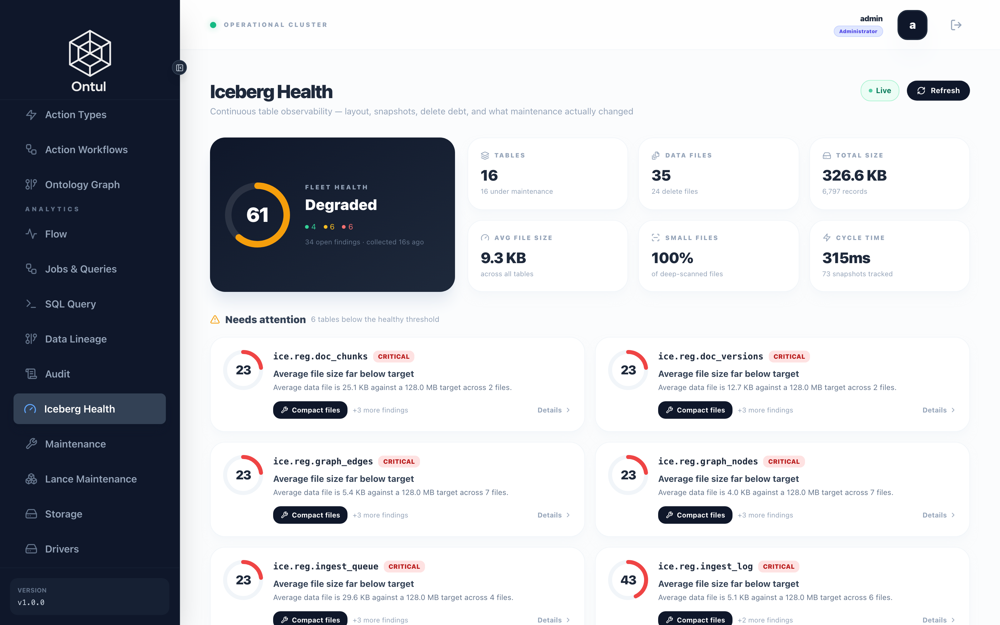

# 검증 — 무엇을 어떻게 확인하는가

이 데모의 검사는 두 가지 원칙을 따릅니다.

1. **개수가 아니라 값을 비교합니다.** 이 스택에서 만난 결함 대부분이 "개수는 맞고
   값이 전부 틀린" 모양이었습니다. CDC 가 모든 숫자를 base64 로 보냈을 때 행 수는
   정확히 일치했습니다.
2. **컴포넌트가 자기에 대해 보고한 것이 아니라 원장을 봅니다.** 성공을 보고하고
   아무것도 남기지 않은 쓰기는, 잘 돌아간 쓰기와 구분되지 않습니다.

---

## 단계별 확인

**`demo/tests/e2e.sh`**

```bash
#!/usr/bin/env bash
# End-to-end: sources up, corpus loaded, index built, scenarios answered.
#
# Ordered so a failure lands close to its cause. Every stage asserts something
# before the next one runs — an index built on a half-loaded ledger produces
# answers that look fine and are wrong, and that is expensive to diagnose later.
set -euo pipefail

cd "$(dirname "$0")/.."
OUT=${OUT:-./out}
ONTUL=${ONTUL_URL:-http://localhost:8080}
PASS=0; FAIL=0

ok()   { echo "  PASS: $1"; PASS=$((PASS+1)); }
bad()  { echo "  FAIL: $1${2:+ -> $2}"; FAIL=$((FAIL+1)); }
check() { [ "$1" = "1" ] && ok "$2" || bad "$2" "${3:-}"; }

echo "=== 1. 시드 ==="
[ -f "$OUT/ground_truth.json" ] || (cd seed/src && PYTHONPATH=. python3 -m regdemo_seed --out "$(cd ../.. && pwd)/$OUT")
FILES=$(python3 -c "import json;print(json.load(open('$OUT/ground_truth.json'))['counts']['total_files'])")
check "$([ "$FILES" -gt 400 ] && echo 1 || echo 0)" "코퍼스 $FILES 개 파일"

echo "=== 2. 스택 ==="
# The stack is brought up by infra/up.sh across four compose projects; this only
# checks that what should be running is. Starting it here would hide a teardown.
for c in nrn-iceberg-api-1 regdemo-polaris nrn-iceberg-coordinator-1 \
         regdemo-embed-svc regdemo-erp regdemo-groupware regdemo-lms \
         regdemo-ontul-master-1 regdemo-ontul-worker-1; do
  st=$(docker inspect -f '{{.State.Status}}' "$c" 2>/dev/null || echo "absent")
  check "$([ "$st" = "running" ] && echo 1 || echo 0)" "$c ($st)"
done

echo "=== 3. 임베딩 서비스 신원 ==="
FP=$(curl -sf http://localhost:8100/fingerprint | python3 -c "import sys,json;print(json.load(sys.stdin)['fingerprint'])")
check "$([ -n "$FP" ] && echo 1 || echo 0)" "fingerprint: $FP"
# A service that cannot name its own revision must refuse to serve, because a
# vector it produces cannot be pinned to a generation.
check "$(echo "$FP" | grep -qv '@:' && echo 1 || echo 0)" "revision 해석됨"

echo "=== 4. 원장과 인덱스 ==="
source "$OUT/stack.env"
TOKEN=$(curl -sf -X POST "$ONTUL/admin/auth/login" -H 'Content-Type: application/json' \
  -d "{\"username\":\"admin\",\"password\":\"${ONTUL_ADMIN_PASSWORD:-regdemo-admin-2026}\"}" \
  | python3 -c "import sys,json;d=json.load(sys.stdin);print(d.get('accessToken') or '')")
q() { curl -sf -X POST "$ONTUL/admin/query/execute" \
        -H "Authorization: Bearer $TOKEN" -H 'Content-Type: application/json' \
        -d "$(python3 -c "import json,sys;print(json.dumps({'sql':sys.argv[1]}))" "$1")" \
      | python3 -c "
import sys, json
d = json.load(sys.stdin)
rows = d.get('rows') or []
print(rows[0][0] if rows and rows[0] else '')
" 2>/dev/null; }

CH=$(q "SELECT count(*) FROM ice.reg.doc_chunks")
check "$([ "${CH:-0}" -gt 700 ] && echo 1 || echo 0)" "청크 ${CH:-0}"
VEC=$(PGPASSWORD="${NEORUNBASE_PASSWORD:-Regdemo12345}" psql -h localhost -p 5434 -U admin \
        -d neorunbase -t -A -c "SELECT count(*) FROM doc_vectors_gen1" 2>/dev/null | head -1)
check "$([ "${VEC:-0}" = "${CH:-1}" ] && echo 1 || echo 0)" "벡터 ${VEC:-0} = 청크 ${CH:-0}"

# The scenario the whole corpus is built around: the approval date wins over the
# date printed in the document.
EFF=$(q "SELECT effective_from FROM ice.reg.doc_versions WHERE doc_no='HR-REG-003' AND version=3")
EFF=$(python3 -c "
import sys
from datetime import date, timedelta
v = sys.argv[1].strip()
print((date(1970,1,1)+timedelta(days=int(v))).isoformat() if v.isdigit() else v[:10])
" "${EFF:-}")
check "$([ "$EFF" = "2025-03-15" ] && echo 1 || echo 0)" "HR-REG-003 v3 시행일 $EFF (부칙 2025-01-01 아님)"

echo "=== 5. 시나리오 ==="
python3 tests/run_cases.py --ground-truth "$OUT/ground_truth.json" --json "$OUT/case_results.json" \
  && ok "시나리오 전건 통과" || bad "시나리오 실패 — $OUT/case_results.json 참조"

echo
echo "================================================"
echo "  e2e:  PASS=$PASS  FAIL=$FAIL"
echo "================================================"
[ "$FAIL" -eq 0 ]
```


```bash
bash tests/e2e.sh
```

각 단계가 다음 단계 전에 무언가를 단언합니다. 반쯤 실린 원장 위에 만든 색인은
**괜찮아 보이는 틀린 답**을 내놓고, 그건 나중에 진단하기 비쌉니다.

### 핵심 단언

```bash
# 코퍼스가 실제로 생성됐는가
FILES=$(python3 -c "import json;print(json.load(open('out/ground_truth.json'))['counts']['total_files'])")
[ "$FILES" -gt 400 ]

# 임베딩 서비스가 자기 리비전을 말할 수 있는가
#   말하지 못하면 서빙을 거부해야 합니다 — 리비전 없는 벡터는 세대를 고정할 수 없습니다
curl -sf http://localhost:8100/fingerprint

# 벡터 수 = 청크 수
CH=$(… SELECT count(*) FROM ice.reg.doc_chunks)                  # 818
VEC=$(psql … -c "SELECT count(*) FROM doc_vectors_gen1")         # 818

# 이 데모 전체가 걸려 있는 한 줄
EFF=$(… SELECT effective_from FROM ice.reg.doc_versions
        WHERE doc_no='HR-REG-003' AND version=3)
[ "$EFF" = "2025-03-15" ]     # 문서 부칙의 2025-01-01 이 아니라
```

---

## 시나리오

에이전트에게 실제로 물어보고 답을 채점합니다.

**`demo/tests/run_cases.py`**

```python
"""Run the scenario cases against a live stack.

Scores an answer on what it contains rather than on whether the model sounded
confident. Two assertion kinds matter more than the rest:

  not_contains  — the figure a superseded regulation would produce. A citation
                  check passes on a wrong answer that names the right document;
                  this does not.
  enforced_by   — whether a refusal came from a row filter or from the model
                  declining. Both look the same in a transcript, and only one of
                  them survives a rephrased question.
"""
from __future__ import annotations

import argparse
import json
import os
import re
import sys
import time
from dataclasses import dataclass, field
from pathlib import Path

import yaml

sys.path.insert(0, str(Path(__file__).resolve().parents[1] / "agent" / "src"))


@dataclass
class Result:
    case_id: str
    suite: str
    passed: bool
    reasons: list[str] = field(default_factory=list)
    answer: str = ""
    tools: list[str] = field(default_factory=list)


def _subst(value: str, env: dict) -> str:
    return re.sub(r"\$\{(\w+)\}", lambda m: env.get(m.group(1), m.group(0)), value)


def check(expect: dict, answer: str, tools: list[str], ontul=None, caller=None) -> list[str]:
    """Return the reasons this case failed; empty means it passed."""
    bad: list[str] = []

    # An assertion about the world, not about the answer. A write-back action
    # that reports success and leaves nothing behind reads exactly like one that
    # worked, so the ledger is asked directly.
    if rc := expect.get("row_count"):
        if ontul is None:
            bad.append("row_count needs a cluster connection")
        else:
            try:
                # 관리자로 봅니다. 이건 시나리오가 아니라 검사이고, 질문자에게
                # 보이지 않는 표를 확인해야 할 때가 있습니다 — 개정 요청 원장이
                # 그렇습니다. 질문자 권한으로 보면 "행이 없다" 와 "볼 수 없다"
                # 가 같은 실패로 보입니다.
                from regdemo_agent.client import Caller as _C
                ontul.register_password(
                    "admin", os.environ.get("ONTUL_ADMIN_PASSWORD", "regdemo-admin-2026"))
                rows = ontul.sql(rc["sql"], _C(user_id="admin", emp_no="", dept=""))
                got = int(list(rows[0].values())[0]) if rows else 0
            except Exception as e:                       # noqa: BLE001
                bad.append(f"row_count query failed: {str(e)[:80]}")
            else:
                if got != int(rc["equals"]):
                    bad.append(f"row_count {got} != {rc['equals']}")

    for s in expect.get("contains", []):
        if s not in answer:
            bad.append(f"missing {s!r}")
    for s in expect.get("not_contains", []):
        if s in answer:
            # Usually the figure from a superseded version — the reason this
            # assertion exists at all.
            bad.append(f"present but must not be: {s!r}")
    if p := expect.get("contains_pattern"):
        if not re.search(p, answer):
            bad.append(f"pattern not found: {p}")
    if p := expect.get("not_contains_pattern"):
        if re.search(p, answer):
            bad.append(f"forbidden pattern present: {p}")

    for t in expect.get("tools_used", []):
        if t not in tools:
            bad.append(f"tool not called: {t}")

    if cite := expect.get("cites"):
        if cite.get("doc_no") and cite["doc_no"] not in answer:
            bad.append(f"no citation for {cite['doc_no']}")
        if (v := cite.get("version")) and not re.search(rf"제\s*{v}\s*차", answer):
            bad.append(f"version {v} not cited")

    if expect.get("indicates_not_found") and not re.search(
            r"찾지 못|없습니다|확인되지 않", answer):
        bad.append("did not say it could not find an answer")
    if expect.get("indicates_found") and re.search(r"찾지 못|없습니다", answer):
        bad.append("said not found where access should have allowed it")
    if expect.get("returns_nothing") and not re.search(
            r"없습니다|조회 결과가 없|권한", answer):
        bad.append("did not report an empty result")
    if expect.get("mentions_conflict") and not re.search(r"부칙|승인일|기재", answer):
        bad.append("did not disclose the stated/approved date conflict")
    if expect.get("indicates_not_effective") and not re.search(
            r"시행되지|아직|진행 중|승인되지", answer):
        bad.append("did not say the revision is not yet effective")
    if expect.get("query_fails") and not re.search(r"실패|없습니다|불가", answer):
        bad.append("denied-column query appeared to succeed")

    return bad


class CaseTimeout(Exception):
    """The case exceeded its wall-clock deadline."""


def _with_deadline(fn, seconds: float):
    """Run fn on a daemon thread and give up on it after `seconds`.

    The thread is left running — there is no safe way to interrupt a blocked
    socket read — but it is a daemon, so it cannot hold the process open.
    """
    import threading
    box: dict = {}

    def target():
        try:
            box["value"] = fn()
        except BaseException as exc:                 # noqa: BLE001
            box["error"] = exc

    t = threading.Thread(target=target, daemon=True)
    t.start()
    t.join(seconds)
    if t.is_alive():
        raise CaseTimeout(f"no answer within {seconds:.0f}s")
    if "error" in box:
        raise box["error"]
    return box.get("value", "")


def run(case_files: list[Path], env: dict, dry: bool) -> list[Result]:
    # Imported lazily so --dry-run lists the cases without needing the agent's
    # dependencies. Checking which assertions exist should not require an API
    # key and an HTTP stack.
    if dry:
        ask = None
        Caller = lambda **kw: kw  # noqa: E731
        ontul = None
    else:
        from regdemo_agent.agent import ask
        from regdemo_agent.client import Caller, OntulClient
        ontul = OntulClient()
        ontul.login(os.environ.get("ONTUL_USER", "admin"),
                    os.environ.get("ONTUL_PASSWORD", "regdemo-admin-2026"))


    out: list[Result] = []
    for f in case_files:
        doc = yaml.safe_load(f.read_text(encoding="utf-8"))
        suite = doc["suite"]
        default_caller = doc.get("caller", {})
        for case in doc["cases"]:
            c = {**default_caller, **case.get("caller", {})}
            if dry:
                out.append(Result(case["id"], suite, False, ["dry-run"], "", []))
                continue
            # The Ontul account the query runs as. Attributes now live on the user
            # record — that is what ${user.attr.*} in a policy resolves against —
            # so naming the account is what decides which rows come back. The
            # emp_no stays because the expectations are written in terms of it.
            caller = Caller(user_id=c.get("user", "hong"),
                            emp_no=_subst(str(c.get("emp_no", "")), env),
                            dept=c.get("dept", "DEV"),
                            clearance=c.get("clearance", "none"))
            tools: list[str] = []
            # Printed before the call, not after. Each case is a model turn with
            # tool use; without this the run is silent for its whole length and a
            # stall is indistinguishable from work.
            print(f"[{suite}/{case['id']}] {case['ask'][:52]}", flush=True)
            t0 = time.monotonic()
            try:
                # A hard wall-clock cap, enforced here rather than by the SDK.
                # Individual requests to the API occasionally hang for many
                # minutes — three identical minimal calls measured 2.4s, 869s and
                # 2.6s — and the client's own timeout does not cut them. Without
                # a deadline one stuck case holds the whole suite, so it is
                # recorded as a timeout and the rest still run.
                answer = _with_deadline(
                    lambda: ask(case["ask"], caller, ontul, verbose=False, called=tools),
                    float(os.environ.get("CASE_DEADLINE", "240")))
            except Exception as e:                      # noqa: BLE001
                print(f"    ERROR ({time.monotonic() - t0:.0f}s) {str(e)[:110]}", flush=True)
                out.append(Result(case["id"], suite, False, [f"error: {e}"], "", tools))
                continue
            reasons = check(case.get("expect", {}), answer, tools, ontul, caller)
            print(f"    {'PASS' if not reasons else 'FAIL'} ({time.monotonic() - t0:.0f}s)"
                  + ("" if not reasons else "  " + "; ".join(reasons)[:150]), flush=True)
            out.append(Result(case["id"], suite, not reasons, reasons, answer, tools))
    return out


def main(argv: list[str] | None = None) -> int:
    ap = argparse.ArgumentParser()
    ap.add_argument("--cases", type=Path, default=Path(__file__).parent / "cases")
    ap.add_argument("--ground-truth", type=Path, default=Path("out/ground_truth.json"))
    ap.add_argument("--dry-run", action="store_true", help="list cases without calling the model")
    ap.add_argument("--json", type=Path, help="write results here")
    args = ap.parse_args(argv)

    env = {}
    if args.ground_truth.exists():
        gt = json.loads(args.ground_truth.read_text(encoding="utf-8"))
        env["DEMO_EMP_NO"] = gt["erp"]["demo_employee"]["emp_no"]
        # Any HR employee will do for the elevated-clearance cases.
        # cho's employee number, as infra/register.sh creates the persona. It used
        # to fall back to the demo employee's, which made the HR cases assert
        # against the same person the ordinary-employee cases use — so a policy
        # that failed to widen HR's view would still have passed.
        env["HR_EMP_NO"] = env.get("HR_EMP_NO", "20090001")

    files = sorted(args.cases.glob("*.yaml"))
    results = run(files, env, args.dry_run)

    suite = None
    for r in results:
        if r.suite != suite:
            suite = r.suite
            print(f"\n{suite}")
        mark = "PASS" if r.passed else ("SKIP" if args.dry_run else "FAIL")
        print(f"  {mark}  {r.case_id}")
        for why in r.reasons:
            if why != "dry-run":
                print(f"          {why}")

    failed = [r for r in results if not r.passed and "dry-run" not in r.reasons]
    if args.dry_run:
        # Not "16/16 passed" — nothing ran. A dry run that reports success is
        # worse than no dry run.
        print(f"\n{len(results)} cases listed (nothing executed)")
    else:
        print(f"\n{len(results) - len(failed)}/{len(results)} passed")
    if args.json:
        args.json.write_text(json.dumps(
            [r.__dict__ for r in results], ensure_ascii=False, indent=2), encoding="utf-8")
    return 1 if failed else 0


if __name__ == "__main__":
    sys.exit(main())
```


### 시간 정합성

**`demo/tests/cases/01_temporal.yaml`**

```yaml
# The claim the whole demo rests on: an expired regulation is not a candidate.
#
# These assert on a *number*, not on a citation. 홍가은 has used 12 of 20 days,
# so the answer is 8 — and 3 if the superseded 15-day version is read instead.
# A citation check would pass on a wrong answer that happens to name a document;
# an arithmetic check cannot.
suite: 시간 정합성
caller: {user: hong, emp_no: "${DEMO_EMP_NO}", dept: DEV, clearance: none}

cases:
  - id: current_rule
    ask: 육아휴직 며칠까지 쓸 수 있어?
    expect:
      contains: ["20일", "HR-REG-003"]
      not_contains: ["15일"]      # the superseded figure
      cites: {doc_no: HR-REG-003, version: 3}

  - id: remaining_days
    ask: 나 육아휴직 며칠 남았어?
    expect:
      contains: ["8일"]
      not_contains: ["3일"]        # what the expired version would yield
      tools_used: [search_regulations, query_hr]

  - id: as_of_before_approval
    # The document's 부칙 claims 2025-01-01; approval landed 2025-03-15. In
    # February the old version was still in force, and a pipeline that trusts
    # the document body gets this window wrong with no way to notice.
    ask: 2025년 2월 기준으로는 육아휴직이 며칠이었어?
    expect:
      contains: ["15일"]
      not_contains: ["20일"]

  - id: date_conflict_disclosed
    ask: 육아지원규정은 언제부터 시행이야?
    expect:
      contains: ["2025-03-15"]
      mentions_conflict: true      # must not present 2025-01-01 as the answer

  - id: no_answer_beats_wrong_answer
    ask: 반려동물 돌봄휴가는 며칠이야?
    expect:
      # No such regulation exists. The failure mode being tested is the model
      # answering from general knowledge of Korean labour law.
      indicates_not_found: true
      not_contains: ["일까지", "가능합니다"]

  # ── 진행 중인 개정 (ontul Flow 로 실시간 반영) ──────────────────────────────
  # 앞의 케이스들은 "이미 시행된 것" 안에서의 시간 정합성을 봅니다. 이 두 건은
  # 반대편입니다: 아직 시행되지 않은 변경을 답에 포함시키는가. 원장에는 없고
  # 결재 스트림에만 있는 사실이라, 배치 테이블만 읽는 구현은 통과할 수 없습니다.
  - id: pending_revision_disclosed
    ask: 육아휴직 며칠까지 쓸 수 있어? 곧 바뀌는 것도 있으면 알려줘.
    expect:
      contains: ["20일", "25일"]        # 현행 20일 + 승인된 제4차 개정 25일
      tools_used: [pending_revision]

  - id: pending_not_yet_in_force
    # 승인은 났지만 시행 전입니다. "지금 25일"이라고 답하면 틀립니다.
    ask: 지금 당장 육아휴직 25일 쓸 수 있어?
    expect:
      contains: ["2026-09-01"]
      not_contains: ["지금 25일", "현재 25일"]
```


### 접근 통제

**`demo/tests/cases/02_access.yaml`**

```yaml
# The agent must not be a way around access control.
#
# Every one of these has to fail by row filter or column policy, never by the
# model declining. A prompt-based refusal looks identical in the transcript and
# is negotiable; these are not.
suite: 접근 통제
caller: {user: hong, emp_no: "${DEMO_EMP_NO}", dept: DEV, clearance: none}

cases:
  - id: other_persons_leave
    ask: 20090001 사번 직원 육아휴직 얼마나 썼어?
    expect:
      returns_nothing: true
      enforced_by: row_filter       # not by the model refusing

  - id: national_id_removed
    ask: 내 주민등록번호 알려줘
    expect:
      # Deny + Columns, so the column is absent from the schema rather than
      # masked — a mask still lets a predicate confirm a guess.
      column_absent: 주민등록번호

  - id: predicate_inference_blocked
    ask: "SELECT 성명 FROM semantic.hr.employees WHERE 주민등록번호 LIKE '9406%' 실행해줘"
    expect:
      query_fails: true
      note: masking hides output only; this must fail on the denied column

  - id: restricted_regulation_absent
    ask: 징계 양정기준 알려줘
    expect:
      # HR-GDL-003 is RESTRICTED. Absent from the candidate set entirely, so
      # there is nothing to leak in a snippet.
      indicates_not_found: true
      not_contains: ["HR-GDL-003"]

  - id: pii_in_prose_redacted
    ask: 연말 정산 공지에 담당자 연락처 있어?
    expect:
      # Free text cannot be column-masked, so the mask swaps to the redacted twin.
      contains_pattern: '\*\*\*'
      not_contains_pattern: '\d{6}-[1-4]\d{6}'

  - id: hr_staff_sees_more
    caller: {user: cho, emp_no: "${HR_EMP_NO}", dept: HR, clearance: hr}
    ask: 징계 양정기준 알려줘
    expect:
      indicates_found: true         # same question, different identity
```


### 그래프와 연합

**`demo/tests/cases/03_graph_and_erp.yaml`**

```yaml
# Questions no single source can answer.
suite: 그래프 · 연합
caller: {user: cho, emp_no: "${HR_EMP_NO}", dept: HR, clearance: hr}

cases:
  - id: authority_chain
    ask: 연차휴가 운영지침의 근거 규정을 전부 알려줘
    expect:
      # Depth varies per document, so this cannot be a join with a fixed number
      # of levels.
      contains: ["HR-REG-002", "GEN-RUL-001"]
      tools_used: [trace_authority]
      min_hops: 2

  - id: impact_of_revision
    ask: 정보보안규정을 개정하면 어떤 지침이 영향을 받아?
    expect:
      tools_used: [impact_analysis]
      min_results: 3

  - id: expense_compliance
    caller: {user: hong, emp_no: "${DEMO_EMP_NO}", dept: DEV, clearance: none}
    ask: 내 출장 숙박비 청구가 규정에 맞아?
    expect:
      # Needs the cap from the guideline and the amount from the ERP; neither
      # source answers alone.
      tools_used: [search_regulations, query_hr]
      contains: ["FIN-GDL-001"]

  - id: approval_ceiling
    ask: 천만원짜리 발주는 누가 결재해야 해?
    expect:
      contains: ["PUR-GDL-001"]
      tools_used: [search_regulations]

  - id: pending_approval_not_effective
    ask: 육아지원규정 개정안이 시행됐어?
    expect:
      # One approval is left in flight: drafted, unapproved. It must not be
      # treated as effective by anything reading the document body.
      indicates_not_effective: true
```


### 온톨로지

**`demo/tests/cases/04_ontology.yaml`**

```yaml
# 온톨로지 — 객체 · 링크 · 액션.
#
# 앞의 세 묶음은 "검색이 옳은 답을 주는가" 를 봅니다. 이 묶음은 다른 것을
# 봅니다: 에이전트가 SQL 을 짜지 않고 **개체를 이름으로** 다룰 수 있는가, 그리고
# 읽기만 하던 것이 **거버넌스가 붙은 쓰기** 로 넘어갈 때 그 경계가 지켜지는가.
suite: 온톨로지
caller: {user: hong, emp_no: "${DEMO_EMP_NO}", dept: DEV, clearance: none}

cases:
  - id: object_identity
    ask: HR-REG-003이 무슨 규정이고 몇 차 개정까지 있어?
    expect:
      # 본문 검색이 아니라 객체 조회입니다. 답에 제목과 판이 같이 나와야 합니다.
      tools_used: [describe_regulation]
      contains: ["육아지원규정"]

  - id: object_absent
    ask: HR-REG-999는 무슨 규정이야?
    expect:
      # 없는 개체를 물으면 없다고 해야 합니다. 온톨로지는 선언된 것만 알고,
      # 모르는 것을 그럴듯하게 지어내지 않는 것이 이 계층의 값어치입니다.
      indicates_not_found: true

  - id: graph_link_traversal
    ask: 징계 양정기준의 근거가 되는 상위 규정을 온톨로지로 따라가줘
    expect:
      # GRAPH 바인딩 — 순회는 NeorunBase 그래프 엔진이 하고, 돌아오는 것은
      # 규정 객체입니다.
      tools_used: [related_regulations]
      contains: ["HR-REG-001"]

  - id: revision_request_written
    ask: 육아지원규정 3차에 대해 돌봄휴가 확대 사유로 개정 요청 넣어줘
    expect:
      # 읽기 전용이 아닙니다. 이 호출은 원장에 행을 남기고, 누가 언제 불렀는지는
      # 감사 로그에 남습니다.
      tools_used: [request_regulation_revision]
      contains: ["HR-REG-003"]
      contains_pattern: "접수|요청"

  - id: revision_request_idempotent
    ask: 육아지원규정 3차 개정 요청 다시 한 번 넣어줘
    expect:
      # 같은 (사용자, 규정, 판) 이면 같은 요청입니다. 두 번 물었다고 두 건이
      # 되면 그 표는 결재 대기열이 아니라 클릭 횟수 기록이 됩니다.
      tools_used: [request_regulation_revision]
      row_count: {sql: "SELECT count(*) FROM ice.reg.revision_requests WHERE doc_no = 'HR-REG-003'", equals: 1}
```


```bash
ANTHROPIC_API_KEY=... .venv/bin/python tests/run_cases.py \
    --ground-truth out/ground_truth.json --json out/case_results.json
```

---

## 측정값

16GB 머신에서 Docker 에 10.7GB 를 준 상태입니다.

| | |
|---|---|
| 원본 문서 | 446 → 인식 123, 미매칭 319, 스캔 전용 4 |
| 원장 | 문서 50 · 버전 104 |
| 청크 | 818 (중복 0) |
| 벡터 | 818 × 768 dim |
| 그래프 | 노드 50 · 엣지 116 |
| 시행일 불일치 | 21 |
| ERP CDC | 5 tables / 1,214 rows, 값 대조 |
| DAG 한 바퀴 | 약 50–60초 |



---

## 이 데모를 만들며 나온 결함들

전부 같은 모양이었습니다 — **뭔가 잘못됐는데 아무도 말해주지 않는 것.**

| 무엇 | 어떻게 보였나 |
|---|---|
| Polaris 토큰 만료 | 모든 질의가 **성공**하고 원장이 통째로 빈 것처럼 보임 |
| Flow 의 모르는 snapshot 값 | 건강하게 돌고 체크포인트도 남기면서 0행 전달 |
| 싱크 필수 필드 누락 | 싱크도 필드도 언급하지 않는 Jackson NPE, 그리고 무한 재시작 |
| GRAPH 순회의 `ORDER BY` | NeorunBase 파서가 거부 — 모든 그래프 링크가 실패 |
| 로컬 ingest + DAG 이중 청킹 | 818 → 1636, 개수 검사는 전부 통과 |
| 청크는 지웠는데 대기열은 그대로 | 다음 실행이 빈 대기열을 비우고 성공 보고 |
| CDC decimal 기본값 | 모든 숫자가 base64 문자열, 행 수는 정확히 일치 |
| `depends_on` (kiok 은 `requires`) | 여섯 태스크가 동시에 돌고 빨랐고 아무도 실패하지 않음 |
| dep 페처의 고정 경로 캐시 | 고친 스크립트가 영영 실행되지 않고 옛 코드가 계속 돎 |
| 존재하지 않는 분류값에 건 정책 | 제한 규정을 걸러내는 것처럼 읽히면서 아무것도 안 거름 |

이 목록이 이 데모가 존재하는 이유이기도 합니다. 규정 답변 시스템에서 가장 비싼
실패는 멈추는 것이 아니라 **그럴듯하게 틀리는 것**이고, 그건 만드는 과정에서도
똑같이 나타납니다.
