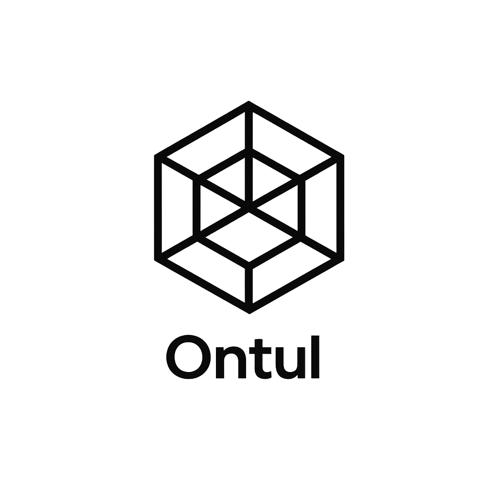

---
hide:
- navigation
- toc
- path
title: " "
---

  

<h2 align="center" style="margin-top: 1.5rem;">Distributed Unified Data Engine</h2>

  Ontul replaces separate Spark, Flink, and Trino clusters with a single engine — handling batch processing, stream processing, and interactive SQL queries in one system.

  <a href="./installation/installation" style="background: #2563eb; color: white; padding: 14px 40px; border-radius: 8px; text-decoration: none; font-weight: 600; font-size: 1.2rem;">Community Download</a>

