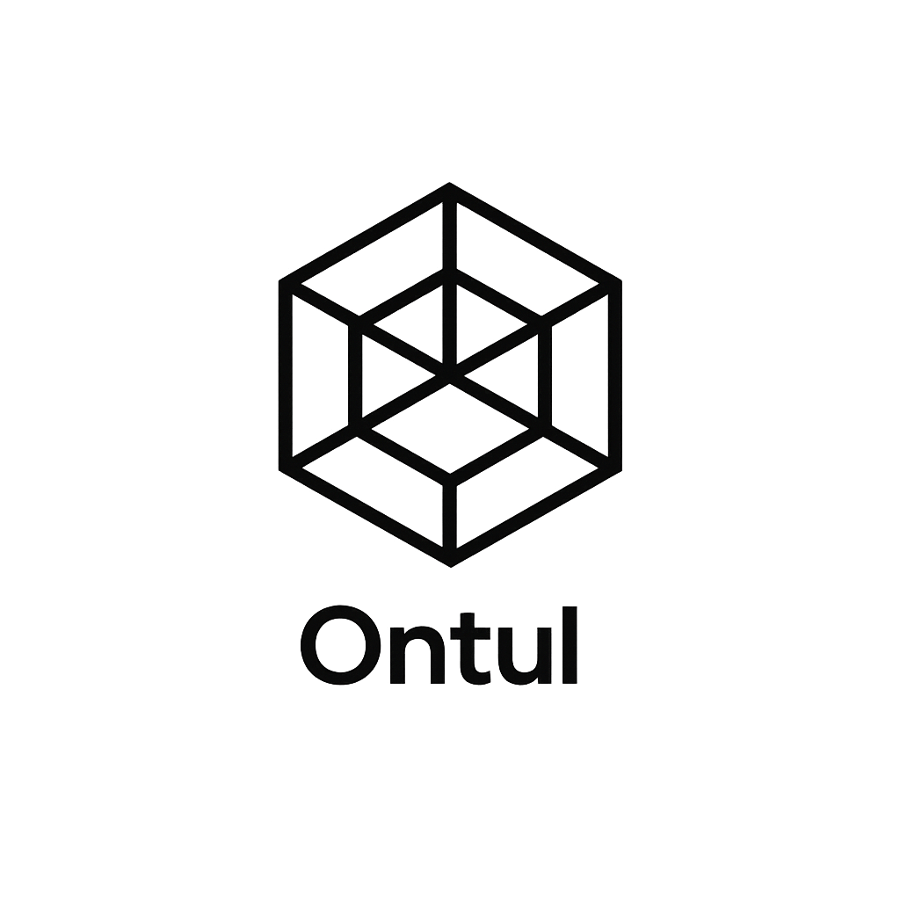

---
hide:
- navigation
- toc
- path
title: " "
---

  

<h2 align="center" style="margin-top: 1.5rem;">Distributed Unified Data Engine</h2>

  Ontul unifies batch processing, stream processing, and interactive SQL queries in a single engine — replacing the sprawl of separate specialized clusters with one system.

  On top of the engine, a built-in <b>semantic layer</b> and <b>ontology</b> serve consistent metrics and objects · links · actions to SQL, BI, and AI agents through the same Arrow Flight SQL and MCP interfaces.

  <a href="./installation/installation" style="background: #2563eb; color: white; padding: 14px 40px; border-radius: 8px; text-decoration: none; font-weight: 600; font-size: 1.2rem;">Download</a>

